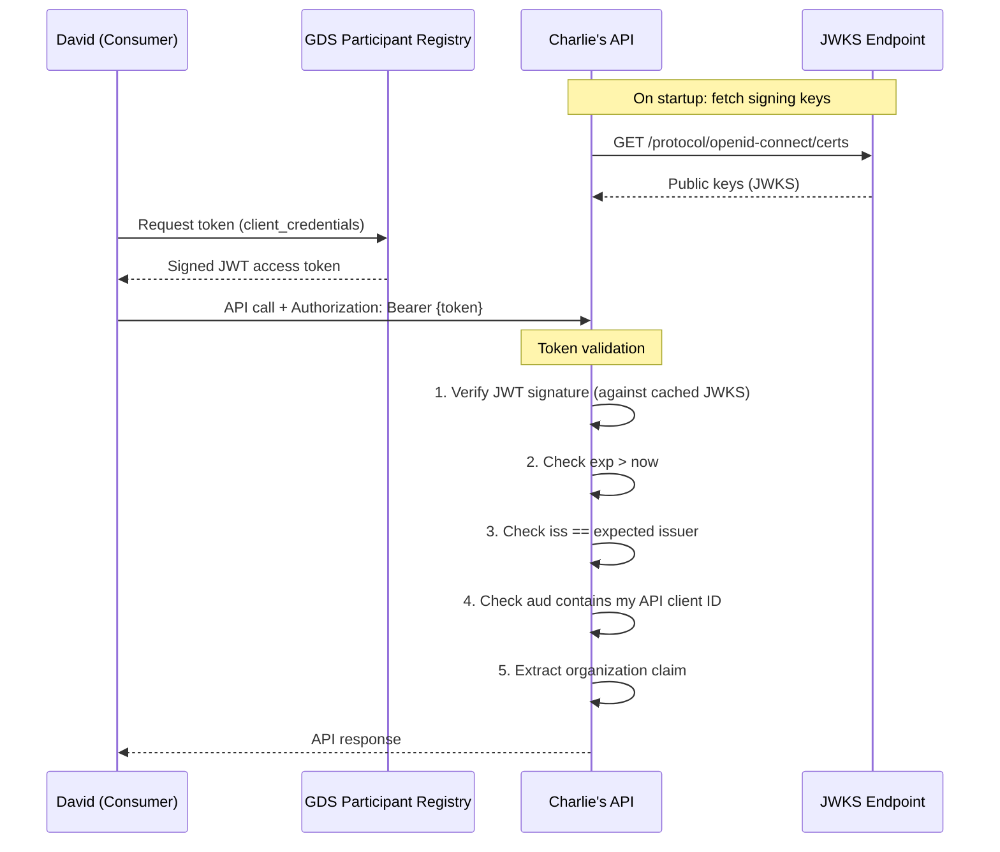

# Validating API Access Tokens — Guide for Data Service Providers

## Who Is This Guide For?

This guide is for **Charlie** — a data service provider who exposes APIs in the GDS dataspace. It covers how to register your API, manage access requests, and validate the JWT access tokens that consumers present when calling your API.

## Prerequisites

Before you begin, ensure the following:

| Requirement | Description |
|-------------|-------------|
| **Organization registered** | Your organization is registered in the GDS Participant Registry and has been approved by the administrator |
| **User account active** | You have an active user account on the [Self-Service Portal](https://gdskc-preview.poort8.nl/portal) |
| **API implemented** | You have an API ready to receive requests and validate tokens |

## Overview



## Step 1 — Register Your API

1. Log in to the [Self-Service Portal](https://gdskc-preview.poort8.nl/portal)
2. Navigate to **Systems** and select **Register API**
3. Fill in the API details (name, description, base URL)
4. Upload your **OpenAPI specification** — this is rendered in the catalogue for consumers to browse
5. Submit the registration

After registration, your API appears in the **Catalogue** where other participants can discover it and request access.

> **Note your API's client ID** — consumers will include this as the `aud` (audience) claim in their tokens, and you must validate it.

## Step 2 — Manage Access Requests

When a consumer (David) requests access to your API:

1. You receive a notification in the self-service portal
2. Navigate to your API's detail page to review pending requests
3. Review the requesting organization's identity
4. **Approve** or **reject** the request

Once approved, the consumer can request tokens that target your API. You can **revoke** access at any time.

## Step 3 — Validate Incoming Tokens

Every API request from a GDS consumer includes a JWT access token in the `Authorization` header. You **must** validate this token before processing the request.

### Validation Steps

Perform these checks in order. Reject the request immediately if any check fails.

| # | Check | What to Verify | On Failure |
|---|-------|---------------|------------|
| 1 | **Signature** | JWT signature is valid against the GDS Participant Registry's public keys (JWKS) | `401 Unauthorized` |
| 2 | **Expiration** | `exp` claim is in the future | `401 Unauthorized` |
| 3 | **Issuer** | `iss` claim equals `https://auth.poort8.nl/realms/gds-preview` | `401 Unauthorized` |
| 4 | **Audience** | `aud` claim contains your API's client ID | `403 Forbidden` |
| 5 | **Organization** | `organization` claim is present and identifies a known consumer | Use for business logic |

> **Step 4 is critical.** Without audience validation, a token intended for a different API could be used to access yours. Always verify that your API's client ID appears in the `aud` claim.

### JWKS Endpoint

The GDS Participant Registry publishes its signing keys at:

```
https://auth.poort8.nl/realms/gds-preview/protocol/openid-connect/certs
```

Fetch and cache these keys on application startup. Most JWT libraries handle key rotation automatically by re-fetching when an unknown `kid` (key ID) is encountered.

### Token Claims Reference

A decoded access token from a GDS consumer looks like this:

```json
{
  "iss": "https://auth.poort8.nl/realms/gds-preview",
  "sub": "a1b2c3d4-e5f6-7890-abcd-ef1234567890",
  "aud": "YOUR_API_CLIENT_ID",
  "exp": 1711324800,
  "iat": 1711324500,
  "jti": "unique-token-id",
  "scope": "YOUR_API_CLIENT_ID organization",
  "client_id": "CONSUMER_APP_CLIENT_ID",
  "organization": {
    "NLNHR.12345678": {
      "id": "ORGANIZATION_UUID"
    }
  }
}
```

| Claim | Type | Description |
|-------|------|-------------|
| `iss` | string | Token issuer — must be the GDS Participant Registry |
| `sub` | string | Service account identifier |
| `aud` | string or string[] | Target audience — must contain your API's client ID |
| `exp` | number | Expiration time (Unix timestamp, 5-minute lifetime) |
| `iat` | number | Issued-at time (Unix timestamp) |
| `jti` | string | Unique token identifier |
| `scope` | string | Space-separated granted scopes |
| `client_id` | string | The consumer application's client ID |
| `organization` | object | Consumer's organization identity (see below) |

### Organization Claim

The `organization` claim identifies the consumer's organization in the GDS dataspace:

```json
{
  "organization": {
    "NLNHR.12345678": {
      "id": "550e8400-e29b-41d4-a716-446655440000"
    }
  }
}
```

The key of the object (e.g., `NLNHR.12345678`) is the organization's **EUID** — the same identifier that was assigned and verified during registration with the GDS Participant Registry. This is not a self-declared value: the EUID is derived from the organization's official KvK registration number, verified by the GDS administrator before the organization was approved.

Use this to:

- Identify which organization is calling your API
- Apply business-level access rules (e.g., return only data belonging to this organization)
- Log API access per organization for auditing

## Code Examples

### Node.js (express-oauth2-jwt-bearer)

```javascript
const express = require('express');
const app = express();
const { auth } = require('express-oauth2-jwt-bearer');

const jwtCheck = auth({
  issuerBaseURL: 'https://auth.poort8.nl/realms/gds-preview',
  audience: 'your-api-client-id',
  tokenSigningAlg: 'RS256'
});

app.use(jwtCheck);

app.get('/data', function (req, res) {
  const organization = req.auth.payload.organization;
  res.send('Secured Resource for ' + JSON.stringify(organization));
});

app.listen(3000);
```

### C# (.NET)

In .NET, use the built-in JWT Bearer authentication middleware. It handles JWKS fetching, key rotation, signature verification, and claim validation automatically.

```csharp
var builder = WebApplication.CreateBuilder(args);

builder.Services.AddAuthentication(JwtBearerDefaults.AuthenticationScheme)
    .AddJwtBearer(options =>
    {
        options.Authority = "https://auth.poort8.nl/realms/gds-preview";
        options.Audience = "your-api-client-id";
    });

builder.Services.AddAuthorization();

var app = builder.Build();

app.UseAuthentication();
app.UseAuthorization();

app.MapGet("/data", (HttpContext ctx) =>
{
    var organization = ctx.User.FindFirst("organization")?.Value;
    return $"Secured Resource for {organization}";
});

app.Run();
```

### Python (PyJWT)

```python
import jwt
from jwt import PyJWKClient

jwks_client = PyJWKClient(
    "https://auth.poort8.nl/realms/gds-preview/protocol/openid-connect/certs"
)

def validate_token(token: str) -> dict:
    signing_key = jwks_client.get_signing_key_from_jwt(token)
    return jwt.decode(
        token,
        signing_key.key,
        algorithms=["RS256"],
        audience="your-api-client-id",
        issuer="https://auth.poort8.nl/realms/gds-preview",
    )
```

## Production Considerations

When moving to production, update all references from `gds-preview` to `gds`:

| Setting | Preview | Production |
|---------|---------|------------|
| Token endpoint | `https://auth.poort8.nl/realms/gds-preview/...` | `https://auth.poort8.nl/realms/gds/...` |
| JWKS endpoint | `https://auth.poort8.nl/realms/gds-preview/...` | `https://auth.poort8.nl/realms/gds/...` |
| Expected `iss` | `https://auth.poort8.nl/realms/gds-preview` | `https://auth.poort8.nl/realms/gds` |
| Portal URL | `https://gdskc-preview.poort8.nl` | `https://gdskc.poort8.nl` |
