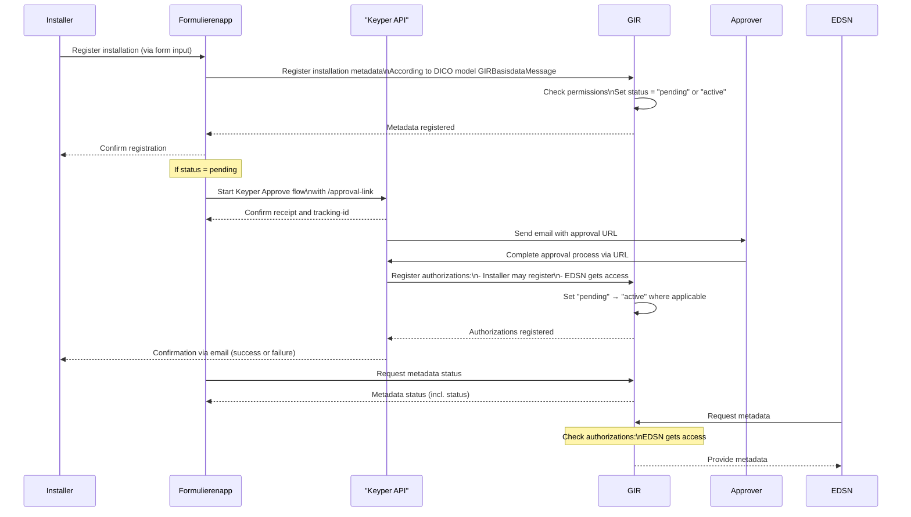

# GIR Implementation in NoodleBar

This section documents the specific implementation of the *Gebouwinstallatieregistratie* (GIR) use case within the NoodleBar ecosystem. GIR leverages modular NoodleBar components (Organization Register, Authorization Register, Keyper Approve) to enable secure, auditable registration and sharing of building installation metadata between installers, approvers, and EDSN.

## 🧩 Components Involved

- **GIR** (based on NoodleBar modules): Manages metadata registration and authorization
- **Formulierenapp**: Frontend for installers to submit installations
- **Keyper API**: Initiates and manages approval workflows
- **EDSN**: Data consumer (authorized third party)
- **Approver**: Entity responsible for validating and approving data sharing
- **Installer**: Entity registering the building installation

---

## 🔁 Process Overview

### 1. Metadata Registration

- The **Installer** submits installation data through the **Formulierenapp**.
- The Formulierenapp sends this data to the **GIR module** using the standardized `GIRBasisdataMessage` format (based on the DICO model).
- GIR sets the status of the installation to `pending` or `active` depending on pre-existing authorizations.
- A confirmation is returned to the Formulierenapp and shown to the installer.

### 2. Conditional Approval Flow

- If the status is `pending`, the Formulierenapp triggers the **Keyper Approve** process via the `/approval-link` endpoint.
- The **Keyper API** issues a tracking ID and sends an approval URL to the **Approver**.
- Once the **Approver** completes the approval, the Keyper API registers policies to grant:
  - That the installer is authorized to register installations.
  - That **EDSN** has access to this specific installation data.
- GIR then updates the status from `pending` to `active` where applicable.

### 3. Data Access

- The Formulierenapp can query the metadata status at any time.
- **EDSN** periodically retrieves metadata from GIR.
- GIR enforces access controls using NoodleBar's Authorization Register, ensuring only authorized access for EDSN.

---

## 📌 Key Features in GIR Flow

| Feature | Description |
|--------|-------------|
| **DICO-based metadata** | Registration conforms to `GIRBasisdataMessage`, ensuring standardized metadata exchange. |
| **Dynamic Authorization** | GIR defers final activation of metadata until authorization is confirmed via Keyper. |
| **Keyper Integration** | Secure, traceable authorization approval via the Keyper Approve flow. |
| **EDSN Access** | Controlled access by EDSN only after explicit approval and registration. |

---

## 🔐 Authorization Logic in GIR

- GIR treats all incoming registrations as *pending* unless prior authorization exists.
- The Keyper Approve flow is used to dynamically **grant roles** (e.g., installer as data provider, EDSN as consumer).
- The Authorization Register is updated programmatically via Keyper, based on approval outcome.

---

## 📈 Sequence Diagram



## DSGO Authorization Logic

According to DSGO, you can get access to an installation registration based on three grounds:

1. You are the **data rights holder** of the registration. This applies to the data owner.
2. You are a **data delegate** for which the data rights holder has placed consent in the authorization register, through an approval request.
3. You are an **application** acting on behalf of a registrant or issuer and you follow DSGO for proper authentication of these parties. Here RFC protocols apply to sharpen the technical and functional implementation.

In the GIR process, additional functionality has been created that is not covered by the above standard DSGO roles.

- Any party can make registrations as a **registrant**, which is not a recognized DSGO role. The registrant is not the data rights holder of a registration, and may not yet have permission as a data delegate. In that case, the above DSGO grounds do not yet apply. To facilitate that this registrant can already prepare a registration on behalf of the data owner, the status **Pending** has been introduced. This is a property of the registration within GIR, and ensures that the registration is not yet recognized as a registration of the data rights holder as long as there is no approval.

- Once approval is obtained, the registration is automatically set to **Active**, and then DSGO with the above grounds 1-3 applies.

- The key question becomes: may the registrant and/or registering application see installations with status Pending that they themselves registered? And if so, how?

- DSGO therefore does not apply to pending registrations, because the registration is not yet recognized. No one else has access to this installation registration either. However, it is wise and customary for the registering application to show something to the registrant at this stage. After all, it is the only way to see if the registration was successful, and it contains data they entered themselves.

## Example Policies

### Example Policy Transactions

Below are example policy transactions used in the GIR process. These policies define access rights for building installation registrations. The `attribute: *` acts as a wildcard, granting permissions for all installations registered under the specified `vboID`. Specific installation access can be further filtered using rules for NL/SFB codes.

#### Example: Registrar Write Access

```json
{
  "useCase": "GIR",
  "issuedAt": 1739881378,
  "notBefore": 1739881378,
  "expiration": 1839881378,
  "issuerId": "NL.KVK.{{installationOwnerChamberOfCommerceNumber}}",
  "subjectId": "NL.KVK.{{registrarChamberOfCommerceNumber}}",
  "serviceProvider": "NL.KVK.27248698",
  "action": "write",
  "resourceId": "{{vboID}}",
  "type": "vboID",
  "attribute": "*",
  "license": "0005"
}
```
This policy allows the registrar (subject) to write installation data for all installations under the given `vboID`.

#### Example: EDSN Read Access with NL/SFB Filter

```json
{
  "useCase": "GIR",
  "issuedAt": 1739881378,
  "notBefore": 1739881378,
  "expiration": 1839881378,
  "issuerId": "NL.KVK.{{installationOwnerChamberOfCommerceNumber}}",
  "subjectId": "NL.KVK.39098825",
  "serviceProvider": "NL.KVK.27248698",
  "action": "read",
  "resourceId": "{{vboID}}",
  "type": "vboID",
  "attribute": "*",
  "license": "0005",
  "rules": "Classificaties(NLSfB-55.21,NLSfB-56.21,NLSfB-61.15,NLSfB-62.32,NLSfB-61.18)"
}
```
This policy grants EDSN read access to all installations under the specified `vboID`, but only for installations matching the listed NL/SFB classification codes.

**Note:**  
- The `attribute: *` enables broad access, but rules can restrict access to specific installations.
- Alternatively, the `attribute` field can be set to a specific installation GUID (e.g., `attribute: "d3b07384-d9a0-4c2e-8e3c-1a2b3c4d5e6f"`) to grant access only to that particular installation, enabling fine-grained policy control.
- For more details on policy structure and filtering, refer to the Authorization Logic section above.