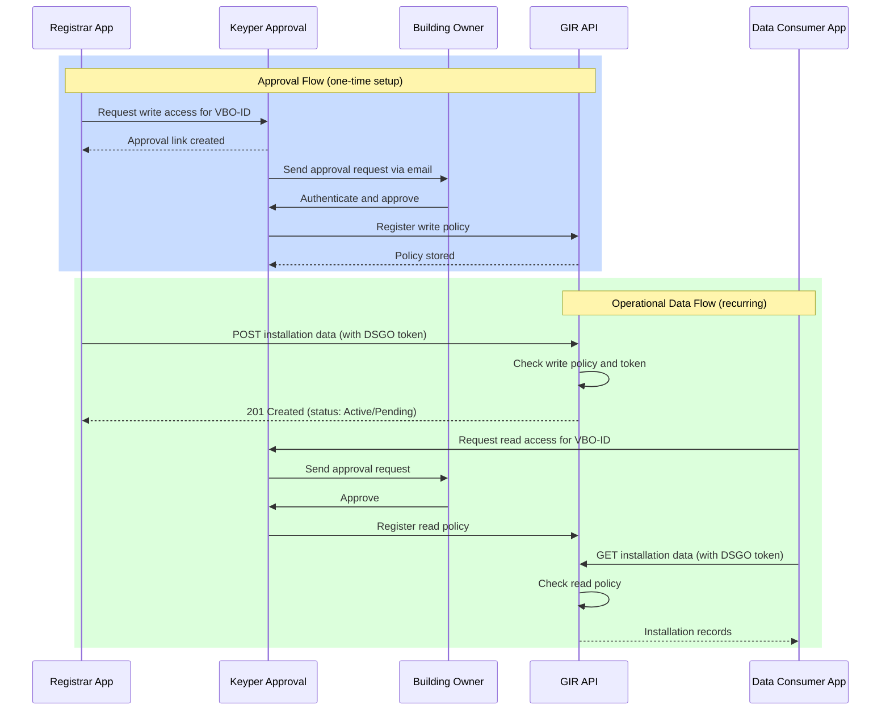

# GIR – Gebouw Installatie Registratie

**GIR** (Building Installation Registry) is a dataspace for registering and securely exchanging building-installation metadata between organizations. It implements the iSHARE Trust Framework with DSGO governance standards and the DICO data model for installation information.

## How it works

Organizations can register installation data and share it with authorized partners through an approval process. A registrar submits installation metadata to GIR; if the building owner approves write access through Keyper, the data becomes visible to data consumers who have also obtained read approval. All interactions require DSGO bearer tokens and pre-established policies.

### Steps

1. **Setup: Request write approval** — A registrar asks the building owner for permission to submit installation data via Keyper.
2. **Setup: Obtain DSGO token** — The registrar obtains a DSGO bearer token by authenticating with signed credentials to the GIR `/connect/token` endpoint.
3. **Register installation data** — The registrar submits or updates installation metadata via `POST /GIRBasisdataMessage`. Records are stored as **Active** (if approved) or **Pending** (waiting for approval).
4. **Setup: Request read approval** — Data consumers ask the building owner for permission to access installation data via Keyper.
5. **Setup: Obtain DSGO token** — Data consumers obtain their own DSGO bearer token.
6. **Retrieve installation data** — Data consumers query installations via `GET /GIRBasisdataMessage` or `GET /GIRBasisdataMessage/{guid}` and receive only records they are authorized to access.
7. **Verification** — Installation records transition to **Active** after policy approval and are visible to all authorized parties.

## Data Transactions

| Transaction | Purpose | Direction |
|-------------|---------|-----------|
| Installation metadata (DICO) | Register, update, and maintain building installation records | Write (registrar → GIR) |
| Installation metadata (DICO) | Query and retrieve installation records for authorized consumers | Read (GIR → data consumer) |

## Access and Environment

GIR is available at:

- **Preview:** https://gir-preview.poort8.nl/
- **Production:** https://gir.poort8.nl/ [TBD — available after production deployment]

All endpoints require a DSGO bearer token, obtained via `POST /connect/token`.

## Getting Started

| What you need | Where to find it |
|---------------|------------------|
| **Understand the registrar flow** | [Registrar Integration Guide](registrar-flow.md) |
| **Understand the data consumer flow** | [Data Consumer Integration Guide](data-consumer-flow.md) |
| **Obtain a DSGO token** | [Obtaining a DSGO Bearer Token](connect-token.md) |
| **Register or update an installation** | [Post a GIRBasisdataMessage](insert-installation.md) |
| **Retrieve a single installation** | [Retrieve a GIRBasisdataMessage by GUID](retrieve-installation.md) |
| **Retrieve multiple installations** | [Retrieve Multiple GIRBasisdataMessages](retrieve-installations.md) |
| **API reference and testing** | [GIR API Docs ➚](https://gir-preview.poort8.nl/scalar/v1) |
| **Keyper (approval workflow)** | [Keyper API Docs ➚](https://keyper-preview.poort8.nl/scalar/v1) |
| **NoodleBar concepts** | [NoodleBar Docs](../noodlebar/) |

## Further Reading

- **[Ketenstandaard GIR API ➚](https://ketenstandaard.semantic-treehouse.nl/docs/api/GIR/)** — Complete DICO schema specification and data model
- **[Ketenstandaarden Documentation about GIR ➚](https://ketenstandaard.semantic-treehouse.nl/docs/TNL/GIR/)** — GIR framework and context
- **[DSGO Standards ➚](https://www.digigo.nu/wat-is-dsgo/)** — Authorization and data governance framework
- **[API Versioning](api-versioning.md)** — How we version GIR-specific endpoints
- **[Changelog](changelog.md)** — Breaking changes and updates
