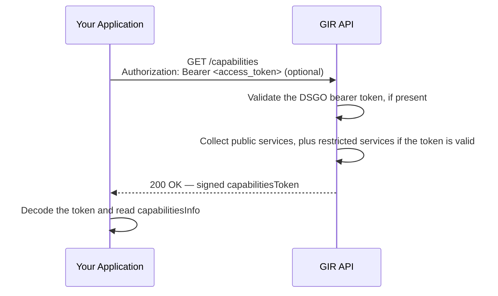

# Discovering GIR Capabilities (`GET /capabilities`)

🔗 [GIR API Docs ➚](https://gir-preview.poort8.nl/scalar/v1)

GIR publishes the DSGO services it offers through the DSGO `GET /capabilities` endpoint. This guide walks you through calling `GET /capabilities` and reading the response.

## When you need this

Call `GET /capabilities` when you want to discover:

- Which DSGO services GIR offers, and at which URL
- Which DSGO framework version and which GIR API version each service implements
- Where to obtain the DSGO bearer token that a service requires

GIR lists these services:

| Service | Route | Visibility | Service type |
|---------|-------|------------|--------------|
| Capabilities | `GET /capabilities` | Public | `framework-defined` |
| Access token | `POST /connect/token` | Public | `framework-defined` |
| Delegation | `POST /v1/api/delegation` | Restricted | `framework-defined` |
| Data services | `GET /dataServices` | Restricted | `framework-defined` |
| Register GIRBasisdataMessage | `POST /api/gir/v0/gir-basisdata-messages` | Restricted | `dataspace-defined` |
| Search GIRBasisdataMessages | `POST /api/gir/v0/gir-basisdata-messages/_search` | Restricted | `dataspace-defined` |
| Retrieve GIRBasisdataMessage | `GET /api/gir/v0/gir-basisdata-messages/{guid}` | Restricted | `dataspace-defined` |

Public services are always listed. Restricted services are only listed when you call the endpoint with a DSGO bearer token.

## Prerequisites

1. **None for public services** — You can call `GET /capabilities` without an access token.
2. **A DSGO bearer token for restricted services** — See [Obtaining a DSGO Bearer Token](connect-token.md).

## How it works



## Step 1: Send the request

Send a `GET` request, with or without a DSGO bearer token:

```http
GET https://gir-preview.poort8.nl/capabilities
Authorization: Bearer <access_token>
```

| Parameter | Value | Notes |
|-----------|-------|-------|
| `Authorization` (header) | `Bearer <access_token>` | Optional. Omit it to retrieve only the public services |
| `format` (query) | `jwt` or `json` | Optional. Defaults to `jwt` |

### Example (curl)

```bash
curl https://gir-preview.poort8.nl/capabilities \
  -H "Authorization: Bearer <access_token>"
```

To receive the payload as plain JSON instead of a signed token, add `?format=json`:

```bash
curl "https://gir-preview.poort8.nl/capabilities?format=json" \
  -H "Authorization: Bearer <access_token>"
```

## Step 2: Read the response

A successful response returns HTTP `200`. By default, the body contains a signed `capabilitiesToken`:

```json
{
  "capabilitiesToken": "eyJhbGciOiJSUzI1NiIsIng1YyI6WyJNSUl..."
}
```

GIR signs the `capabilitiesToken` with `RS256` and includes its certificate chain in the `x5c` header. The decoded payload looks like this (shortened to one service per list):

```json
{
  "iss": "did:ishare:EU.NL.NTRNL-76660680",
  "sub": "did:ishare:EU.NL.NTRNL-76660680",
  "aud": "did:ishare:EU.NL.NTRNL-<YOUR_KVK>",
  "jti": "5e0c1d2a-7f3b-4c8e-9a61-2b4d8f0e6c13",
  "nbf": 1790000000,
  "iat": 1790000000,
  "exp": 1790000030,
  "capabilitiesInfo": {
    "publicServices": [
      {
        "identifier": "capabilities",
        "title": "Capabilities",
        "description": "Retrieves the DSGO capabilities of this party.",
        "endpointDescription": "https://gir-preview.poort8.nl/openapi/v1.json",
        "endpointURL": "https://gir-preview.poort8.nl/capabilities",
        "tokenEndpoint": "https://gir-preview.poort8.nl/connect/token",
        "status": "active",
        "serviceType": "framework-defined",
        "version": {
          "compliesWithFrameworkVersions": ["2.1"],
          "capabilityVersion": "1.0"
        },
        "methods": ["GET"],
        "aal": "QSeal",
        "conformsTo": ["https://nl-digigo.github.io/DGSO-OAS/#tag/Central-Participant-Registry/operation/getCapabilities"]
      }
    ],
    "restrictedServices": [
      {
        "identifier": "gir-basisdata-messages-search",
        "title": "Search GIRBasisdataMessages",
        "description": "Searches GIRBasisdataMessages using filter criteria.",
        "endpointDescription": "https://gir-preview.poort8.nl/openapi/v1.json",
        "endpointURL": "https://gir-preview.poort8.nl/api/gir/v0/gir-basisdata-messages/_search",
        "tokenEndpoint": "https://gir-preview.poort8.nl/connect/token",
        "status": "active",
        "serviceType": "dataspace-defined",
        "version": {
          "compliesWithFrameworkVersions": ["2.1"],
          "capabilityVersion": "0.102.0"
        },
        "methods": ["POST"],
        "aal": "QSeal",
        "conformsTo": ["https://ketenstandaard.semantic-treehouse.nl/docs/api/GIR/#tag/GIRBasisdataMessage"]
      }
    ]
  }
}
```

With `?format=json`, GIR returns this same payload as the response body, unsigned and without the `nbf` claim.

| Field | Value | Notes |
|-------|-------|-------|
| `iss`, `sub` | `did:ishare:EU.NL.NTRNL-76660680` | GIR's own DID (preview) |
| `aud` | Your organization's DID | Omitted when you call the endpoint without a token |
| `exp` | `iat + 30` | The `capabilitiesToken` is valid for 30 seconds |
| `capabilitiesInfo.restrictedServices` | Array of services | Omitted when you call the endpoint without a token |
| `version.capabilityVersion` | `0.102.0` for the GIRBasisdataMessage services | The [Ketenstandaard GIR API ➚](https://ketenstandaard.semantic-treehouse.nl/docs/api/GIR/) version GIR implements |
| `tokenEndpoint` | `https://gir-preview.poort8.nl/connect/token` | Omitted for the access token service itself |

## Errors

| HTTP status | Message | Cause |
|-------------|---------|-------|
| `400 Bad Request` | Validation error: `Authorization header must use the Bearer scheme.` | The `Authorization` header uses a scheme other than `Bearer` |
| `400 Bad Request` | Validation error on `format` | `format` is not `jwt` or `json` |
| `401 Unauthorized` | No body | The bearer token is invalid or expired |
| `501 Not Implemented` | No body | The request contains a query parameter other than `format` |

## Common issues

| Symptom | Likely cause |
|---------|-------------|
| Response has no `restrictedServices` | The request was sent without an `Authorization` header |
| 401 with a token that worked before | The DSGO bearer token has expired after 3600 seconds: request a new one via `POST /connect/token` |
| 401 with a token from another identity provider | GIR only accepts DSGO bearer tokens obtained from `POST /connect/token` |
| 400 on every request with a token | The token is sent without the `Bearer ` prefix |

## API reference

- Interactive endpoint reference: [GIR API Docs ➚](https://gir-preview.poort8.nl/scalar/v1)
- DSGO specification: [GET /capabilities ➚](https://afsprakenstelseldsgo.atlassian.net/wiki/spaces/dsgo/pages/976065713/GET+capabilities) and [capabilitiesInfo object ➚](https://afsprakenstelseldsgo.atlassian.net/wiki/spaces/dsgo/pages/976066515/capabilitiesInfo+object)
- DSGO API definitions: [DSGO OAS ➚](https://nl-digigo.github.io/DGSO-OAS/#tag/Central-Participant-Registry/operation/getCapabilities)
