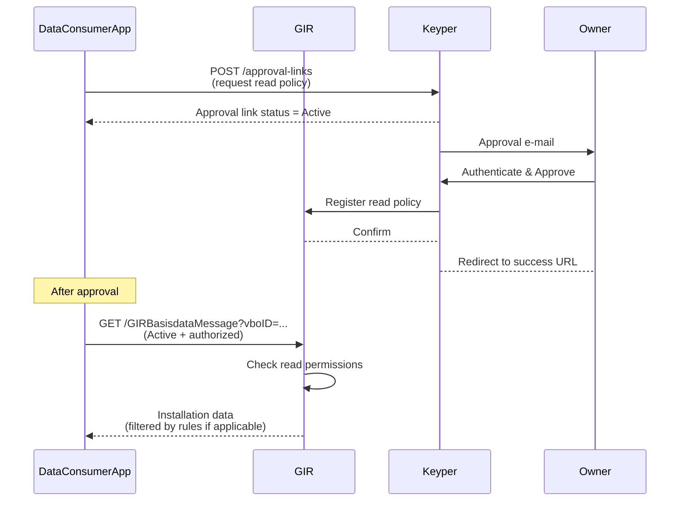

# Data-Consumer Flow – "May I read installation data?"

>**Note**: This guide covers version 1 (v1) of the Keyper API, of which the POST endpoint has been updated. If you're looking for coverage of the previous version (v0) of the Keyper API, please refer to the [legacy version of this guide](legacy/data-consumer-flow.md) instead.

This guide walks through the approval workflow for data consumers (like EDSN) who need read access to building installation data.

🔗 **[API Docs](https://keyper-preview.poort8.nl/scalar/v1#tag/approval-links/post/v1/api/approval-links)** – Interactive endpoint testing

## **Overview**

The data-consumer flow uses exactly the same approval-link structure as the [registrar flow](registrar-flow.md) but with a read-policy instead of a write-policy.

## **Sequence Diagram – Data-Consumer Flow**



## **Minimum Payload for POST /approval-links**

| **JSON path** | **Filled by** | **Value / validation** |
| -- | -- | -- |
| requester.\* | **App** | Consumer e-mail, name, organizationId="NL.KVK.<CONSUMER_KVK>" |
| approver.\* | **App** | Owner e-mail, name, organizationId="NL.KVK.<OWNER_KVK>" |
| dataspace.\* | **Fixed** | baseUrl:"https://gir-preview.poort8.nl" |
| description | **App** | Shown to owner |
| reference | **App** | Internal ID (not used by Keyper) |
| addPolicyTransactions\[0\] | **App** | Single **read** policy (data-consumer) – see example |
| orchestration.flow | **Fixed** | "dsgo.gir@v1" |
| addOROrganizationTransaction | **Optional** | Include if owner not in OR – see section on [Missing Owner](#missing-owner-in-the-organization-register) below |

**Notes:**
- **One policy per VBO-ID** – use separate policy transactions in a single approval-link for different buildings
- **BAG validation**: `resourceId` must be a valid 16-digit BAG VBO-ID; Keyper returns 400 if not found
- **Rules filtering**: Optional `rules` field can specify NL/SfB classifications; omit for full building access

## **JSON Skeleton**

```json
{
  "requester": {
    "name": "<CONSUMER_NAME>",
    "email": "<CONSUMER_EMAIL>",
    "organization": "<CONSUMER_ORGANIZATION_NAME>",
    "organizationId": "NL.KVK.<CONSUMER_KVK>"
  },
  "approver": {
    "name": "<OWNER_NAME>",
    "email": "<OWNER_EMAIL>",
    "organization": "<OWNER_ORGANIZATION_NAME>",
    "organizationId": "NL.KVK.<OWNER_KVK>"
  },
  "dataspace": {
    "baseUrl": "https://gir-preview.poort8.nl"
  },
  "description": "Data access approval for GIR installation data",
  "reference": "<APP_REFERENCE>",
  "addPolicyTransactions": [
    {
      "useCase": "GIR",
      "issuedAt": "<NOW>",
      "notBefore": "<NOW>",
      "expiration": "<NOW_PLUS_3Y>",
      "issuerId": "NL.KVK.<OWNER_KVK>",
      "subjectId": "NL.KVK.<CONSUMER_KVK>",
      "serviceProvider": "NL.KVK.27248698",
      "action": "read",
      "resourceId": "<VBO_ID>",
      "type": "vboID",
      "attribute": "*",
      "license": "0005",
      "rules": "Classificaties(...)"
    }
  ],
  "orchestration": { "flow": "dsgo.gir@v1" }
}
```

| Field | Notes |
|-------|-------|
| `issuedAt`, `notBefore`, `expiration` | Unix timestamps. Keyper may override if in the past |
| `rules` | Optional – NL/SfB classification filter. Remove field for full building access |

**⚠️ Note**: In production, `serviceProvider` changes to **NL.KVK.41084554** (Stichting Ketenstandaard).

## **Authentication Example**

### **Data-Consumer Token**

```bash
curl -X POST https://poort8.eu.auth0.com/oauth/token \
  -H "Content-Type: application/json" \
  -d '{
        "client_id": "<CONSUMER_CLIENT_ID>",
        "client_secret": "<CONSUMER_CLIENT_SECRET>",
        "audience": "Poort8-Dataspace-Keyper-Preview",
        "grant_type": "client_credentials"
      }'
```

*No scope required. In production, use `audience`: `Poort8-Dataspace-Keyper`.*

## **Complete Example Request**

### **Example 1: Access with NL/SfB Classification Filter**

```bash
curl -X POST https://keyper-preview.poort8.nl/v1/api/approval-links \
  -H "Authorization: Bearer <CONSUMER_ACCESS_TOKEN>" \
  -H "Content-Type: application/json" \
  -d '{
    "requester": {
      "name": "EDSN representative",
      "email": "data@edsn.nl",
      "organization": "EDSN",
      "organizationId": "NL.KVK.39098825"
    },
    "approver": {
      "name": "Building owner",
      "email": "owner@building.com",
      "organization": "Building Owner BV",
      "organizationId": "NL.KVK.87654321"
    },
    "dataspace": {
      "baseUrl": "https://gir-preview.poort8.nl"
    },
    "description": "EDSN access to building installation data for energy monitoring",
    "reference": "EDSN-ACCESS-2025-001",
    "addPolicyTransactions": [
      {
        "useCase": "GIR",
        "issuedAt": 1739881378,
        "notBefore": 1739881378,
        "expiration": 1839881378,
        "issuerId": "NL.KVK.87654321",
        "subjectId": "NL.KVK.39098825",
        "serviceProvider": "NL.KVK.27248698",
        "action": "read",
        "resourceId": "0344010000126888",
        "type": "vboID",
        "attribute": "*",
        "license": "0005",
        "rules": "Classificaties(NLSfB-55.21,NLSfB-56.21,NLSfB-61.15,NLSfB-62.32,NLSfB-61.10)"
      }
    ],
    "orchestration": { "flow": "dsgo.gir@v1" }
  }'
```

### **Example 2: Full Building Access (No NL/SfB Classification Filter)**

```bash
curl -X POST https://keyper-preview.poort8.nl/v1/api/approval-links \
  -H "Authorization: Bearer <CONSUMER_ACCESS_TOKEN>" \
  -H "Content-Type: application/json" \
  -d '{
    "requester": {
      "name": "Research Institute representative",
      "email": "research@university.nl",
      "organization": "Research Institute",
      "organizationId": "NL.KVK.12345678"
    },
    "approver": {
      "name": "Building owner",
      "email": "owner@building.com",
      "organization": "Building Owner BV",
      "organizationId": "NL.KVK.87654321"
    },
    "dataspace": {
      "baseUrl": "https://gir-preview.poort8.nl"
    },
    "description": "Research access to all building installation data",
    "reference": "RESEARCH-ACCESS-2025-001",
    "addPolicyTransactions": [
      {
        "useCase": "GIR",
        "issuedAt": 1739881378,
        "notBefore": 1739881378,
        "expiration": 1839881378,
        "issuerId": "NL.KVK.87654321",
        "subjectId": "NL.KVK.12345678",
        "serviceProvider": "NL.KVK.27248698",
        "action": "read",
        "resourceId": "0344010000126888",
        "type": "vboID",
        "attribute": "*",
        "license": "0005"
      }
    ],
    "orchestration": { "flow": "dsgo.gir@v1" }
  }'
```

### **Example Response**

```json
{
  "id": "a1b2c3d4-5678-90ef-ghij-klmnopqrstuv",
  "reference": "EDSN-ACCESS-2025-001",
  "url": "https://keyper-preview.poort8.nl/approve?id=a1b2c3d4-5678-90ef-ghij-klmnopqrstuv",
  "expiresAtUtc": 1739884978,
  "status": "Active"
}
```

The `url` is the approval link. Once the owner approves, `status` changes to `Approved`.

> **Note**: By default, Keyper sends an email to the approver when the approval link is created. You don't need to send the URL manually unless you want to use a custom notification flow.

## **Common Error Responses**

| **Status** | **Scenario** | **Solution** |
|------------|--------------|--------------|
| `400` | Invalid/unknown VBO-ID | Verify BAG VBO-ID format (16 digits) |
| `400` | Invalid organizationId format | Use "NL.KVK." prefix + valid KVK number |

## **Missing Owner in the Organization Register?**

If the installation owner is not yet registered in the Organization Register, include an `addOROrganizationTransaction` in your approval-link request with at least:

```json
{
  "identifier": "NL.KVK.<OWNER_KVK>",
  "name": "<Owner name>",
  "adherence": { "status": "Active" }
}
```

This ensures the owner organization is properly registered before the approval flow begins. See the full [iSHARE specification](https://dev.ishare.eu/participant-registry-role/create-entitled-party) for complete details. ⚠️ In production this transaction will potentially change to match the interface of the DSGO Participant register.

## **Follow-up Actions**

After the approval of the approval link by the owner, the data-consumer can immediately begin querying installation data:

```bash
GET /api/GIRBasisdataMessage?vboID=<VBO_ID>
```

**Access behavior**: Only `Active` installations with matching read policies will be returned. If rules were specified in the policy, only installations matching those NL/SfB classifications will be visible.

For complete querying details, see the [Querying Installations](README.md#4-querying-installations) section.
