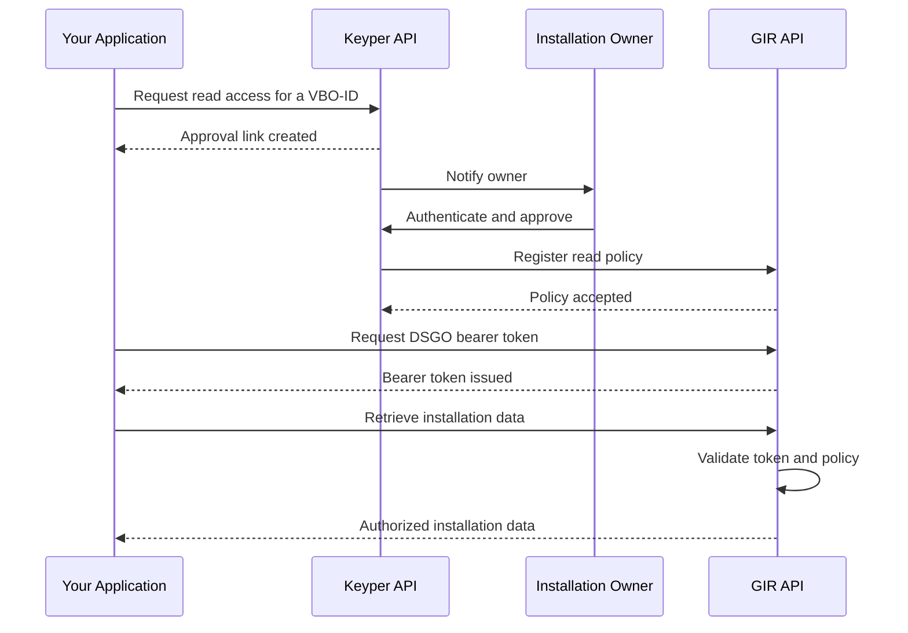
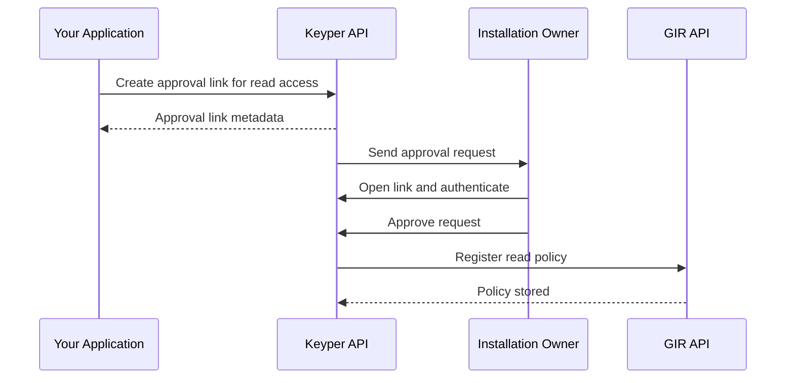
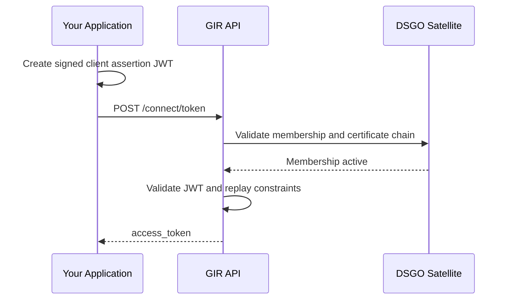
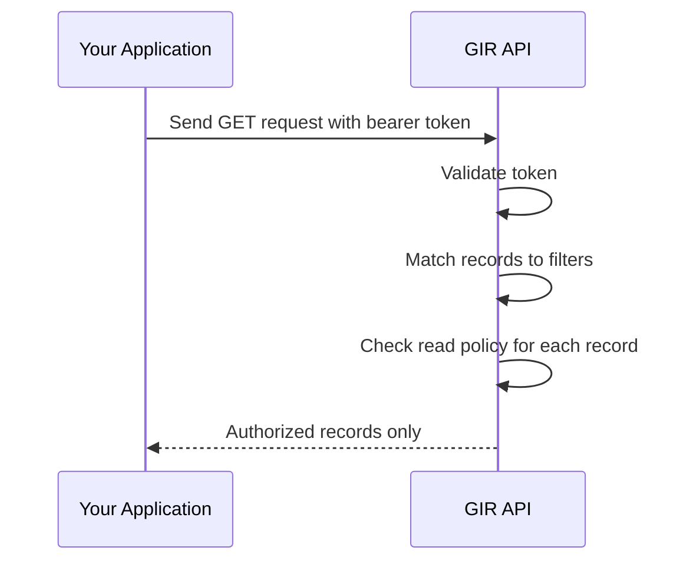
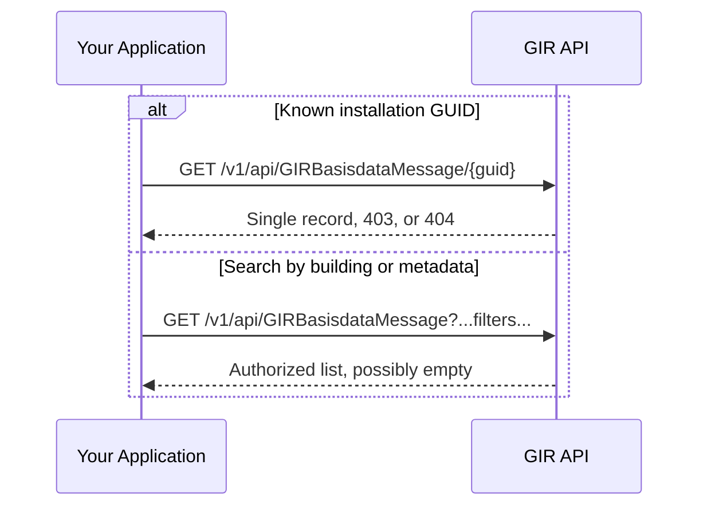
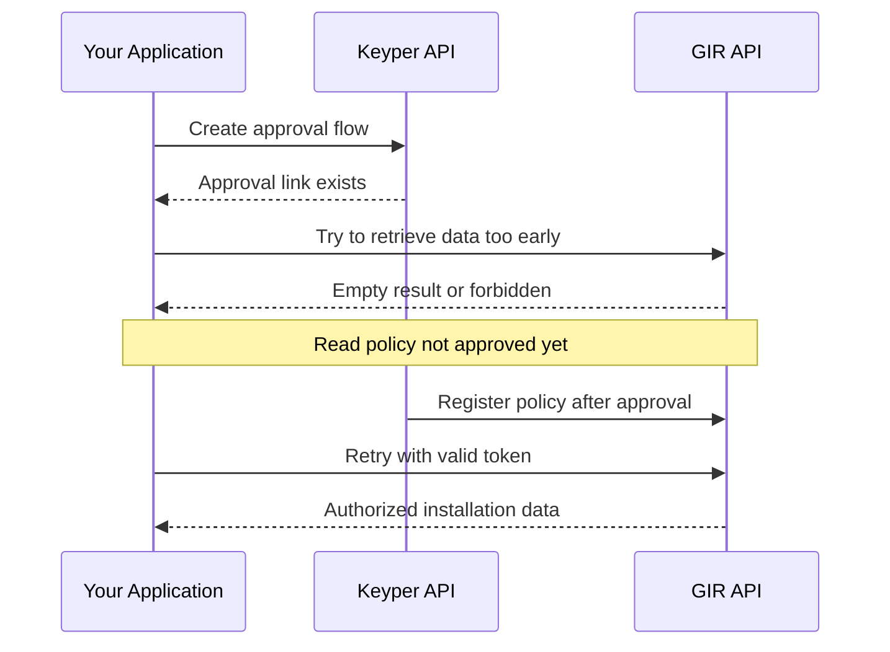

# Data Consumer Integration Guide

This guide explains the end-to-end flow for data consumers that want to retrieve installation data from GIR.

It is intentionally an overview page. It describes how the flow works across Keyper, DSGO, and GIR, while endpoint-level implementation details are documented in the dedicated guides.

To successfully read data from GIR, two conditions must be met:

- Your organization must have an approved read policy for the target building.
- Your application must call GIR with a valid DSGO bearer token.

## Overview

The data-consumer flow has three steps:

1. Request and obtain read access for a building through Keyper.
2. Obtain a DSGO bearer token for GIR.
3. Retrieve installation data from GIR.

This page focuses on orchestration between systems. For payloads, parameters, and response schemas, use the endpoint-specific guides linked throughout this document.

## End-to-End Orchestration

```mermaid
sequenceDiagram
    participant App as Your Application
    participant Keyper as Keyper API
    participant Owner as Installation Owner
    participant GIR as GIR API

    App->>Keyper: Request read access for a VBO-ID
    Keyper-->>App: Approval link created
    Keyper->>Owner: Notify owner
    Owner->>Keyper: Authenticate and approve
    Keyper->>GIR: Register read policy
    GIR-->>Keyper: Policy accepted

    App->>GIR: Request DSGO bearer token
    GIR-->>App: Bearer token issued

    App->>GIR: Retrieve installation data
    GIR->>GIR: Validate token and policy
    GIR-->>App: Authorized installation data
```

## Step 1: Ensure a valid Keyper read policy is present

Before GIR can return data to a data consumer, the installation owner must approve access for the relevant building.

At a high level, your application asks Keyper to create an approval flow for a specific building, the owner approves it, and Keyper registers the resulting read policy in GIR.

```mermaid
sequenceDiagram
    participant App as Your Application
    participant Keyper as Keyper API
    participant Owner as Installation Owner
    participant GIR as GIR API

    App->>Keyper: Create approval link for read access
    Keyper-->>App: Approval link metadata
    Keyper->>Owner: Send approval request
    Owner->>Keyper: Open link and authenticate
    Owner->>Keyper: Approve request
    Keyper->>GIR: Register read policy
    GIR-->>Keyper: Policy stored
```

### What must align

The approval flow must consistently target:

- The building identifier as a BAG VBO-ID.
- The installation owner's DID.
- The data consumer's DID.
- Optional classification rules, if access should be scoped.

If these identifiers do not line up with the later GIR query, the query may return no data even though the approval flow itself succeeded.

### What changes after approval

After owner approval completes:

- A read policy exists in GIR for the building.
- GIR can authorize your organization for matching installation records.
- Your application can move on to token acquisition and data retrieval.

### Implementation references

- [../keyper/README.md](../keyper/README.md)
- [Keyper API Docs ➚](https://keyper-preview.poort8.nl/scalar/v1)

## Step 2: Obtain a DSGO bearer token

All GIR read requests require a DSGO bearer token.

The token does not replace the read policy from Step 1. Both are needed:

- The token authenticates your application to GIR.
- The read policy authorizes access to the building data.

```mermaid
sequenceDiagram
    participant App as Your Application
    participant GIR as GIR API
    participant SAT as DSGO Satellite

    App->>App: Create signed client assertion JWT
    App->>GIR: POST /connect/token
    GIR->>SAT: Validate membership and certificate chain
    SAT-->>GIR: Membership active
    GIR->>GIR: Validate JWT and replay constraints
    GIR-->>App: access_token
```

### Operational meaning

Request a token when:

- Your application is about to call GIR.
- The previous token has expired.
- You are starting a new retrieval batch and want a fresh token lifecycle.

A valid token by itself is not enough to read installation data if no matching read policy exists.

### Implementation references

- [connect-token.md](connect-token.md)
- [GIR API Docs ➚](https://gir-preview.poort8.nl/scalar/v1)
- [DSGO Developer Portal ➚](https://digigo-nu.gitbook.io/dsgo-developer-portal/)

## Step 3: Retrieve installation data

Once Step 1 and Step 2 are complete, your application can query GIR.

At runtime, GIR evaluates both the token and the installed authorization state before returning data.

```mermaid
sequenceDiagram
    participant App as Your Application
    participant GIR as GIR API

    App->>GIR: Send GET request with bearer token
    GIR->>GIR: Validate token
    GIR->>GIR: Match records to filters
    GIR->>GIR: Check read policy for each record
    GIR-->>App: Authorized records only
```

### Two retrieval patterns

Use one of these guides depending on how your application retrieves data:

- [retrieve-installation.md](retrieve-installation.md) for a single known GUID.
- [retrieve-installations.md](retrieve-installations.md) for filtered list retrieval.

### Runtime decision flow

```mermaid
sequenceDiagram
    participant App as Your Application
    participant GIR as GIR API

    alt Known installation GUID
        App->>GIR: GET /v1/api/GIRBasisdataMessage/{guid}
        GIR-->>App: Single record, 403, or 404
    else Search by building or metadata
        App->>GIR: GET /v1/api/GIRBasisdataMessage?...filters...
        GIR-->>App: Authorized list, possibly empty
    end
```

### What data is actually visible

For data consumers, GIR only returns records that satisfy authorization.

In practice this means:

- Records outside your approved building scope are excluded.
- Records outside your rule scope are excluded when rules are used.
- Records you are not authorized to read are not returned.

For list retrieval, unauthorized matches are silently excluded. For single-record retrieval, an existing record can still result in `403 Forbidden`.

## What happens when the flow is incomplete

The most common operational issue is that one part of the flow has completed and another has not.

```mermaid
sequenceDiagram
    participant App as Your Application
    participant Keyper as Keyper API
    participant GIR as GIR API

    App->>Keyper: Create approval flow
    Keyper-->>App: Approval link exists
    App->>GIR: Try to retrieve data too early
    GIR-->>App: Empty result or forbidden
    Note over App,GIR: Read policy not approved yet

    Keyper->>GIR: Register policy after approval
    App->>GIR: Retry with valid token
    GIR-->>App: Authorized installation data
```

Typical causes of incomplete access:

- The owner has not approved the Keyper request yet.
- The query targets a different VBO-ID than the approved policy.
- The bearer token is missing or expired.
- Classification rules were applied and requested records fall outside them.

## Recommended implementation split

Treat the flow in your application as three separate concerns:

1. Approval orchestration.
   Use Keyper to create and monitor access requests.
2. Token lifecycle.
   Obtain and refresh DSGO bearer tokens as needed.
3. Data retrieval.
   Use the appropriate GIR read endpoint depending on whether you fetch one record or many.

This split makes troubleshooting easier because each concern has its own state and dedicated implementation guide.

## Implementation guides

Use these pages when moving from flow design into endpoint integration:

- [connect-token.md](connect-token.md)
- [retrieve-installation.md](retrieve-installation.md)
- [retrieve-installations.md](retrieve-installations.md)

Related context:

- [README.md](README.md)
- [insert-installation.md](insert-installation.md#activation-after-write-approval)

## Summary

| Step | Goal | Result |
|------|------|--------|
| 1. Keyper approval | Obtain owner-approved read access for a building | Read policy becomes active in GIR |
| 2. Token acquisition | Authenticate your application to GIR | DSGO bearer token available |
| 3. GIR retrieval | Retrieve installation data | Authorized records returned |

For repeated retrieval on the same building, Step 1 usually does not need to be repeated until the policy expires. Step 2 is repeated whenever the current token expires.
