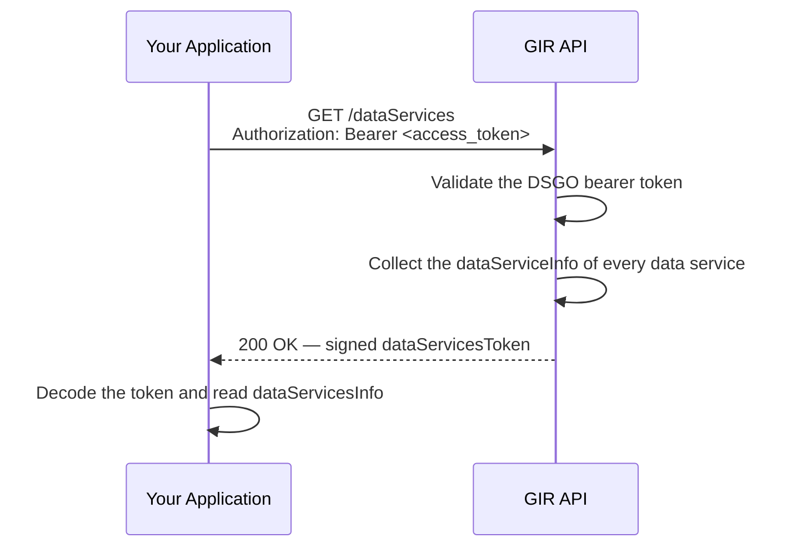

# Discovering GIR Data Services (`GET /dataServices`)

🔗 [GIR API Docs ➚](https://gir-preview.poort8.nl/scalar/v1)

GIR publishes the conditions under which its data services are offered through the DSGO `GET /dataServices` endpoint. This guide walks you through calling `GET /dataServices` and reading the response.

## When you need this

Call `GET /dataServices` when you want to know, for each GIR data service:

- Which access rights, license, and costs apply
- Which type of data service consumer is supported, and which level of assurance is required
- Which service levels (availability and performance) you can expect

`GET /dataServices` complements [`GET /capabilities`](capabilities.md): `/capabilities` describes *where* and *how* to call a service technically, `/dataServices` describes the terms under which the data services are offered.

GIR offers one data service per GIRBasisdataMessage endpoint:

| Data service | Route |
|--------------|-------|
| Register GIRBasisdataMessage | `POST /api/gir/v0/gir-basisdata-messages` |
| Retrieve GIRBasisdataMessage | `GET /api/gir/v0/gir-basisdata-messages/{guid}` |
| Search GIRBasisdataMessages | `POST /api/gir/v0/gir-basisdata-messages/_search` |

## Prerequisites

1. **A DSGO bearer token** — See [Obtaining a DSGO Bearer Token](connect-token.md).

## How it works



## Step 1: Send the request

Send a `GET` request with a DSGO bearer token:

```http
GET https://gir-preview.poort8.nl/dataServices
Authorization: Bearer <access_token>
```

| Parameter | Value | Notes |
|-----------|-------|-------|
| `Authorization` (header) | `Bearer <access_token>` | Required |
| `format` (query) | `jwt` or `json` | Optional. Defaults to `jwt` |

### Example (curl)

```bash
curl https://gir-preview.poort8.nl/dataServices \
  -H "Authorization: Bearer <access_token>"
```

To receive the payload as plain JSON instead of a signed token, add `?format=json`:

```bash
curl "https://gir-preview.poort8.nl/dataServices?format=json" \
  -H "Authorization: Bearer <access_token>"
```

## Step 2: Read the response

A successful response returns HTTP `200`. By default, the body contains a signed `dataServicesToken`:

```json
{
  "dataServicesToken": "eyJhbGciOiJSUzI1NiIsIng1YyI6WyJNSUl..."
}
```

GIR signs the `dataServicesToken` with `RS256` and includes its certificate chain in the `x5c` header. The decoded payload looks like this:

```json
{
  "iss": "did:ishare:EU.NL.NTRNL-76660680",
  "sub": "did:ishare:EU.NL.NTRNL-76660680",
  "aud": "did:ishare:EU.NL.NTRNL-<YOUR_KVK>",
  "jti": "5e0c1d2a-7f3b-4c8e-9a61-2b4d8f0e6c13",
  "nbf": 1790000000,
  "iat": 1790000000,
  "exp": 1790000030,
  "dataServicesInfo": {
    "count": 3,
    "totalCount": 3,
    "currentPage": 1,
    "pageSize": 3,
    "totalPages": 1,
    "data": [
      {
        "accessRights": "Requires a valid DSGO access token. Only GIRBasisdataMessages the calling party is authorised for, directly or via delegation evidence, are returned.",
        "contactPoint": "hello@poort8.nl",
        "costs": "Not Applicable",
        "dataServiceConsumerType": "M2M",
        "hasPolicy": "None",
        "license": ["DSGO.0001"],
        "securityLevel": "Not Applicable",
        "serviceLevelAgreements": [
          {
            "availability": [
              { "monday": { "start": "00:00", "end": "23:59" } },
              { "tuesday": { "start": "00:00", "end": "23:59" } },
              { "wednesday": { "start": "00:00", "end": "23:59" } },
              { "thursday": { "start": "00:00", "end": "23:59" } },
              { "friday": { "start": "00:00", "end": "23:59" } },
              { "saturday": { "start": "00:00", "end": "23:59" } },
              { "sunday": { "start": "00:00", "end": "23:59" } }
            ]
          },
          { "performance": "Best effort" }
        ]
      }
      // ... 2 more data service objects
    ]
  }
}
```

> [TBD] The license, costs, service level and policy values shown above are provisional and may change.

With `?format=json`, GIR returns this same payload as the response body, unsigned and without the `nbf` claim.

| Field | Value | Notes |
|-------|-------|-------|
| `iss`, `sub` | `did:ishare:EU.NL.NTRNL-76660680` | GIR's own DID (preview) |
| `aud` | Your organization's DID | |
| `exp` | `iat + 30` | The `dataServicesToken` is valid for 30 seconds |
| `dataServicesInfo.data` | Array of `dataServiceInfo` objects | One per GIRBasisdataMessage endpoint |
| `dataServicesInfo.currentPage`, `totalPages` | `1` | GIR returns all data services in a single page; `next` and `previous` are omitted |
| `serviceLevelAgreements` | Array | Contains one `availability` object (one entry per weekday) and one `performance` object |

## Errors

| HTTP status | Message | Cause |
|-------------|---------|-------|
| `400 Bad Request` | Validation error: `Authorization header must use the Bearer scheme.` | The `Authorization` header uses a scheme other than `Bearer` |
| `400 Bad Request` | Validation error on `format` | `format` is not `jwt` or `json` |
| `401 Unauthorized` | No body | The bearer token is missing, invalid or expired |
| `501 Not Implemented` | No body | The request contains a query parameter other than `format`, such as `page` or `size` |

## Common issues

| Symptom | Likely cause |
|---------|-------------|
| 401 without a token | `GET /dataServices` always requires a DSGO bearer token, unlike `GET /capabilities` |
| 401 with a token that worked before | The DSGO bearer token has expired after 3600 seconds: request a new one via `POST /connect/token` |
| 401 with a token from another identity provider | GIR only accepts DSGO bearer tokens obtained from `POST /connect/token` |
| 501 when requesting a page | GIR does not support pagination on `GET /dataServices`: omit `page` and `size` |

## API reference

- Interactive endpoint reference: [GIR API Docs ➚](https://gir-preview.poort8.nl/scalar/v1)
- DSGO API definitions: [DSGO OAS ➚](https://nl-digigo.github.io/DGSO-OAS/#tag/Central-Participant-Registry/operation/getDataServices)
- DSGO specification: [GET /dataServices ➚](https://afsprakenstelseldsgo.atlassian.net/wiki/spaces/dsgo/pages/976065857/GET+dataServices) and [dataServicesInfo object ➚](https://afsprakenstelseldsgo.atlassian.net/wiki/spaces/dsgo/pages/976066546/dataServicesInfo+object). Where these differ from the DSGO OAS, GIR follows the DSGO OAS.
