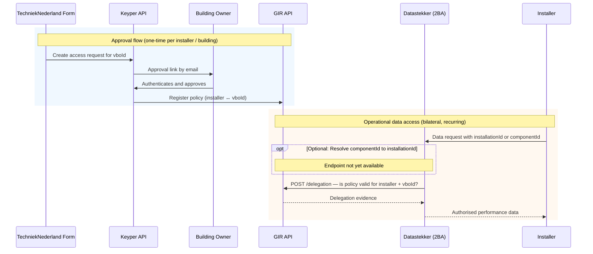

# Datastekker – Installer Access Flow

> **⚠️ Design document — not ready for implementation**
>
> This document describes the intended flow for the Datastekker use case. Several open questions remain unresolved (see [Open Questions](#open-questions)). Policy field values, data-element sets, and license conditions have not been finalised. Do not use this document as the basis for implementation until it has been marked as approved.

Datastekker (developed by 2BA) retrieves performance data from installation manufacturers and translates it into uniform performance data using the Heatpump Common Ontology. To access this data, an installer needs explicit consent from the building owner. GIR manages that authorization.

This guide describes how an installer requests access through a form on the TechniekNederland website, how the building owner approves the request via Keyper, and how Datastekker validates authorization against the GIR delegation endpoint on every data request.

🔗 [Keyper API Docs ➚](https://keyper-preview.poort8.nl/scalar/v1)
🔗 [GIR API Docs ➚](https://gir-preview.poort8.nl/scalar/v1)

## Parties

| Role | Party | Description |
|------|-------|-------------|
| Datastekker | 2BA | Data service provider; retrieves installation data from manufacturers and exposes it via an API |
| Installer (installateur) | Installation company | Data service consumer; requests access to performance data for installations they maintain |
| Building owner (gebouw-eigenaar) | Property owner | Approves the access request; has authority over the installations in the building |
| TechniekNederland | Industry association | Hosts the form through which the access request is initiated |
| GIR | Gebouw-Installatie-Registratie | Manages policy registration and enforces authorization via the delegation endpoint |
| Keyper | Poort8 | Orchestrates the approval flow and registers the policy in GIR after approval |

## Overview

The flow has two phases: a one-time approval flow and a recurring operational data access pattern.



### Steps

**Approval flow (one-time per installer / building)**

1. The form submits an access request for the vboId to Keyper.
2. Keyper sends the building owner an approval link by email.
3. The building owner authenticates and approves.
4. Keyper registers the policy in GIR.

**Operational data access (bilateral, recurring)**

5. The installer sends a data request with an installationId or componentId to Datastekker.
6. *(Optional)* Datastekker queries GIR to resolve a componentId to an installationId.
7. Datastekker checks the GIR delegation endpoint to verify the active policy.
8. Datastekker returns authorised performance data to the installer.

## Before the Approval Flow

The TechniekNederland form collects the following information before triggering the Keyper flow:

| Field | Description |
|-------|-------------|
| vboId | BAG Verblijfsobjectidentificatie (16-digit building identifier) |
| Installer (KvK) | KvK number of the installation company requesting access |
| Building owner (KvK) | KvK number of the owner who approves the request |
| Validity period | Start and end date of the requested access |
| Data-element set | Which set of performance data becomes accessible [TBD — see open questions] |
| License conditions | Terms of use for the data [TBD — see open questions] |

> ℹ️ This step is outside the scope of GIR and Keyper. TechniekNederland builds and manages the form.

The form may optionally query GIR to display the installations registered at the given building, so the user can scope the request:

```http
GET https://gir-preview.poort8.nl/v1/api/GIRBasisdataMessage?vboID={vboId}
Authorization: Bearer <ACCESS_TOKEN>
Accept: application/json
```

This returns a list of registered installations including their `installationID.value` and component information. See [Retrieve Multiple Installations](retrieve-installations.md) for the full parameter reference and the required DSGO token.

## Approval Flow

### Step 1: Form Submits Access Request to Keyper *(Poort8)*

After the form is submitted, TechniekNederland sends a request to the Keyper API. Keyper generates an approval link and sends a notification email to the building owner.

**Keyper Approve API example:**

```http
POST https://keyper-preview.poort8.nl/v1/api/approval-links
Authorization: Bearer <ACCESS_TOKEN>
Content-Type: application/json
```

```json
{
  "requester": {
    "name": "<INSTALLER NAME>",
    "email": "<INSTALLER EMAIL>",
    "organization": "<INSTALLER COMPANY NAME>",
    "organizationId": "did:ishare:EU.NL.NTRNL-<INSTALLER KVK>"
  },
  "approver": {
    "name": "<BUILDING OWNER NAME>",
    "email": "<BUILDING OWNER EMAIL>",
    "organization": "<BUILDING OWNER ORGANISATION>",
    "organizationId": "did:ishare:EU.NL.NTRNL-<BUILDING OWNER KVK>"
  },
  "dataspace": {
    "baseUrl": "https://gir-preview.poort8.nl"
  },
  "reference": "<UNIQUE REFERENCE>",
  "addPolicyTransactions": [
    {
      "type": "[TBD — instance-specific]",
      "action": "[TBD — instance-specific, e.g. read]",
      "license": "[TBD — see open questions]",
      "useCase": "[TBD — instance-specific]",
      "issuedAt": "<UNIX TIMESTAMP>",
      "issuerId": "did:ishare:EU.NL.NTRNL-<BUILDING OWNER KVK>",
      "attribute": "[TBD — identifier for the data-element set]",
      "notBefore": "<UNIX TIMESTAMP>",
      "subjectId": "did:ishare:EU.NL.NTRNL-<INSTALLER KVK>",
      "expiration": "<UNIX TIMESTAMP matching validity period>",
      "resourceId": "<VBOID — BAG Verblijfsobjectidentificatie>",
      "serviceProvider": "did:ishare:EU.NL.NTRNL-<2BA (DATASTEKKER) KVK>"
    }
  ],
  "orchestration": {
    "flow": "dsgo.[TBD — instance-specific]@v1"
  }
}
```

The fields `type`, `license`, `useCase`, `attribute`, and `orchestration.flow` are instance-specific and will be determined during technical configuration of the Datastekker integration. See the [Keyper API reference ➚](https://keyper-preview.poort8.nl/scalar/v1) for full field documentation.

### Step 2: Keyper Sends Approval Link to Building Owner *(Poort8)*

Keyper generates a unique approval link and sends a notification email to the building owner. No action is required from the installer or TechniekNederland at this point.

### Step 3: Building Owner Authenticates and Approves *(Poort8)*

The building owner opens the approval link and:

1. Authenticates (for example via eHerkenning).
2. Inspects the requested access: which building, which installer, which data, for how long.
3. Clicks **Approve** or **Reject**.

If the building owner rejects the request, the approval link expires and TechniekNederland can initiate a new request.

### Step 4: Keyper Registers Policy in GIR *(Poort8)*

On approval, Keyper automatically registers the policy in the GIR Authorization Register. The installer does not need to take any action. The policy is now active and Datastekker can enforce it on every subsequent data request.

## Operational Data Access

### Step 5: Installer Sends Data Request to Datastekker *(external)*

The data exchange between the installer and Datastekker is bilateral and does not flow through GIR. The installer calls the Datastekker API directly, using an installationId or componentId as the identifier.

> ℹ️ The Datastekker API endpoints are outside the scope of this document. Contact 2BA for the technical specifications.

### Step 6 (optional): Datastekker Resolves componentId to installationId *(Poort8)*

If the installer provides a `componentId` rather than an `installationId`, Datastekker needs to resolve it to an installationId before it can check the delegation policy.

> ℹ️ A GIR endpoint for resolving a componentId to an installationId is not yet available. This step is a placeholder pending that capability.

### Step 7: Datastekker Checks Delegation in GIR *(Poort8)*

Datastekker calls the GIR delegation endpoint to verify that an active and valid policy exists for the installer:

```http
POST https://gir-preview.poort8.nl/delegation
Authorization: Bearer <ACCESS_TOKEN>
Content-Type: application/json
```

```json
{
  "delegationRequest": {
    "policyIssuer": "did:ishare:EU.NL.NTRNL-<BUILDING OWNER KVK>",
    "target": {
      "accessSubject": "did:ishare:EU.NL.NTRNL-<INSTALLER KVK>"
    },
    "policySets": [
      {
        "policies": [
          {
            "target": {
              "resource": {
                "type": "[TBD — instance-specific]",
                "identifiers": ["<VBOID>"],
                "attributes": ["[TBD — data-element set]"]
              },
              "actions": ["[TBD — instance-specific, e.g. read]"],
              "environment": {
                "serviceProviders": ["did:ishare:EU.NL.NTRNL-<2BA KVK>"]
              }
            }
          }
        ]
      }
    ]
  }
}
```

### Step 8: Datastekker Returns Authorised Data *(Poort8)*

GIR responds with a `delegationEvidence` object. Datastekker inspects this to confirm the policy covers the requested data elements and has not expired:

```json
{
  "delegationEvidence": {
    "notBefore": "<UNIX TIMESTAMP>",
    "notOnOrAfter": "<UNIX TIMESTAMP>",
    "policyIssuer": "did:ishare:EU.NL.NTRNL-<BUILDING OWNER KVK>",
    "target": {
      "accessSubject": "did:ishare:EU.NL.NTRNL-<INSTALLER KVK>"
    },
    "policySets": [
      {
        "maxDelegationDepth": 0,
        "target": {
          "environment": {
            "licenses": ["[TBD — license identifier]"]
          }
        },
        "policies": [
          {
            "target": {
              "resource": {
                "type": "[TBD — instance-specific]",
                "identifiers": ["<VBOID>"],
                "attributes": ["[TBD — data-element set]"]
              },
              "actions": ["[TBD — instance-specific, e.g. read]"],
              "environment": {
                "serviceProviders": ["did:ishare:EU.NL.NTRNL-<2BA KVK>"]
              }
            },
            "rules": [
              { "effect": "Permit" }
            ]
          }
        ]
      }
    ]
  }
}
```

If no matching policy exists or the policy has expired, GIR returns a response without a `Permit` rule. Datastekker treats any non-permit result as an authorization failure and returns an error to the installer.

## Policy Parameters

| Parameter | Description | Status |
|-----------|-------------|--------|
| `vboId` | BAG Verblijfsobjectidentificatie of the building | Registered in the Keyper policy |
| `installationId` | Installation identifier from GIRBasisdataMessage | Resolved by Datastekker via GIR |
| Validity period | Start and end date of access | Provided with the Keyper request |
| Data-element set | Which performance data is accessible | [TBD — see open questions] |
| License conditions | Terms of use and restrictions | [TBD — see open questions] |

## Open Questions

The following points are unresolved and must be answered before the integration can be fully specified.

**1. Boundary between legal and technical aspects**

The line between what is legal and what is technical in nature is still unclear. Discussions span both domains simultaneously, making it difficult to reach concrete technical decisions. It would be beneficial to document the legal framework separately before locking in technical implementation choices.

**2. Requirements on software parties versus installers**

Why must a software party operating on behalf of an installer meet more requirements than an installer who has written their own software and acts directly? The basis for this distinction needs to be clarified.

**3. Validation of the installer with the manufacturer**

Should an installer also be validated by the installation manufacturer — for example before being allowed to adjust installation parameters? It is not yet clear whether this becomes part of the authorization flow and what the implications are for the policy model.

**4. Predefined data-element sets**

Which fixed sets of data elements can be authorized? This has a direct impact on the requirements for the Datastekker API: the API must recognise the requested set and filter on it. The definition of these sets is a prerequisite before the `attribute` field in the policy and delegation request can be filled in.

**5. License conditions**

Which license conditions apply to the use of performance data? Considerations include:

- Obligation to delete data after use (purpose limitation)
- Prohibition on re-use or onward sharing with third parties
- GDPR requirements for buildings with occupants, where performance data may indirectly constitute personal data

---

## Further Reading

- [Data-Consumer Flow](data-consumer-flow.md) — alternative data-access flow through GIR
- [Retrieve Multiple Installations](retrieve-installations.md) — querying GIRBasisdataMessage by vboId
- [GIR API Docs ➚](https://gir-preview.poort8.nl/scalar/v1)
- [Keyper API Docs ➚](https://keyper-preview.poort8.nl/scalar/v1)
- [NoodleBar Documentation](../noodlebar/)
