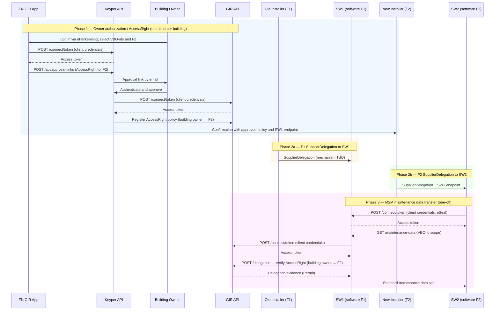
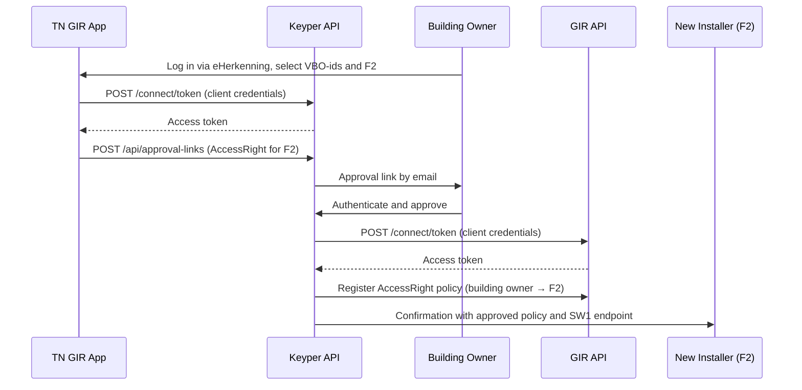
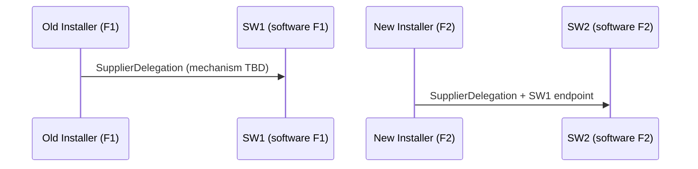
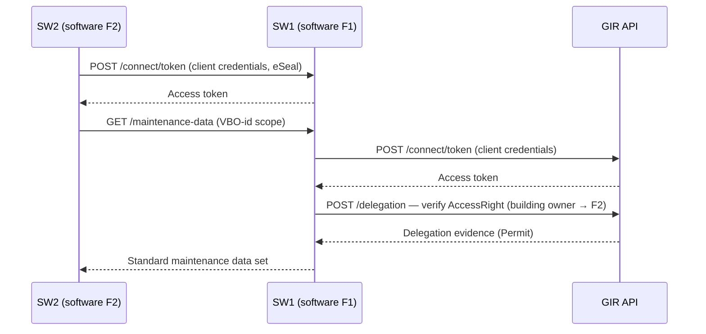

# Digitaal Onderhoudsboekje – Maintenance Data Transfer Flow

> **⚠️ Design document — not ready for implementation**
>
> This document describes the intended flow for the Digitaal Onderhoudsboekje use case. The `SupplierDelegation` mechanism for F1 → SW1 and F2 → SW2 and the exact authorization type mapping in GIR have not been finalised. See [Open Questions](#open-questions). Do not use this document as the basis for implementation until it has been marked as approved.

The Digitaal Onderhoudsboekje enables a building owner to authorize a new installation service party to retrieve maintenance history from the previous installation service party. GIR manages the authorization; Keyper orchestrates owner approval; the actual maintenance data exchange happens directly between the software parties via M2M, authenticated with eSeals.

This guide describes how a building owner grants authorization through the TechniekNederland GIR app, how the software parties obtain delegation rights from their respective installers, and how the new installer's software party retrieves maintenance data from the old installer's software party.

🔗 [Keyper API Docs ➚](https://keyper-preview.poort8.nl/scalar/v1)
🔗 [GIR API Docs ➚](https://gir-preview.poort8.nl/scalar/v1)

## Parties

| Role | Party | DSGO role | Description |
|------|-------|-----------|-------------|
| Building owner (gebouweigenaar) | Property owner | Data service rights holder | Approves the transfer; holds authority over the installations in the building. Authenticates via eHerkenning. |
| New installer (F2) | New installation service party | Legal data service consumer | Receives an `AccessRight` from the building owner; requests access to the maintenance history of the buildings they take over. |
| Old installer (F1) | Previous installation service party | Legal data service provider | Holds the maintenance history; issues a `SupplierDelegation` to SW1 to serve data on its behalf. |
| SW2 | Software party of F2 | Authorized data service consumer | Receives a `SupplierDelegation` from F2; retrieves maintenance data via M2M on behalf of F2. |
| SW1 | Software party of F1 | Authorized data service provider | Receives a `SupplierDelegation` from F1; serves maintenance data via M2M on behalf of F1. |
| TN GIR app | Poort8 (SaaS, TN front-end) | — | Web application through which the building owner initiates the authorization. |
| GIR | Gebouw-Installatie-Registratie | Third-party authorization registry | Stores the `AccessRight` policy (building owner → F2) as PAP/PRP/PDP; enforces authorization via the delegation endpoint. |
| Keyper | Poort8 | — | Orchestrates the approval flow and registers the `AccessRight` policy in GIR after approval. |

## Overview

The flow has four phases: a one-time owner authorization (`AccessRight` via Keyper), F1 issuing a `SupplierDelegation` to SW1, F2 issuing a `SupplierDelegation` to SW2, and a one-off M2M data transfer.



### Steps

**Phase 1 — Owner authorization / `AccessRight` (one-time per building / installer pair)**

1. The building owner logs into the TN GIR app via eHerkenning and selects VBO-ids and the new installer (F2).
2. The app obtains a Keyper access token and creates an approval link registering an `AccessRight` for F2.
3. Keyper sends the approval link to the building owner by email.
4. The building owner authenticates and approves.
5. Keyper obtains a GIR access token and registers the `AccessRight` policy in GIR-AR.
6. Keyper sends F2 a confirmation including the approved policy details and SW1's endpoint.

**Phase 2a — F1 `SupplierDelegation` to SW1**

7. F1 issues a `SupplierDelegation` to SW1, authorizing SW1 to serve maintenance data on F1's behalf (mechanism TBD).

**Phase 2b — F2 `SupplierDelegation` to SW2**

8. F2 issues a `SupplierDelegation` to SW2, authorizing SW2 to request maintenance data on F2's behalf, and passes SW1's endpoint.

**Phase 3 — M2M maintenance data transfer (one-off)**

9. SW2 obtains an access token from SW1 (eSeal-authenticated).
10. SW2 requests maintenance data from SW1.
11. SW1 obtains a GIR access token and verifies the `AccessRight` (building owner → F2).
12. SW1 returns the standard maintenance data set for the authorized scope.

## Prerequisites

Before the flow can operate, all parties must be onboarded in DSGO with their respective roles:

| Party | Required DSGO role |
|-------|-----------------------|
| Building owner | Data service rights holder |
| New installer (F2) | Legal data service consumer |
| Old installer (F1) | Legal data service provider |
| SW2 | Authorized data service consumer |
| SW1 | Authorized data service provider |
| GIR | Third-party authorization registry |

All parties must be registered in the DSGO participant register before any step in this flow can be executed. All parties with M2M connections (SW1, SW2, Keyper, GIR) require a DSGO-approved Electronic Seal.

## DSGO Authorization Types

DSGO distinguishes three authorization types that apply in this flow:

| Type | Meaning | Where used |
|------|---------|------------|
| `AccessRight` | The data service rights holder (building owner) authorizes a legal data service consumer (F2) to access a data service. | Registered in GIR by Keyper after owner approval (phase 1). |
| `SupplierDelegation` | A legal party authorizes an authorized party to act on its behalf. | F1 → SW1 (provider side, phase 2a); F2 → SW2 (consumer side, phase 2b). |
| `Delegation` | A legal data service consumer delegates an access right to another legal data service consumer. | Not used in this flow. |

> ⚠️ **Open question**: See [Open Questions](#open-questions) for whether the GIR policy should be typed as `AccessRight` in the iSHARE/DSGO sense, or whether a different policy type mapping is used in the GIR instance.

## Before the Authorization Flow


The TN GIR app collects the following information before triggering the Keyper flow:

| Field | Description |
|-------|-------------|
| VBO-id(s) | BAG Verblijfsobjectidentificatie (16-digit building identifier); one or more |
| NL/SfB filter | Optional: scope authorization to specific installation types by NL/SfB code |
| New installer (F2) KvK | KvK number of the installation company requesting access |
| Old installer (F1) KvK | KvK number of the installation company that will serve the data |
| Building owner KvK | KvK number of the approving owner |
| Validity period | Start and end date of the requested access |

> ℹ️ The building owner must be authenticated via eHerkenning before initiating the flow. VBO-id lookup uses the BAG API.

> **⚠️ Design decision open — TN GIR app implementation pattern**
>
> Two implementation patterns are under consideration for the TN GIR app:
>
> **Option A — Third-party app with Keyper Approve**: TechniekNederland builds and operates the web app. Authentication of the building owner and approval link creation are handled via the standard Keyper Approve flow. Poort8 provides Keyper as a service; TN integrates against the Keyper API.
>
> **Option B — Poort8-hosted TN GIR app with Keyper Manager integration**: Poort8 builds and operates the TN GIR app with full integration into Keyper Manager, providing a white-label UI. TN acts as the content owner; Poort8 handles the complete technical stack including eHerkenning authentication.
>
> The choice between these patterns affects who is responsible for eHerkenning integration, UI/UX, and ongoing maintenance. This decision must be made before implementation begins.

The app may optionally query GIR to display the installations registered at the selected buildings, so the owner can optionally scope the request by NL/SfB code:

```http
GET https://gir-preview.poort8.nl/v1/api/GIRBasisdataMessage?vboID={vboId}
Authorization: Bearer <ACCESS_TOKEN>
Accept: application/json
```

See [Retrieve Multiple Installations](retrieve-installations.md) for the full parameter reference and the required DSGO token.

## Phase 1 — Owner Authorization Flow



### Step 1: TN GIR App Creates Approval Link *(Poort8)*

After the owner has selected VBO-ids and F2, the app first obtains an access token from Keyper, then sends the approval link request. Keyper generates an approval link registering an `AccessRight` policy for F2:

**1a. Obtain access token from Keyper:**

```http
POST https://keyper-preview.poort8.nl/connect/token
Content-Type: application/x-www-form-urlencoded

grant_type=client_credentials&client_id=<CLIENT_ID>&client_secret=<CLIENT_SECRET>
```

**1b. Create the approval link:**

```http
POST https://keyper-preview.poort8.nl/v1/api/approval-links
Authorization: Bearer <ACCESS_TOKEN>
Content-Type: application/json
```

```json
{
  "requester": {
    "name": "<F2 NAME>",
    "email": "<F2 EMAIL>",
    "organization": "<F2 COMPANY NAME>",
    "organizationId": "did:ishare:EU.NL.NTRNL-<F2 KVK>"
  },
  "approver": {
    "name": "<BUILDING OWNER NAME>",
    "email": "<BUILDING OWNER EMAIL>",
    "organization": "<BUILDING OWNER ORGANISATION>",
    "organizationId": "did:ishare:EU.NL.NTRNL-<OWNER KVK>"
  },
  "dataspace": {
    "baseUrl": "https://gir-preview.poort8.nl"
  },
  "reference": "<UNIQUE REFERENCE>",
  "addPolicyTransactions": [
    {
      "type": "[TBD — instance-specific]",
      "action": "read",
      "license": "[TBD — terms of use for the maintenance data]",
      "useCase": "[TBD — instance-specific]",
      "issuedAt": "<UNIX TIMESTAMP>",
      "issuerId": "did:ishare:EU.NL.NTRNL-<OWNER KVK>",
      "subjectId": "did:ishare:EU.NL.NTRNL-<F2 KVK>",
      "serviceProvider": "did:ishare:EU.NL.NTRNL-<SW2 KVK>",
      "resourceId": "<VBOID>",
      "attribute": "[TBD — NL/SfB scope or wildcard]",
      "notBefore": "<UNIX TIMESTAMP>",
      "expiration": "<UNIX TIMESTAMP>"
    }
  ],
  "orchestration": {
    "flow": "dsgo.[TBD]@v1"
  }
}
```

### Step 2: Keyper Sends Approval Link to Building Owner *(Poort8)*

Keyper generates a unique approval link and notifies the building owner by email. No further action from F2 or the TN GIR app is needed at this point.

### Step 3: Building Owner Authenticates and Approves *(Poort8)*

The building owner opens the approval link and:

1. Authenticates via eHerkenning.
2. Reviews the requested access: which buildings, which installer, which scope, for how long.
3. Clicks **Approve** or **Reject**.

On rejection, the approval link expires and F2 can initiate a new request.

### Step 4: Keyper Registers the Policy in GIR and Notifies F2 *(Poort8)*

On approval, Keyper first obtains an access token from GIR, then registers the `AccessRight` policy in GIR-AR. Once registered, Keyper sends F2 a confirmation that includes:

- The approved policy details (VBO-ids, NL/SfB scope, validity period).
- SW1's maintenance data endpoint URL (mechanism for passing this through Keyper is TBD — see [Open Questions](#open-questions)).

F2 can now initiate the sub-delegation to SW2 and share SW1's endpoint with SW2 so the data transfer can proceed.

## Phase 2 — SupplierDelegation



Phases 2a and 2b can happen in parallel and independently of each other. Both must be completed before the M2M data transfer (phase 3) can proceed.

### Step 5: F1 Issues SupplierDelegation to SW1 *(mechanism TBD)*

F1 authorizes SW1 to serve maintenance data on F1's behalf. In DSGO terms this is a `SupplierDelegation` from the legal data service provider (F1) to the authorized data service provider (SW1). The exact mechanism (F1's own authorization registry, a third-party registry, or a DSGO token exchange) is to be determined.

> ℹ️ The DSGO documentation for the double delegation chain on the provider side is not fully specified. The `SupplierDelegation` F1 → SW1 is likely governed by the same mechanism as F2 → SW2. When SW2 presents its token at SW1, SW1 can act as the authorized provider by virtue of this `SupplierDelegation` — no separate runtime check of F1's delegation is needed.

### Step 6: F2 Issues SupplierDelegation to SW2 *(mechanism TBD)*

F2 authorizes SW2 to request maintenance data on F2's behalf. In DSGO terms this is a `SupplierDelegation` from the legal data service consumer (F2) to the authorized data service consumer (SW2). The same mechanism as step 5 applies. F2 also passes SW1's endpoint URL (received in the Keyper confirmation) to SW2.

## Phase 3 — M2M Maintenance Data Transfer



This phase is a one-off transaction triggered once after phases 2a and 2b are complete. SW1 is responsible for verifying authorization; SW2 does not need to pre-verify before requesting.

### Step 7: SW2 Obtains Access Token from SW1 *(external)*

SW2 authenticates to SW1 using its eSeal (DSGO certificate) to obtain an access token:

```http
POST <SW1 ENDPOINT>/connect/token
Content-Type: application/x-www-form-urlencoded

grant_type=client_credentials&client_assertion_type=urn:ietf:params:oauth:client-assertion-type:jwt-bearer&client_assertion=<SIGNED_JWT>
```

### Step 8: SW2 Requests Maintenance Data from SW1 *(external)*

Using the access token from SW1, SW2 requests the maintenance data:

```http
GET <SW1 ENDPOINT>/maintenance-data?vboId=<VBOID>
Authorization: Bearer <SW1_ACCESS_TOKEN>
Content-Type: application/json
```

> ℹ️ SW1's endpoint URL is received by F2 in the Keyper confirmation (step 4) and passed to SW2 as part of the `SupplierDelegation` (step 6).

### Step 9: SW1 Obtains Access Token from GIR *(Poort8)*

Before checking authorization, SW1 obtains an access token from GIR:

```http
POST https://gir-preview.poort8.nl/connect/token
Content-Type: application/x-www-form-urlencoded

grant_type=client_credentials&client_assertion_type=urn:ietf:params:oauth:client-assertion-type:jwt-bearer&client_assertion=<SIGNED_JWT>
```

### Step 10: SW1 Verifies the AccessRight Against GIR *(Poort8)*

SW1 verifies that F2 holds a valid `AccessRight` for the requested VBO-ids by calling the GIR delegation endpoint:

```http
POST https://gir-preview.poort8.nl/delegation
Authorization: Bearer <GIR_ACCESS_TOKEN>
Content-Type: application/json
```

```json
{
  "delegationRequest": {
    "policyIssuer": "did:ishare:EU.NL.NTRNL-<OWNER KVK>",
    "target": {
      "accessSubject": "did:ishare:EU.NL.NTRNL-<F2 KVK>"
    },
    "policySets": [
      {
        "policies": [
          {
            "target": {
              "resource": {
                "type": "[TBD — instance-specific]",
                "identifiers": ["<VBOID>"],
                "attributes": ["[TBD — NL/SfB scope or wildcard]"]
              },
              "actions": ["read"],
              "environment": {
                "serviceProviders": ["did:ishare:EU.NL.NTRNL-<SW2 KVK>"]
              }
            }
          }
        ]
      }
    ]
  }
}
```

### Step 11: SW1 Returns Maintenance Data *(external)*

If GIR returns a `Permit`, SW1 returns the standard maintenance data set for the authorized VBO-ids and NL/SfB scope. A non-permit result causes SW1 to return an authorization error.

## Authorization Granularity

Authorization can be scoped at two levels:

| Level | Scope | Use case |
|-------|-------|----------|
| VBO-id | All installations in a building | Full portfolio transfer (e.g. housing corporation handing over all units) |
| VBO-id + NL/SfB | Specific installation types within a building | Partial transfer (e.g. only HVAC, not electrical) |

In both cases, the default is to include the full standard maintenance data set for the authorized installations. The NL/SfB filter is optional.

## Policy Parameters

| Parameter | Where used | Description | Status |
|-----------|------------|-------------|--------|
| `issuerId` | Keyper request, delegation request | DID of the building owner (policy issuer) | Required |
| `subjectId` | Keyper request, delegation request | DID of F2 (the data service consumer) | Required |
| `serviceProvider` | Keyper request, delegation request | DID of SW2 (the delegated data service consumer) | Required |
| `resourceId` / `identifiers` | Keyper request, delegation request | VBO-id; a building-level identifier covering all registered installations | Required |
| `attribute` | Keyper request, delegation request | NL/SfB code for optional scoping; wildcard for all installation types | TBD |
| `action` | Keyper request, delegation request | `read` (F2 reads maintenance data from SW1) | TBD — instance-specific |
| `notBefore` / `expiration` | Keyper request, delegation evidence | Validity period of the authorization | Required |
| `type` | Keyper request, delegation request | Resource type identifier for policy matching | TBD — instance-specific |

## Open Questions

**1. Authorization type mapping in GIR**

DSGO defines the `AccessRight` type for the building owner → F2 authorization. It is not yet confirmed whether the GIR instance's `type` field in the policy and delegation request maps directly to the DSGO `AccessRight` type identifier, or whether a GIR-specific resource type string is used. This affects the value of the `type` field in the Keyper request and the GIR delegation check.

**2. SupplierDelegation mechanism (F1 → SW1 and F2 → SW2)**

How do F1 and F2 each issue a `SupplierDelegation` to their respective software party? Options per DSGO:

- The legal party implements its own authorization registry (DSGO variant 1 / 2).
- A third-party authorization registry is used (DSGO variant 5) — this could be GIR or another Poort8 service.

**3. Passing SW1 endpoint to F2 via Keyper**

The flow requires Keyper to include SW1's endpoint URL in the confirmation sent to F2 after approval. The current Keyper Approve API specification does not have a mechanism to carry arbitrary metadata (such as an endpoint URL) through the approval link request and relay it in the confirmation. A Keyper API extension or an alternative out-of-band mechanism is needed.


**Standard maintenance data set**

This will be defined by a DICO standard, developed and maintained by Ketenstandaard — the same organisation responsible for the GIRBasisdataMessage standard.

**SW1 endpoint**

SW1's endpoint is communicated to F2 in the Keyper confirmation after approval (step 4) and passed to SW2 as part of the `SupplierDelegation` (step 6).

**DSGO roles**

Roles are as defined in the DSGO transaction roles documentation. The DICO standard is expected to further specify how these roles apply in the maintenance data transfer context.

---

## Further Reading

- [Datastekker – Installer Access Flow](datastekker-installateur-flow.md) — similar authorization pattern for a different use case
- [Data-Consumer Flow](data-consumer-flow.md) — standard GIR data access flow
- [Registrar Flow](registrar-flow.md) — how installation data is submitted to GIR
- [GIR API Docs ➚](https://gir-preview.poort8.nl/scalar/v1)
- [Keyper API Docs ➚](https://keyper-preview.poort8.nl/scalar/v1)
