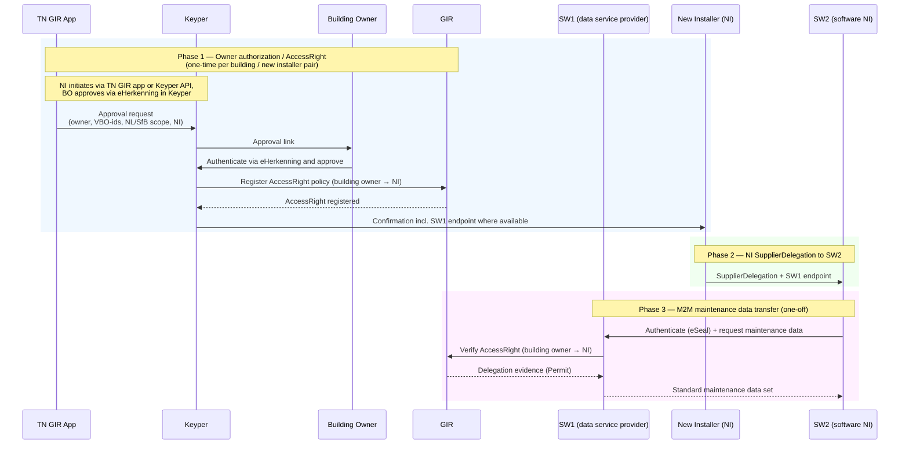
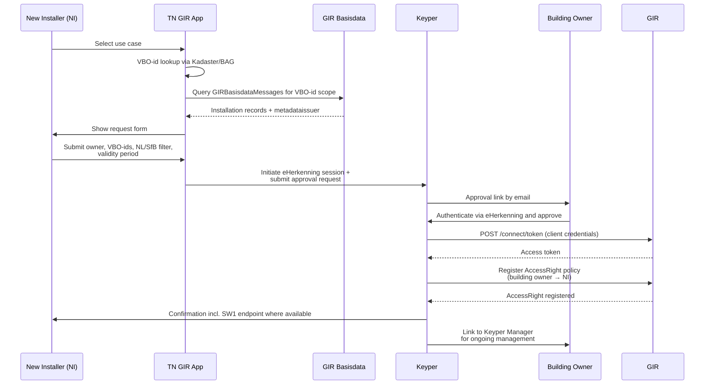
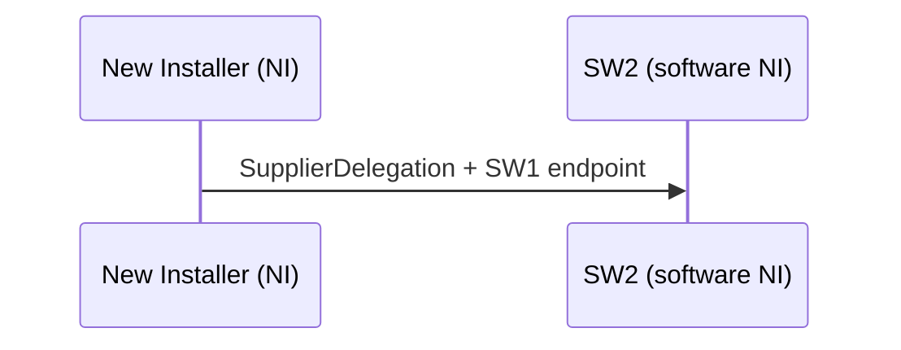
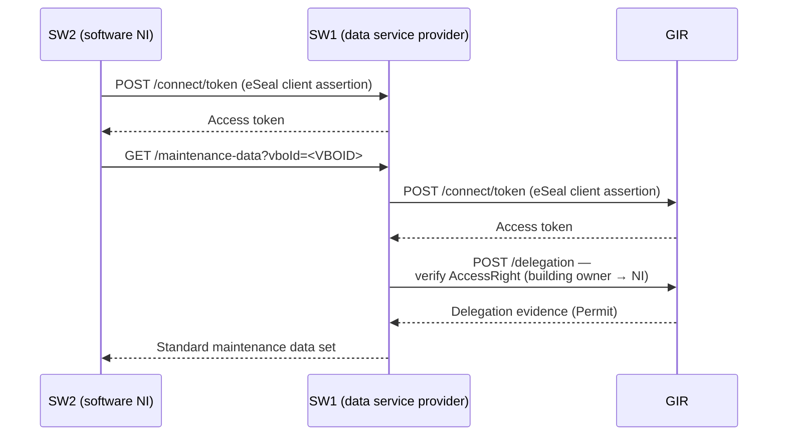

# Digitaal Onderhoudsboekje – Maintenance Data Transfer Flow

> **⚠️ Implementation decisions pending**
>
> Several policy field values and integration points have not yet been finalised. All open points are listed in [Open Decisions](#open-decisions). Do not use this document as the basis for implementation until those items have been resolved.

The Digitaal Onderhoudsboekje enables a building owner to authorize a new installation service party to retrieve maintenance history from the previous installation service party. GIR manages the authorization; Keyper orchestrates owner approval; the actual maintenance data exchange happens directly between the software parties via M2M, authenticated with eSeals.

This guide describes the NI-initiated flow, where the new installer starts the authorization through the TechniekNederland GIR app or directly via the Keyper API, then delegates SW2 as authorized data service consumer. The initial request contains the building owner and VBO-id scope. SW1 acts as the data service provider in the M2M phase.

🔗 [Keyper API Docs ➚](https://keyper-preview.poort8.nl/scalar/v1)
🔗 [GIR API Docs ➚](https://gir-preview.poort8.nl/scalar/v1)

## Parties

| Role | Party | DSGO role | Description |
|------|-------|-----------|-------------|
| Building owner (gebouweigenaar) | Property owner | Data service rights holder | Approves the transfer; holds authority over the installations in the building. Authenticates via eHerkenning. |
| New installer (NI) | New installation service party | Legal data service consumer | Initiates the authorization request and receives an `AccessRight` from the building owner. |
| SW2 | Software party of NI | Authorized data service consumer | Receives a `SupplierDelegation` from NI; retrieves maintenance data via M2M on behalf of NI. |
| SW1 | Software party serving the maintenance data | Data service provider | Serves maintenance data via M2M and verifies the `AccessRight` in GIR at request time. |
| TN GIR app | TechniekNederland | — | Shared permission request portal for GIR use cases. For Digitaal Onderhoudsboekje, the operational flow starts with the new installer (NI). In this flow, the app also acts as the metadata app that derives the previous installer(s) from GIR registration metadata. The app has no credentials of its own; all authentication is via eHerkenning through Keyper. |
| GIR | Gebouw-Installatie-Registratie | Third-party authorization registry | Stores the `AccessRight` policy (building owner → NI) as PAP/PRP/PDP; enforces authorization via the delegation endpoint. |
| Keyper | Poort8 | — | Orchestrates the approval flow, provides eHerkenning authentication in-session, and registers the `AccessRight` policy in GIR after approval. |

## Overview

The flow has three phases: a one-time owner authorization (`AccessRight` via Keyper), NI issuing a `SupplierDelegation` to SW2, and a one-off M2M data transfer.



## Prerequisites

Before any phase of this flow can operate, all parties must be onboarded in DSGO with their respective roles:

| Party | Required DSGO role |
|-------|-------------------|
| Building owner | Data service rights holder |
| New installer (NI) | Legal data service consumer |
| SW2 | Authorized data service consumer |
| SW1 | Data service provider |
| GIR | Third-party authorization registry |

All parties must be registered in the DSGO participant register before any step in this flow can be executed. All parties with M2M connections (SW1, SW2, Keyper, GIR) require a DSGO-approved Electronic Seal.

## DSGO Authorization Types

DSGO distinguishes two authorization types that apply in this flow:

| Type | Meaning | Where used |
|------|---------|------------|
| `AccessRight` | The data service rights holder (building owner) authorizes a legal data service consumer (NI) to access a data service. | Registered in GIR by Keyper after owner approval (phase 1). |
| `SupplierDelegation` | A legal party authorizes an authorized party to act on its behalf. | NI → SW2 (consumer side, phase 2). |

> **⚠️ Open decision**: The exact value of the `type` field in GIR policies has not been confirmed. See [Open Decisions](#open-decisions).

---

## Phase 1 — Owner Authorization

The Digitaal Onderhoudsboekje flow starts with the new installer (NI). NI submits the request through the TN GIR app or directly via the Keyper API, after which Keyper handles the building owner's approval through eHerkenning. The TN GIR app itself holds no credentials.



### Step 1: Start the Request in the TN GIR App *(TechniekNederland)*

The TN GIR app presents the Digitaal Onderhoudsboekje entry point for the new installer (NI), acting on behalf of themselves.

The same app handles other GIR permission flows (registrar write access, Datastekker access) through additional entry points.

### Step 2: VBO-id Lookup *(TechniekNederland)*

The TN GIR app looks up VBO-ids for the relevant buildings via the Kadaster/BAG API. The building can be identified by address or direct VBO-id entry. The BAG API does not require DSGO credentials.

### Step 3: Determine Previous Installers from GIR Metadata and Complete the AccessRight Request *(TechniekNederland)*

The TN GIR app acts as a metadata app for the selected VBO-id scope. It queries previously registered `GIRBasisdataMessage` records and uses the `metadataissuer` of the most recent registration per installation to derive one or more previous installers.

The previous installer is therefore derived from GIR metadata, not entered by the user.

> ℹ️ `registrarChamberOfCommerceNumber` in the `GIRBasisdataMessage` identifies the registering installer. The DSGO-id of the app that performed the registration is stored separately by GIR as metadata (`metadataissuer`) and is used to derive the previous installer(s) for this flow.

The TN GIR app collects the following before handing off to Keyper:

| Field | Description |
|-------|-------------|
| VBO-id(s) | BAG Verblijfsobjectidentificatie (16-digit); one or more |
| NL/SfB filter | Optional: scope to specific installation types by NL/SfB code |
| New installer (NI) | The requester and future legal data service consumer |
| Previous installer(s) | Derived by the metadata app from GIR registration metadata (`metadataissuer`) |
| Building owner email | Recipient of the approval link |
| Validity period | Start and end date of the requested access |

> ℹ️ The building owner's authoritative identity is confirmed by eHerkenning in Keyper.

This flow uses Variant A: no pre-approval installation display. The TN GIR app submits the request based on the entered VBO-id scope and optional NL/SfB filter without first querying GIR through Keyper.

### Step 4: Keyper Approval Flow *(Poort8)*

The TN GIR app initiates the Keyper approval flow for the building owner. The same request can also be created directly against the Keyper API without the TN GIR app.

The approval request includes:

```json
{
  "requester": {
    "name": "<NI NAME>",
    "email": "<NI EMAIL>",
    "organization": "<NI COMPANY NAME>",
    "organizationId": "did:ishare:EU.NL.NTRNL-<NI KVK>"
  },
  "approver": {
    "name": "<BUILDING OWNER NAME>",
    "email": "<BUILDING OWNER EMAIL>",
    "organization": "<BUILDING OWNER ORGANISATION>",
    "organizationId": "did:ishare:EU.NL.NTRNL-<OWNER KVK>"
  },
  "dataspace": {
    "baseUrl": "https://gir-preview.poort8.nl"
  },
  "reference": "<UNIQUE REFERENCE>",
  "addPolicyTransactions": [
    {
      "type": "[TBD — instance-specific, see Open Decisions]",
      "action": "read",
      "license": "[TBD — terms of use for the maintenance data, see Open Decisions]",
      "useCase": "[TBD — instance-specific, see Open Decisions]",
      "issuedAt": "<UNIX TIMESTAMP>",
      "issuerId": "did:ishare:EU.NL.NTRNL-<OWNER KVK>",
      "subjectId": "did:ishare:EU.NL.NTRNL-<NI KVK>",
      "serviceProvider": "did:ishare:EU.NL.NTRNL-<SW1 KVK>",
      "resourceId": "<VBOID>",
      "attribute": "[TBD — NL/SfB code or wildcard, see Open Decisions]",
      "notBefore": "<UNIX TIMESTAMP>",
      "expiration": "<UNIX TIMESTAMP>"
    }
  ],
  "orchestration": {
    "flow": "[TBD — instance-specific, see Open Decisions]"
  }
}
```

> ℹ️ Multiple VBO-ids require one entry per VBO-id in `addPolicyTransactions`. The `resourceId` field takes a single identifier.

See the [Keyper API reference ➚](https://keyper-preview.poort8.nl/scalar/v1) for the full field documentation and authentication flow.

Keyper sends the approval link to the building owner by email. The building owner opens the link, authenticates via eHerkenning, and reviews and approves the request.

The building owner can:

1. Review the requested access: which buildings, which new installer, which previous installer(s), which scope, for how long.
2. Click **Approve** or **Reject**.

On rejection, the approval link expires and a new request can be initiated.

### Step 5: Keyper Registers the AccessRight in GIR *(Poort8)*

On approval, Keyper obtains a GIR access token and registers the `AccessRight` policy in GIR-AR:

```http
POST https://gir-preview.poort8.nl/connect/token
Content-Type: application/x-www-form-urlencoded

grant_type=client_credentials&scope=iSHARE&client_id=did:ishare:EU.NL.NTRNL-<KEYPER KVK>&client_assertion_type=urn:ietf:params:oauth:client-assertion-type:jwt-bearer&client_assertion=<SIGNED_JWT>
```

The building owner also receives a link to Keyper Manager, where active authorizations can be reviewed and revoked.

### Step 6: Notify NI After Approval *(Poort8)*

Once the `AccessRight` is registered, Keyper sends NI a confirmation that includes:

- The approved policy details (VBO-ids, NL/SfB scope, validity period).
- The previous installer(s) derived from GIR registration metadata.
- SW1's maintenance data endpoint URL, if available.

> **⚠️ Open decision**: The mechanism for capturing SW1's endpoint and including it in the Keyper confirmation has not been specified. See [Open Decisions](#open-decisions).

---

## Phase 2 — SupplierDelegation

NI must complete this phase before the M2M data transfer (phase 3) can proceed.



### Step 7: NI Issues SupplierDelegation to SW2 *(mechanism TBD)*

NI authorizes SW2 to request maintenance data on NI's behalf. In DSGO terms this is a `SupplierDelegation` from the legal data service consumer (NI) to the authorized data service consumer (SW2). NI also passes SW1's endpoint URL (received in the Keyper confirmation from phase 1) to SW2.

> **⚠️ Open decision**: The mechanism by which NI issues a `SupplierDelegation` to SW2 has not been determined. Options per DSGO: the legal party's own authorization registry (DSGO variant 1/2), or a third-party registry such as GIR (DSGO variant 5). See [Open Decisions](#open-decisions).

---

## Phase 3 — M2M Maintenance Data Transfer

This phase is the implementation guide for the M2M data transaction. It is triggered once phase 2 is complete. SW1 is responsible for verifying authorization at request time; SW2 does not pre-verify.



### Authentication to SW1 *(external)*

SW2 authenticates to SW1 using its eSeal (DSGO certificate) to obtain an access token:

```http
POST <SW1 ENDPOINT>/connect/token
Content-Type: application/x-www-form-urlencoded

grant_type=client_credentials&client_assertion_type=urn:ietf:params:oauth:client-assertion-type:jwt-bearer&client_assertion=<SIGNED_JWT>
```

> ℹ️ SW1's endpoint URL is received by NI in the Keyper confirmation (step 6) and passed to SW2 as part of the `SupplierDelegation` (step 7).

### Maintenance Data Request *(external)*

```http
GET <SW1 ENDPOINT>/maintenance-data?vboId=<VBOID>
Authorization: Bearer <SW1_ACCESS_TOKEN>
```

### GIR Access Token *(Poort8)*

Before verifying the authorization, SW1 obtains a GIR access token using its DSGO eSeal. See [Obtaining a DSGO Bearer Token](connect-token.md) for the full procedure.

```http
POST https://gir-preview.poort8.nl/connect/token
Content-Type: application/x-www-form-urlencoded

grant_type=client_credentials&scope=iSHARE&client_id=did:ishare:EU.NL.NTRNL-<SW1 KVK>&client_assertion_type=urn:ietf:params:oauth:client-assertion-type:jwt-bearer&client_assertion=<SIGNED_JWT>
```

### AccessRight Verification *(Poort8)*

SW1 verifies that NI holds a valid `AccessRight` for the requested VBO-ids:

```http
POST https://gir-preview.poort8.nl/delegation
Authorization: Bearer <GIR_ACCESS_TOKEN>
Content-Type: application/json
```

```json
{
  "delegationRequest": {
    "policyIssuer": "did:ishare:EU.NL.NTRNL-<OWNER KVK>",
    "target": {
      "accessSubject": "did:ishare:EU.NL.NTRNL-<NI KVK>"
    },
    "policySets": [
      {
        "policies": [
          {
            "target": {
              "resource": {
                "type": "[TBD — instance-specific, see Open Decisions]",
                "identifiers": ["<VBOID>"],
                "attributes": ["[TBD — NL/SfB code or wildcard, see Open Decisions]"]
              },
              "actions": ["read"],
              "environment": {
                "serviceProviders": ["did:ishare:EU.NL.NTRNL-<SW1 KVK>"]
              }
            }
          }
        ]
      }
    ]
  }
}
```

### Maintenance Data Response *(external)*

If GIR returns a `Permit`, SW1 returns the standard maintenance data set for the authorized VBO-ids and NL/SfB scope. Any non-permit result causes SW1 to return an authorization error to SW2.

> **⚠️ Open decision**: The content and format of the standard maintenance data set is to be defined by a DICO standard developed by Ketenstandaard. Phase 3 implementation is blocked until this standard is available.

---

## Authorization Granularity

Authorization can be scoped at two levels:

| Level | Scope | Use case |
|-------|-------|----------|
| VBO-id | All installations in a building | Full portfolio transfer (e.g. housing corporation handing over all units) |
| VBO-id + NL/SfB | Specific installation types within a building | Partial transfer (e.g. only HVAC, not electrical) |

In both cases, the full standard maintenance data set is included for the authorized installations. The NL/SfB filter is optional.

## Policy Parameters

| Parameter | Where used | Description | Status |
|-----------|------------|-------------|--------|
| `issuerId` | Keyper request, delegation request | DID of the building owner (policy issuer) | Required |
| `subjectId` | Keyper request, delegation request | DID of NI (the data service consumer) | Required |
| `serviceProvider` | Keyper request, delegation request | DID of SW1 (the data service provider) | Required |
| `resourceId` / `identifiers` | Keyper request, delegation request | VBO-id; covers all registered installations in the building | Required |
| `notBefore` / `expiration` | Keyper request, delegation evidence | Validity period of the authorization | Required |
| `attribute` | Keyper request, delegation request | NL/SfB code for optional scoping; wildcard for all installation types | **TBD** |
| `action` | Keyper request, delegation request | `read` | **TBD — instance-specific** |
| `type` | Keyper request, delegation request | Resource type identifier for policy matching | **TBD — instance-specific** |
| `useCase` | Keyper request | Use case identifier for policy scoping | **TBD — instance-specific** |
| `license` | Keyper request, delegation evidence | License identifier for the terms of use | **TBD — instance-specific** |

---

## Open Decisions

The following must be resolved before the corresponding parts of this flow can be implemented.

**1. Policy field values (`type`, `useCase`, `attribute`, `license`, `orchestration.flow`)**

These are all instance-specific and must be defined during technical configuration of the GIR integration. The `type` field also depends on whether the GIR instance maps directly to the DSGO `AccessRight` type identifier or uses a GIR-specific resource type string.

**2. SupplierDelegation mechanism (NI → SW2)**

How does NI issue a `SupplierDelegation` to SW2? Options per DSGO: the legal party's own authorization registry (DSGO variant 1/2), or a third-party registry such as GIR (DSGO variant 5).

**3. SW1 endpoint delivery via Keyper**

The Keyper confirmation to NI must include SW1's endpoint URL. The mechanism for capturing SW1's endpoint during the authorization request and passing it through to the confirmation has not been specified.

**4. Standard maintenance data set**

The content and format of the maintenance data transferred in phase 3 will be defined by a DICO standard developed by Ketenstandaard. Phase 3 implementation is blocked until this standard is published.

---

## Further Reading

- [Datastekker – Installer Access Flow](datastekker-installateur-flow.md) — similar authorization pattern for a different use case
- [Data-Consumer Flow](data-consumer-flow.md) — standard GIR data access flow
- [Registrar Flow](registrar-flow.md) — how installation data is submitted to GIR
- [Obtaining a DSGO Bearer Token](connect-token.md) — acquiring DSGO credentials for GIR API calls
- [Retrieve Multiple Installations](retrieve-installations.md) — GIRBasisdataMessage by VBO-id
- [GIR API Docs ➚](https://gir-preview.poort8.nl/scalar/v1)
- [Keyper API Docs ➚](https://keyper-preview.poort8.nl/scalar/v1)
