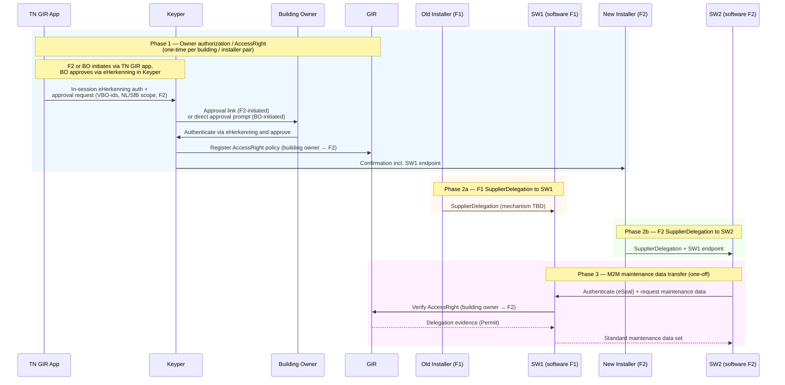
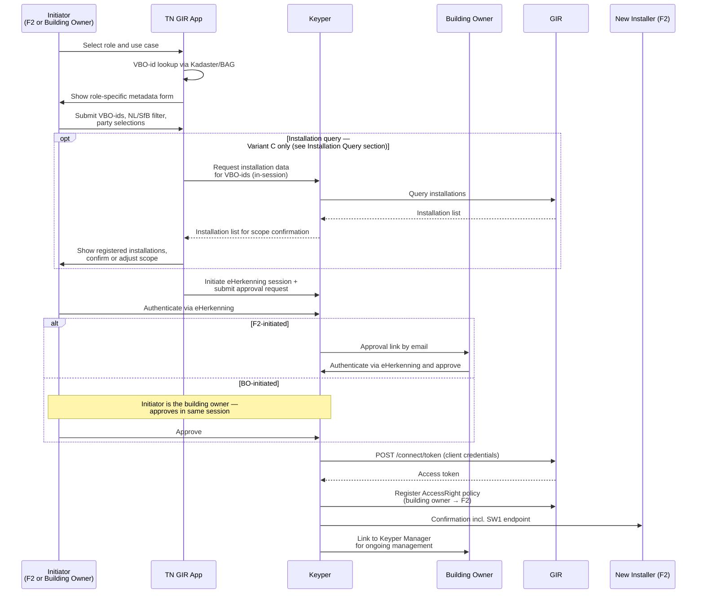
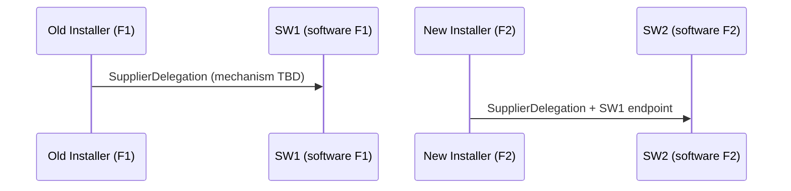
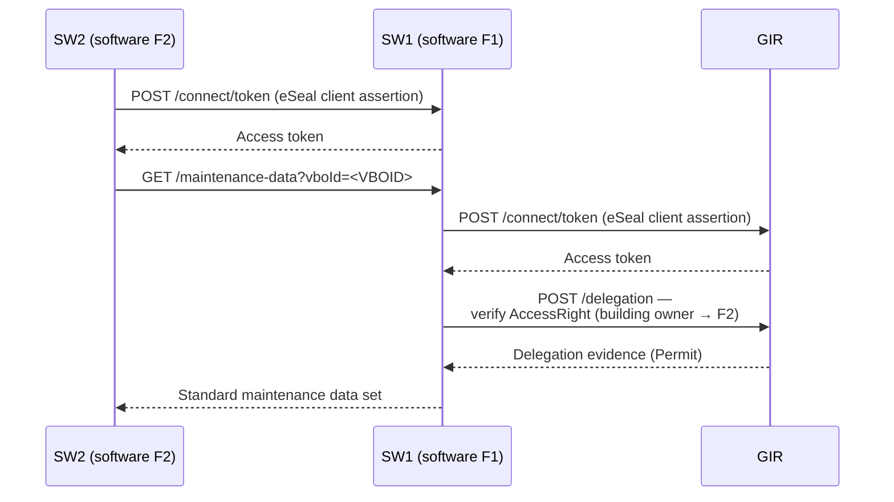

# Digitaal Onderhoudsboekje – Maintenance Data Transfer Flow

> **⚠️ Implementation decisions pending**
>
> Several policy field values and integration points have not yet been finalised. All open points are listed in [Open Decisions](#open-decisions). Do not use this document as the basis for implementation until those items have been resolved.

The Digitaal Onderhoudsboekje enables a building owner to authorize a new installation service party to retrieve maintenance history from the previous installation service party. GIR manages the authorization; Keyper orchestrates owner approval; the actual maintenance data exchange happens directly between the software parties via M2M, authenticated with eSeals.

This guide describes how a building owner or new installer initiates the authorization through the TechniekNederland GIR app, how both software parties obtain delegation rights from their respective installers, and how the new installer's software retrieves maintenance data from the old installer's software.

🔗 [Keyper API Docs ➚](https://keyper-preview.poort8.nl/scalar/v1)
🔗 [GIR API Docs ➚](https://gir-preview.poort8.nl/scalar/v1)

## Parties

| Role | Party | DSGO role | Description |
|------|-------|-----------|-------------|
| Building owner (gebouweigenaar) | Property owner | Data service rights holder | Approves the transfer; holds authority over the installations in the building. Authenticates via eHerkenning. |
| New installer (F2) | New installation service party | Legal data service consumer | Initiates or responds to the authorization request; receives an `AccessRight` from the building owner. |
| Old installer (F1) | Previous installation service party | Legal data service provider | Holds the maintenance history; issues a `SupplierDelegation` to SW1 to serve data on its behalf. |
| SW2 | Software party of F2 | Authorized data service consumer | Receives a `SupplierDelegation` from F2; retrieves maintenance data via M2M on behalf of F2. |
| SW1 | Software party of F1 | Authorized data service provider | Receives a `SupplierDelegation` from F1; serves maintenance data via M2M on behalf of F1. |
| TN GIR app | TechniekNederland | — | Shared permission request portal for GIR use cases. Supports multiple initiating roles (building owner, new installer) and multiple use cases (Digitaal Onderhoudsboekje, registrar, Datastekker). Has no credentials of its own; all authentication is via eHerkenning through Keyper. |
| GIR | Gebouw-Installatie-Registratie | Third-party authorization registry | Stores the `AccessRight` policy (building owner → F2) as PAP/PRP/PDP; enforces authorization via the delegation endpoint. |
| Keyper | Poort8 | — | Orchestrates the approval flow, provides eHerkenning authentication in-session, and registers the `AccessRight` policy in GIR after approval. |

## Overview

The flow has four phases: a one-time owner authorization (`AccessRight` via Keyper), F1 issuing a `SupplierDelegation` to SW1, F2 issuing a `SupplierDelegation` to SW2, and a one-off M2M data transfer.



## Prerequisites

Before any phase of this flow can operate, all parties must be onboarded in DSGO with their respective roles:

| Party | Required DSGO role |
|-------|-------------------|
| Building owner | Data service rights holder |
| New installer (F2) | Legal data service consumer |
| Old installer (F1) | Legal data service provider |
| SW2 | Authorized data service consumer |
| SW1 | Authorized data service provider |
| GIR | Third-party authorization registry |

All parties must be registered in the DSGO participant register before any step in this flow can be executed. All parties with M2M connections (SW1, SW2, Keyper, GIR) require a DSGO-approved Electronic Seal.

## DSGO Authorization Types

DSGO distinguishes three authorization types that apply in this flow:

| Type | Meaning | Where used |
|------|---------|------------|
| `AccessRight` | The data service rights holder (building owner) authorizes a legal data service consumer (F2) to access a data service. | Registered in GIR by Keyper after owner approval (phase 1). |
| `SupplierDelegation` | A legal party authorizes an authorized party to act on its behalf. | F1 → SW1 (provider side, phase 2a); F2 → SW2 (consumer side, phase 2b). |
| `Delegation` | A legal data service consumer delegates an access right to another legal data service consumer. | Not used in this flow. |

> **⚠️ Open decision**: The exact value of the `type` field in GIR policies has not been confirmed. See [Open Decisions](#open-decisions).

---

## Phase 1 — Owner Authorization

The TN GIR app guides either the building owner or the new installer (F2) through providing the required metadata, then hands off to Keyper where all authentication and approval take place via eHerkenning. The TN GIR app holds no credentials of its own.

The flow supports two entry points that share the same Keyper-based approval mechanism:

- **F2-initiated** — F2 provides the building owner's email address; the owner receives a link and approves independently.
- **BO-initiated** — The building owner starts the flow themselves; no email step is needed.



### Step 1: Role and Use Case Selection *(TechniekNederland)*

The TN GIR app presents entry points for different roles and use cases. For the Digitaal Onderhoudsboekje, the relevant roles are:

- **New installer (F2)** — initiating the transfer on behalf of themselves.
- **Building owner** — initiating the transfer directly.

The same app handles other GIR permission flows (registrar write access, Datastekker access) through additional entry points.

### Step 2: VBO-id Lookup *(TechniekNederland)*

The TN GIR app looks up VBO-ids for the relevant buildings via the Kadaster/BAG API. The building can be identified by address or direct VBO-id entry. The BAG API does not require DSGO credentials.

### Step 3: Metadata Collection *(TechniekNederland)*

The TN GIR app collects the following before handing off to Keyper:

| Field | F2-initiated | BO-initiated | Description |
|-------|:-----------:|:------------:|-------------|
| VBO-id(s) | ✓ | ✓ | BAG Verblijfsobjectidentificatie (16-digit); one or more |
| NL/SfB filter | ✓ | ✓ | Optional: scope to specific installation types by NL/SfB code |
| New installer (F2) | ✓ (self) | ✓ | Selected from DSGO participant register |
| Old installer (F1) | ✓ | ✓ | Selected from DSGO participant register |
| Building owner email | ✓ | — | Recipient of the approval link; not validated at this stage |
| Validity period | ✓ | ✓ | Start and end date of the requested access |

> ℹ️ The building owner's KvK identity is confirmed by eHerkenning in Keyper — it is not entered manually.

### Step 4 (optional): Show Registered Installations *(Keyper / TN GIR app)*

The TN GIR app can optionally display the installations currently registered in GIR for the selected VBO-ids, so the initiating party can confirm or refine the NL/SfB scope before submitting. See [Installation Query Variants](#installation-query-variants) for how this works and what is required.

### Step 5: Keyper Approval Flow *(Poort8)*

The TN GIR app initiates a Keyper eHerkenning session for the initiating party (F2 or building owner). Within this session, the approval request is submitted to Keyper.

The approval request includes:

```json
{
  "requester": {
    "name": "<F2 NAME>",
    "email": "<F2 EMAIL>",
    "organization": "<F2 COMPANY NAME>",
    "organizationId": "did:ishare:EU.NL.NTRNL-<F2 KVK>"
  },
  "approver": {
    "name": "<BUILDING OWNER NAME>",
    "email": "<BUILDING OWNER EMAIL>",
    "organization": "<BUILDING OWNER ORGANISATION>",
    "organizationId": "did:ishare:EU.NL.NTRNL-<OWNER KVK>"
  },
  "dataspace": {
    "baseUrl": "https://gir-preview.poort8.nl"
  },
  "reference": "<UNIQUE REFERENCE>",
  "addPolicyTransactions": [
    {
      "type": "[TBD — instance-specific, see Open Decisions]",
      "action": "read",
      "license": "[TBD — terms of use for the maintenance data, see Open Decisions]",
      "useCase": "[TBD — instance-specific, see Open Decisions]",
      "issuedAt": "<UNIX TIMESTAMP>",
      "issuerId": "did:ishare:EU.NL.NTRNL-<OWNER KVK>",
      "subjectId": "did:ishare:EU.NL.NTRNL-<F2 KVK>",
      "serviceProvider": "did:ishare:EU.NL.NTRNL-<SW2 KVK>",
      "resourceId": "<VBOID>",
      "attribute": "[TBD — NL/SfB code or wildcard, see Open Decisions]",
      "notBefore": "<UNIX TIMESTAMP>",
      "expiration": "<UNIX TIMESTAMP>"
    }
  ],
  "orchestration": {
    "flow": "[TBD — instance-specific, see Open Decisions]"
  }
}
```

> ℹ️ Multiple VBO-ids require one entry per VBO-id in `addPolicyTransactions`. The `resourceId` field takes a single identifier.

See the [Keyper API reference ➚](https://keyper-preview.poort8.nl/scalar/v1) for the full field documentation and authentication flow.

**F2-initiated**: Keyper sends the approval link to the building owner by email. The building owner opens the link, authenticates via eHerkenning, and reviews and approves the request.

**BO-initiated**: The building owner approves directly within the same Keyper session, without an email step.

In both cases, the building owner can:

1. Review the requested access: which buildings, which installer, which scope, for how long.
2. Click **Approve** or **Reject**.

On rejection, the approval link expires and a new request can be initiated.

### Step 6: Keyper Registers the Policy in GIR and Notifies F2 *(Poort8)*

On approval, Keyper obtains a GIR access token and registers the `AccessRight` policy in GIR-AR:

```http
POST https://gir-preview.poort8.nl/connect/token
Content-Type: application/x-www-form-urlencoded

grant_type=client_credentials&scope=iSHARE&client_id=did:ishare:EU.NL.NTRNL-<KEYPER KVK>&client_assertion_type=urn:ietf:params:oauth:client-assertion-type:jwt-bearer&client_assertion=<SIGNED_JWT>
```

Once registered, Keyper sends F2 a confirmation that includes:

- The approved policy details (VBO-ids, NL/SfB scope, validity period).
- SW1's maintenance data endpoint URL.

> **⚠️ Open decision**: The mechanism for capturing SW1's endpoint and including it in the Keyper confirmation has not been specified. See [Open Decisions](#open-decisions).

The building owner also receives a link to Keyper Manager, where active authorizations can be reviewed and revoked.

---

## Installation Query Variants

Before submitting the approval request, the TN GIR app can optionally display the installations currently registered in GIR for the selected buildings, helping the initiating party confirm or refine the NL/SfB scope.

Two variants are available:

### Variant A — No pre-approval installation display

The TN GIR app proceeds directly to the Keyper approval flow without showing GIR installation data beforehand. The scope (VBO-ids and optional NL/SfB filter) is based solely on what the user enters.

Keyper Approve can show the installations within scope as part of its approval screen if that data is included in the approval request's flow content.

- No additional integration required.
- Lowest implementation effort.
- Installations are visible to the building owner only after they open the Keyper Approve link.

> **⚠️ Open decision**: Whether and how installation data is displayed in the Keyper Approve screen depends on the flow content configuration for this use case.

### Variant C — Keyper Read (in-session installation query)

As part of the in-session Keyper eHerkenning flow, Keyper mediates a GIR installation query and returns the results to the TN GIR app. The TN GIR app can then display registered installations to the user before the approval request is submitted.

- Installations are visible **before** the approval request is created.
- The TN GIR app does not need GIR credentials; the query is mediated by Keyper using the in-session eHerkenning identity.
- Requires a Keyper Read capability that may not yet be available in Keyper.

> **⚠️ Open decision**: Keyper Read (in-session GIR query mediation) must be confirmed as an available or planned Keyper capability before Variant C can be implemented. If not yet available, Variant A is the appropriate starting point.

---

## Phase 2 — SupplierDelegation

Phases 2a and 2b can happen in parallel and independently of each other. Both must be complete before the M2M data transfer (phase 3) can proceed.



### Phase 2a: F1 Issues SupplierDelegation to SW1 *(mechanism TBD)*

F1 authorizes SW1 to serve maintenance data on F1's behalf. In DSGO terms this is a `SupplierDelegation` from the legal data service provider (F1) to the authorized data service provider (SW1).

> ℹ️ When SW2 presents its token at SW1, SW1 can act as the authorized provider by virtue of this `SupplierDelegation`. No separate runtime verification of F1's delegation against GIR is required during the M2M transfer.

### Phase 2b: F2 Issues SupplierDelegation to SW2 *(mechanism TBD)*

F2 authorizes SW2 to request maintenance data on F2's behalf. In DSGO terms this is a `SupplierDelegation` from the legal data service consumer (F2) to the authorized data service consumer (SW2). F2 also passes SW1's endpoint URL (received in the Keyper confirmation from phase 1) to SW2.

> **⚠️ Open decision**: The mechanism by which F1 and F2 issue `SupplierDelegation` to their software parties has not been determined. Options per DSGO: the legal party's own authorization registry (DSGO variant 1/2), or a third-party registry such as GIR (DSGO variant 5). See [Open Decisions](#open-decisions).

---

## Phase 3 — M2M Maintenance Data Transfer

This phase is triggered once, after both phases 2a and 2b are complete. SW1 is responsible for verifying authorization at request time; SW2 does not pre-verify.



### Step 1: SW2 Authenticates to SW1 *(external)*

SW2 authenticates to SW1 using its eSeal (DSGO certificate) to obtain an access token:

```http
POST <SW1 ENDPOINT>/connect/token
Content-Type: application/x-www-form-urlencoded

grant_type=client_credentials&client_assertion_type=urn:ietf:params:oauth:client-assertion-type:jwt-bearer&client_assertion=<SIGNED_JWT>
```

> ℹ️ SW1's endpoint URL is received by F2 in the Keyper confirmation (phase 1, step 6) and passed to SW2 as part of the `SupplierDelegation` (phase 2b).

### Step 2: SW2 Requests Maintenance Data from SW1 *(external)*

```http
GET <SW1 ENDPOINT>/maintenance-data?vboId=<VBOID>
Authorization: Bearer <SW1_ACCESS_TOKEN>
```

### Step 3: SW1 Obtains a GIR Access Token *(Poort8)*

Before verifying the authorization, SW1 obtains a GIR access token using its DSGO eSeal. See [Obtaining a DSGO Bearer Token](connect-token.md) for the full procedure.

```http
POST https://gir-preview.poort8.nl/connect/token
Content-Type: application/x-www-form-urlencoded

grant_type=client_credentials&scope=iSHARE&client_id=did:ishare:EU.NL.NTRNL-<SW1 KVK>&client_assertion_type=urn:ietf:params:oauth:client-assertion-type:jwt-bearer&client_assertion=<SIGNED_JWT>
```

### Step 4: SW1 Verifies the AccessRight Against GIR *(Poort8)*

SW1 verifies that F2 holds a valid `AccessRight` for the requested VBO-ids:

```http
POST https://gir-preview.poort8.nl/delegation
Authorization: Bearer <GIR_ACCESS_TOKEN>
Content-Type: application/json
```

```json
{
  "delegationRequest": {
    "policyIssuer": "did:ishare:EU.NL.NTRNL-<OWNER KVK>",
    "target": {
      "accessSubject": "did:ishare:EU.NL.NTRNL-<F2 KVK>"
    },
    "policySets": [
      {
        "policies": [
          {
            "target": {
              "resource": {
                "type": "[TBD — instance-specific, see Open Decisions]",
                "identifiers": ["<VBOID>"],
                "attributes": ["[TBD — NL/SfB code or wildcard, see Open Decisions]"]
              },
              "actions": ["read"],
              "environment": {
                "serviceProviders": ["did:ishare:EU.NL.NTRNL-<SW2 KVK>"]
              }
            }
          }
        ]
      }
    ]
  }
}
```

### Step 5: SW1 Returns Maintenance Data *(external)*

If GIR returns a `Permit`, SW1 returns the standard maintenance data set for the authorized VBO-ids and NL/SfB scope. Any non-permit result causes SW1 to return an authorization error to SW2.

> **⚠️ Open decision**: The content and format of the standard maintenance data set is to be defined by a DICO standard developed by Ketenstandaard. Phase 3 implementation is blocked until this standard is available.

---

## Authorization Granularity

Authorization can be scoped at two levels:

| Level | Scope | Use case |
|-------|-------|----------|
| VBO-id | All installations in a building | Full portfolio transfer (e.g. housing corporation handing over all units) |
| VBO-id + NL/SfB | Specific installation types within a building | Partial transfer (e.g. only HVAC, not electrical) |

In both cases, the full standard maintenance data set is included for the authorized installations. The NL/SfB filter is optional.

## Policy Parameters

| Parameter | Where used | Description | Status |
|-----------|------------|-------------|--------|
| `issuerId` | Keyper request, delegation request | DID of the building owner (policy issuer) | Required |
| `subjectId` | Keyper request, delegation request | DID of F2 (the data service consumer) | Required |
| `serviceProvider` | Keyper request, delegation request | DID of SW2 (the delegated data service consumer) | Required |
| `resourceId` / `identifiers` | Keyper request, delegation request | VBO-id; covers all registered installations in the building | Required |
| `notBefore` / `expiration` | Keyper request, delegation evidence | Validity period of the authorization | Required |
| `attribute` | Keyper request, delegation request | NL/SfB code for optional scoping; wildcard for all installation types | **TBD** |
| `action` | Keyper request, delegation request | `read` | **TBD — instance-specific** |
| `type` | Keyper request, delegation request | Resource type identifier for policy matching | **TBD — instance-specific** |
| `useCase` | Keyper request | Use case identifier for policy scoping | **TBD — instance-specific** |
| `license` | Keyper request, delegation evidence | License identifier for the terms of use | **TBD — instance-specific** |

---

## Open Decisions

The following must be resolved before the corresponding parts of this flow can be implemented.

**1. Policy field values (`type`, `useCase`, `attribute`, `license`, `orchestration.flow`)**

These are all instance-specific and must be defined during technical configuration of the GIR integration. The `type` field also depends on whether the GIR instance maps directly to the DSGO `AccessRight` type identifier or uses a GIR-specific resource type string.

**2. Installation Query Variant (A or C)**

Decide whether to show registered installations before the approval request is submitted (Variant C — requires Keyper Read) or only during Keyper Approve or not at all (Variant A). If Keyper Read is not yet available, Variant A is the starting point.

**3. Keyper Read availability**

Confirm whether in-session GIR query mediation (Keyper Read) is an available or planned Keyper capability, and on what timeline, before committing to Variant C.

**4. SupplierDelegation mechanism (F1 → SW1 and F2 → SW2)**

How do F1 and F2 issue a `SupplierDelegation` to their respective software parties? Options per DSGO: the legal party's own authorization registry (DSGO variant 1/2), or a third-party registry such as GIR (DSGO variant 5).

**5. SW1 endpoint delivery via Keyper**

The Keyper confirmation to F2 must include SW1's endpoint URL. The mechanism for capturing SW1's endpoint during the authorization request and passing it through to the confirmation has not been specified.

**6. Standard maintenance data set**

The content and format of the maintenance data transferred in phase 3 will be defined by a DICO standard developed by Ketenstandaard. Phase 3 implementation is blocked until this standard is published.

---

## Further Reading

- [Datastekker – Installer Access Flow](datastekker-installateur-flow.md) — similar authorization pattern for a different use case
- [Data-Consumer Flow](data-consumer-flow.md) — standard GIR data access flow
- [Registrar Flow](registrar-flow.md) — how installation data is submitted to GIR
- [Obtaining a DSGO Bearer Token](connect-token.md) — acquiring DSGO credentials for GIR API calls
- [Retrieve Multiple Installations](retrieve-installations.md) — GIRBasisdataMessage by VBO-id
- [GIR API Docs ➚](https://gir-preview.poort8.nl/scalar/v1)
- [Keyper API Docs ➚](https://keyper-preview.poort8.nl/scalar/v1)
