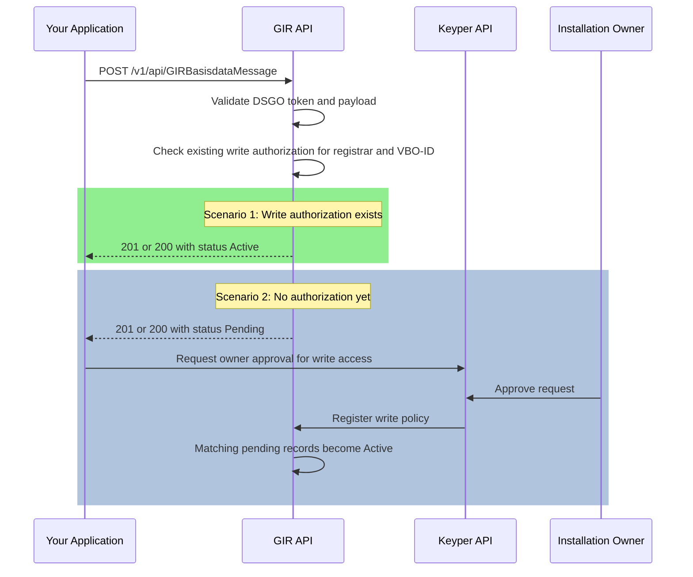

# Post a GIRBasisdataMessage (`POST /v1/api/GIRBasisdataMessage`)

🔗 [GIR API Docs ➚](https://gir-preview.poort8.nl/scalar/v1)
🔗 [Keyper API Docs ➚](https://keyper-preview.poort8.nl/scalar/v1)

This guide explains how to register or update installation data in GIR.

Use this endpoint when your application needs to submit a `GIRBasisdataMessage` for a building installation. GIR treats this endpoint as an upsert: the first submission creates the installation record, and later submissions with the same `installationID.value` update it.

## Prerequisites

- A valid DSGO bearer token. See [Obtaining a DSGO Bearer Token](connect-token.md).
- The registrar KvK number and the installation owner KvK number, both as 8 digits.
- A valid BAG VBO-ID for the building where the installation belongs.
- At least one component in the payload.

If no approved write policy exists yet for the registrar and VBO-ID combination, GIR still accepts the message but stores it as `Pending`.

## How it works

The flow depends on whether write authorization is already established:



## Request

```http
POST https://gir-preview.poort8.nl/v1/api/GIRBasisdataMessage
Authorization: Bearer <ACCESS_TOKEN>
Content-Type: application/json
Accept: application/json
```

GIR expects a JSON body containing:

- A message `guid`.
- The registrar KvK number.
- `installationBaseData` with the installation identity, location, lifecycle state, control system type, and at least one component.

Use GIR Scalar as the canonical source for the full request schema and enum values:

- [GIR API Docs ➚](https://gir-preview.poort8.nl/scalar/v1)

## Minimal example payload

This example includes the minimum practical fields needed to pass the endpoint validator.

```json
{
	"guid": "b4d1a2f3-9c6d-4b8e-a317-987654321abc",
	"registrarChamberOfCommerceNumber": "30276543",
	"installationBaseData": {
		"installationID": {
			"value": "INST-987-001",
			"type": "GUID"
		},
		"operationalStatus": "Operational",
		"lifeCycleStatus": "Installed",
		"installationOwnerChamberOfCommerceNumber": "12345678",
		"installationLocation": {
			"vboID": "0344010000126888"
		},
		"installationProperties": {
			"controlSystemType": "GBS"
		},
		"component": [
			{
				"componentLineGUID": "c5e8f9a2-b7d4-4c1e-9f23-456789abcdef",
				"productInformation": {
					"etimClassification": {
						"etimClassCode": "EC000123",
						"version": "2025"
					},
					"datapoolInformation": {
						"source": "2baValid",
						"registrationID": "3a29af76-d2e4-4c53-05d7-842539d5c98e"
					}
				}
			}
		]
	}
}
```

## Upsert behavior

The endpoint uses `installationBaseData.installationID.value` as its uniqueness key.

| Scenario | Result |
|----------|--------|
| First submission for this installation ID | `201 Created` |
| Later submission with the same installation ID | `200 OK` and the existing record is updated |

This means your client can safely retry with the same installation ID when you intend to update the same installation.

## Activation after write approval

GIR decides the record status during the POST request:

| Condition | Stored status |
|-----------|---------------|
| Registrar already has write authorization for the target VBO-ID | `Active` |
| No approved write authorization yet | `Pending` |

Write authorization is checked against the installation owner, the registrar, the target VBO-ID, and the GIR use case.

If the record is stored as `Pending`, it is only visible to the registrar. Other parties do not see it until the owner approves the write-access request and Keyper registers the policy.

For the owner approval step, use Keyper to create a write-policy approval link for the same VBO-ID. GIR automatically promotes matching pending records to `Active` after approval has completed.

## Response behavior

Both create and update responses return the stored message together with metadata:

```json
{
	"guid": "b4d1a2f3-9c6d-4b8e-a317-987654321abc",
	"registrarChamberOfCommerceNumber": "30276543",
	"installationBaseData": {
		"installationID": {
			"value": "INST-987-001",
			"type": "GUID"
		},
		"operationalStatus": "Operational",
		"lifeCycleStatus": "Installed",
		"installationOwnerChamberOfCommerceNumber": "12345678",
		"installationLocation": {
			"vboID": "0344010000126888"
		},
		"installationProperties": {
			"controlSystemType": "GBS"
		},
		"component": []
	},
	"metadata": {
		"issuer": "did:ishare:EU.NL.NTRNL-30276543",
		"createdAt": "2026-04-15T10:00:00Z",
		"updatedAt": null,
		"deletedAt": null,
		"status": "Pending"
	}
}
```

The important field for client logic is `metadata.status`:

- `Active` means the installation is already available to authorized readers.
- `Pending` means the installation is stored, but still waiting for owner-approved write authorization.

## Common validation failures

These are the most common reasons GIR rejects a POST request with `400 Bad Request`:

| Field | Rule |
|-------|------|
| `guid` | Must be exactly 36 characters |
| `registrarChamberOfCommerceNumber` | Must be exactly 8 digits |
| `installationBaseData.installationOwnerChamberOfCommerceNumber` | Must be exactly 8 digits |
| `installationBaseData.installationID.value` | Required, 1 to 70 characters |
| `installationBaseData.installationLocation.vboID` | Required and must pass Kadaster BAG validation |
| `installationBaseData.installationLocation.installationLocationID` | If present, each `type` may only occur once |
| `installationBaseData.installationInformation.energyConnectionID` | If present, must be exactly 18 characters |
| `installationBaseData.component` | At least one component is required |
| `component[].componentLineGUID` | Must be exactly 36 characters |
| `component[].productInformation.etimClassification.etimClassCode` | Must match `EC` followed by 6 digits |

Two validation details matter operationally:

- `vboID` is validated against the Kadaster BAG API, so a structurally valid value can still be rejected when the building is unknown.
- Optional objects such as `productInformation`, `datapoolInformation`, and enum-backed fields still have required child fields when present in the schema. Use GIR Scalar for the complete contract.

## Status codes

| Status | Meaning |
|--------|---------|
| `201 Created` | A new installation record was created |
| `200 OK` | An existing installation record was updated |
| `400 Bad Request` | The JSON body failed validation |
| `401 Unauthorized` | Missing or invalid DSGO bearer token |
| `403 Forbidden` | Authenticated caller is not allowed to use the endpoint |
| `415 Unsupported Media Type` | Request is not sent as JSON |

## API reference

- Full request and response schema: [GIR API Docs ➚](https://gir-preview.poort8.nl/scalar/v1)
- Approval-link endpoints for owner approval: [Keyper API Docs ➚](https://keyper-preview.poort8.nl/scalar/v1)