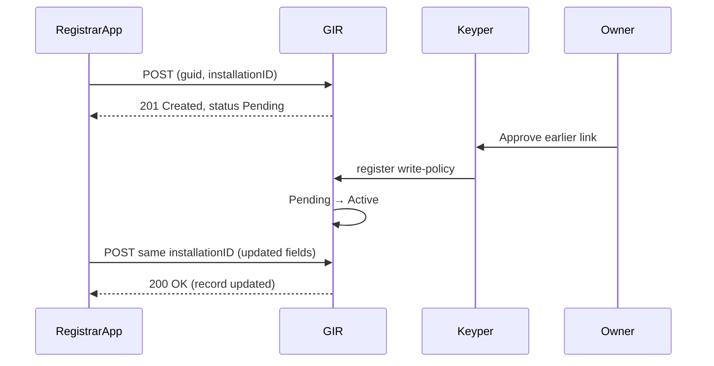

# Register Installations – "POST /GIRBasisdataMessage"

This guide covers the actual write call that a registrar performs to create or update installation records in GIR.

🔗 **[Live API Documentation](https://gir-preview.poort8.nl/scalar/#tag/girbasisdatamessage/POST/api/GIRBasisdataMessage)** – Interactive endpoint testing

## **When to Call**

**You can register installations at any time** – the API automatically handles status based on policy presence:

- **No write policy exists** → Installation stored as `Pending` (registrar sees it, others don't)
- **Write policy already exists** → Installation stored as `Active` (visible to authorized parties)
- **The same endpoint handles both "create" (201) and "update" (200)**

💡 **Tip**: If the response shows `status: "Pending"`, you need to request write approval via the [Registrar Flow](registrar-flow.md)

---

## **1 Prerequisites**

| **Must have** | **Notes** |
| -- | -- |
| Auth0 access-token for the registrar app | Scopes: `read:ar:delegated` `write:ar:delegated` |
| Valid BAG VBO-ID and 8-digit KVK numbers (no NL.KVK. prefix) | API rejects unknown/invalid IDs |
| Installation with minimum of one component | DICO standard describes requirements of the [GIRBasisdataMessage](https://ketenstandaard.semantic-treehouse.nl/docs/api/GIR/)|

---

## **2 Endpoint**

```
POST https://gir-preview.poort8.nl/api/GIRBasisdataMessage
Authorization: Bearer <REGISTRAR_ACCESS_TOKEN>
Content-Type: application/json
```

🔗 **[Live API Documentation](https://gir-preview.poort8.nl/scalar/#tag/girbasisdatamessage/POST/api/GIRBasisdataMessage)** – Interactive endpoint testing

---

## **3 Body Schema 


**📖 Complete DICO Schema Reference:**
- **[Ketenstandaard GIR API Specification](https://ketenstandaard.semantic-treehouse.nl/docs/api/GIR/)** – Full DICO field documentation
- **[GIR Concept & Background](https://ketenstandaard.semantic-treehouse.nl/docs/TNL/GIR/)** – Understanding the GIR framework

*This API follows the Ketenstandaard GIR specification for complete DICO field support including classifications, components, geographical coordinates, and detailed installation properties.*

---

## **4 Example – Create or Update**

```bash
curl -X POST https://gir-preview.poort8.nl/api/GIRBasisdataMessage \
  -H "Authorization: Bearer <REGISTRAR_ACCESS_TOKEN>" \
  -H "Content-Type: application/json" \
  -d '{
        "guid": "b4d1a2f3-9c6d-4b8e-a317-987654321abc",
        "registrarChamberOfCommerceNumber": "12345678",
        "installation": {
          "installationID": { "value": "INST-987-001", "type": "TYPE-001" },
          "name": "Main Transformer Station",
          "installationOwnerChamberOfCommerceNumber": "87654321",
          "installationLocation": {
            "vboID": "0344010000126888",
            "address": {
              "street": "Energiestraat",
              "houseNumber": 12,
              "postalCode": "1234AB",
              "city": "Amsterdam",
              "country": "NL"
            }
          }
        }
      }'
```

---

## **5 Responses**

| **Code** | **Meaning** | **Body** |
| -- | -- | -- |
| `201 Created` | New installation stored | `{ "guid": "...", "status": "Pending" }`<br/>*Status is `Active` if owner had already approved* |
| `200 OK` | `installationID.value` already existed – record updated | Same payload as 201 |
| `400 Bad Request` | Validation error (e.g. bad VBO, wrong lengths)<br/>Body follows Problem-Details format | ```json<br/>{ <br/>  "statusCode": 400,<br/>  "message": "One or more errors occurred!",<br/>  "errors": {<br/>    "installation.installationID.value": [<br/>      "must be unique"<br/>    ]<br/>  }<br/>}``` |
| `401 Unauthorized` | Token missing / expired | — |
| `403 Forbidden` | Write policy missing or token lacks correct scopes | — |
| `415 Unsupported Media Type` | Content-Type not JSON | — |

---

## **6 Lifecycle Recap**

1. **POST succeeds** → record is `Pending` (only visible to registrar)
2. **Owner clicks Approve in Keyper** → Keyper writes policy → GIR promotes record to `Active` automatically
3. **Registrar or owner can later archive** (soft delete) the record

---

## **7 Sequence Diagram (Create + Approve + Update)**



---

## **8 Error-Handling Cheat-Sheet**

| **Problem** | **Typical Fix** |
| -- | -- |
| `400 InvalidVboID` | Verify 16-digit BAG ID; no spaces |
| `400 guid format` | Ensure UUID v4, 36 chars |
| `403 PolicyNotFound` | Owner hasn't approved write-policy yet |
| `409` (no longer used – 200 covers update) | — |

---

## **9 Production Notes**

⚠️ **Key Production Changes:**
- Same JSON contract; base host and token type change (iSHARE)
- Scopes remain `read:ar:delegated` `write:ar:delegated`

---

## **Next Steps**

- **After a record becomes Active**, head back to the [Querying Installations](README.md#5-querying-installations) guide
- **Data-consumers can then request read-access** via the [Data-Consumer Flow](data-consumer-flow.md)
