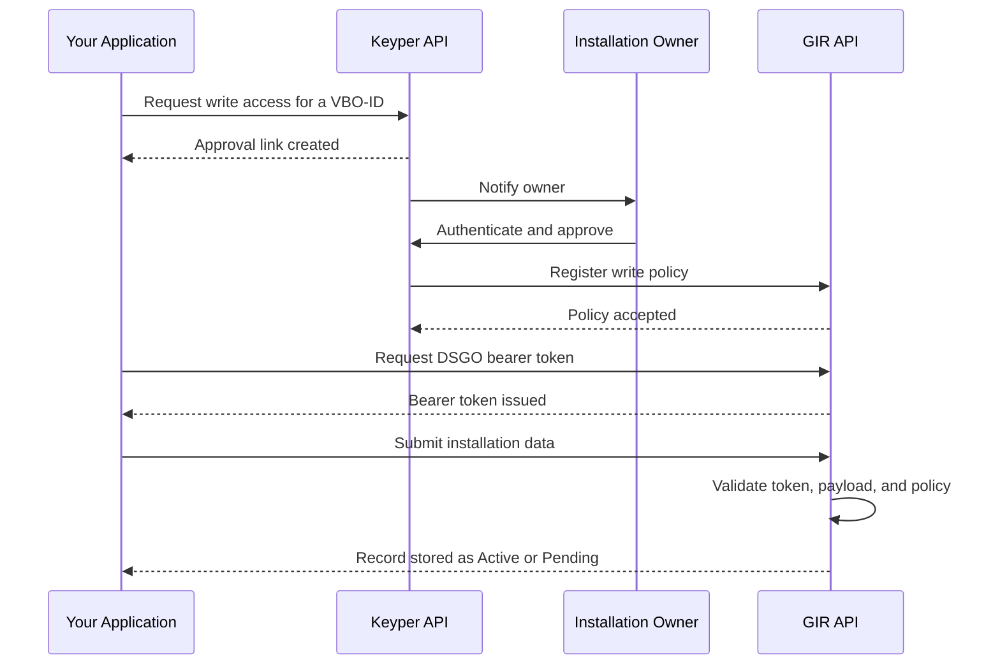
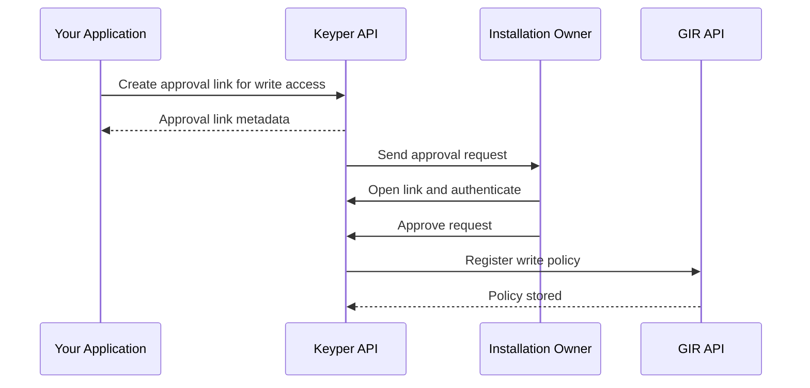
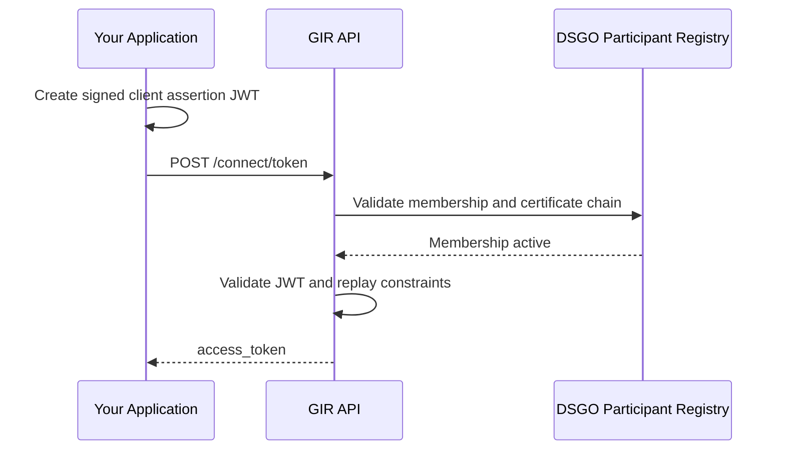
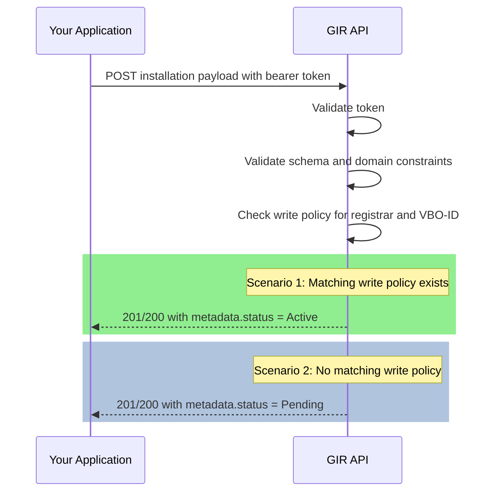
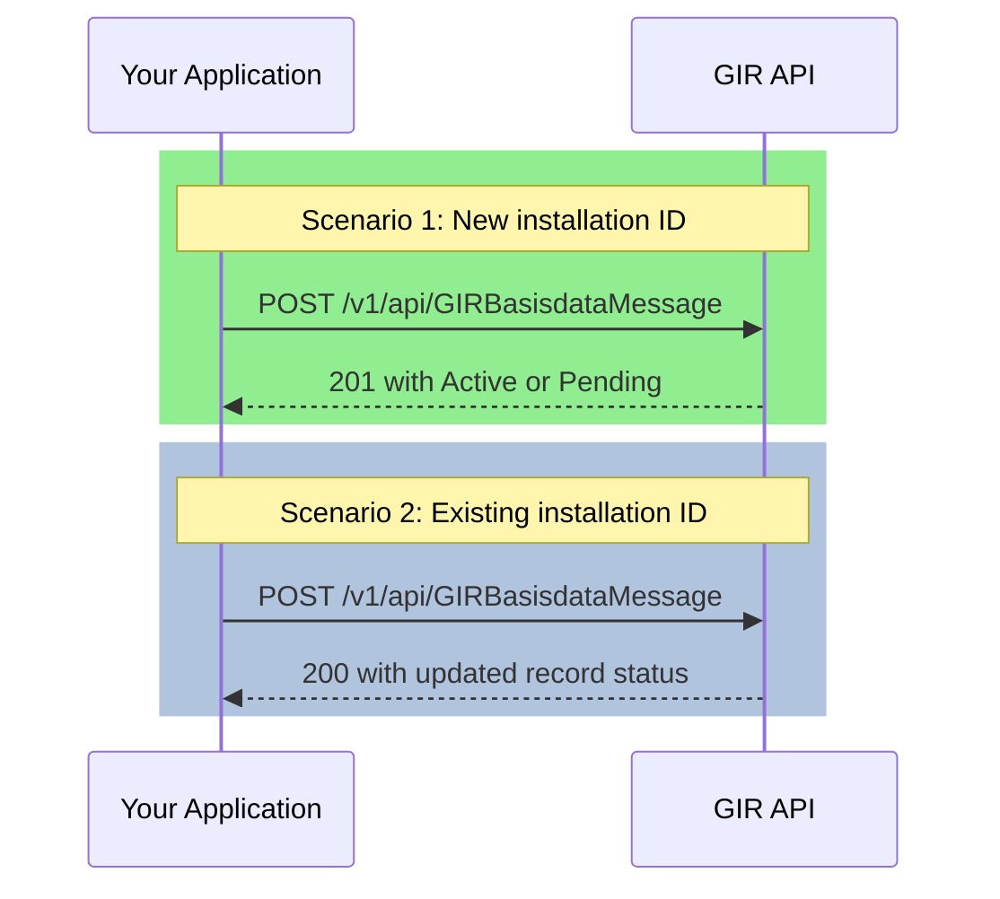
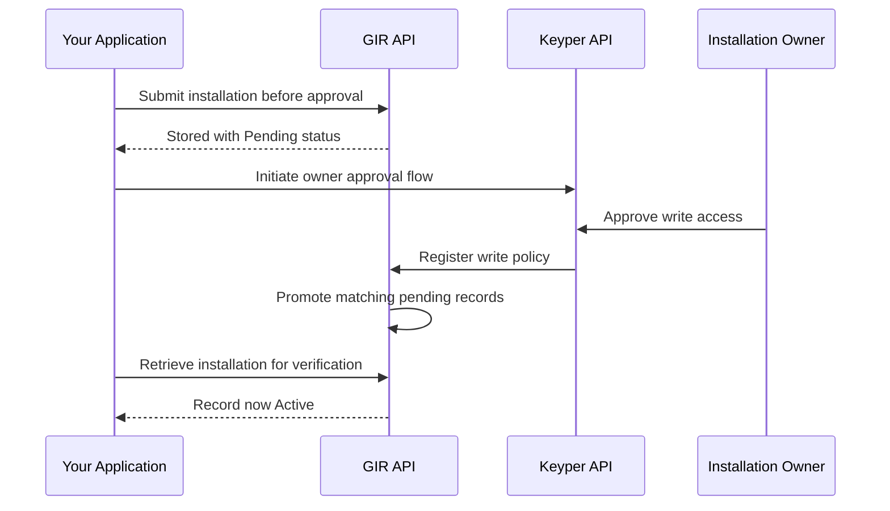
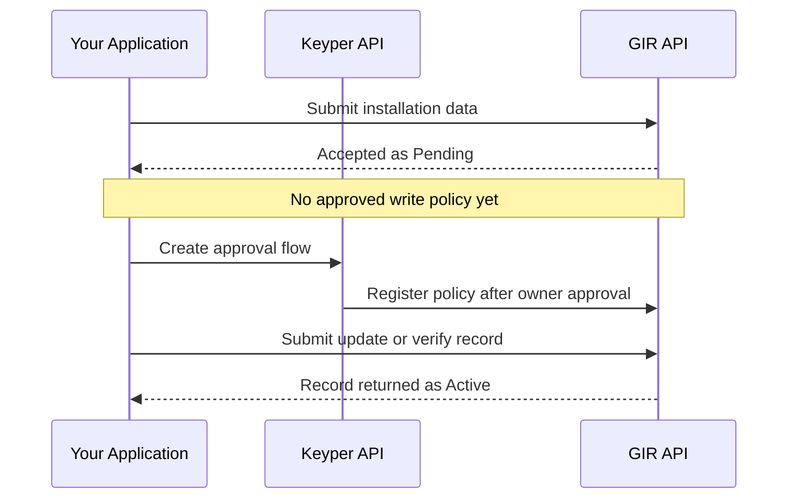

# Registrar Integration Guide

This guide explains the end-to-end flow for registrars that want to publish and maintain installation data in GIR.

It is intentionally an overview page. It describes how the flow works across Keyper, DSGO, and GIR, while endpoint-level implementation details are documented in the dedicated guides.

To successfully publish data to GIR, two conditions must be met:

- Your organization must have an approved write policy for the target building.
- Your application must call GIR with a valid DSGO bearer token.

## Overview

The registrar flow has four steps:

1. Request and obtain owner approval for write access through Keyper.
2. Obtain a DSGO bearer token for GIR.
3. Submit or update installation data in GIR.
4. Verify records are Active and available for authorized consumers.

This page focuses on orchestration between systems. For payloads, parameters, and response schemas, use the endpoint-specific guides linked throughout this document.

## End-to-End Orchestration


```mermaid
sequenceDiagram
    participant App as Your Application
    participant Keyper as Keyper API
    participant Owner as Installation Owner
    participant GIR as GIR API

    App->>Keyper: Request write access for a VBO-ID
    Keyper-->>App: Approval link created
    Keyper->>Owner: Notify owner
    Owner->>Keyper: Authenticate and approve
    Keyper->>GIR: Register write policy
    GIR-->>Keyper: Policy accepted

    App->>GIR: Request DSGO bearer token
    GIR-->>App: Bearer token issued

    App->>GIR: Submit installation data
    GIR->>GIR: Validate token, payload, and policy
    GIR-->>App: Record stored as Active or Pending
```

## Step 1: Ensure a valid Keyper write policy is present

Before installation data can be broadly shared through GIR, write authorization must be approved by the installation owner.

At a high level, your application asks Keyper to create an approval flow for a specific building, the owner approves it, and Keyper registers the resulting write policy in GIR.


```mermaid
sequenceDiagram
    participant App as Your Application
    participant Keyper as Keyper API
    participant Owner as Installation Owner
    participant GIR as GIR API

    App->>Keyper: Create approval link for write access
    Keyper-->>App: Approval link metadata
    Keyper->>Owner: Send approval request
    Owner->>Keyper: Open link and authenticate
    Owner->>Keyper: Approve request
    Keyper->>GIR: Register write policy
    GIR-->>Keyper: Policy stored
```

### What must align

The approval flow must consistently target:

- The building identifier as a BAG VBO-ID.
- The installation owner's organization identifier.
- The registrar (provider) organization identifier.
- Optional classification rules, if writes should be scoped.

If these identifiers do not line up with the later GIR write request, records may remain `Pending` or be rejected.

### What changes after approval

After owner approval completes:

- A write policy exists in GIR for the building.
- New and updated records for that scope can become `Active` immediately.
- Your application can proceed with token acquisition and submission.

### Implementation references

- [../keyper/README.md](../keyper/README.md)
- [Keyper API Docs ➚](https://keyper-preview.poort8.nl/scalar/v1)

### Keyper approval-link example (v1)

Use this example as a template to create the owner approval request for write access.

```http
POST https://keyper-preview.poort8.nl/v1/api/approval-links
Authorization: Bearer <KEYPER_ACCESS_TOKEN>
Content-Type: application/json
Accept: application/json
```

```json
{
    "requester": {
        "name": "<REGISTRAR_CONTACT_NAME>",
        "email": "<REGISTRAR_CONTACT_EMAIL>",
        "organization": "<REGISTRAR_ORGANIZATION_NAME>",
        "organizationId": "did:ishare:EU.NL.NTRNL-<REGISTRAR_ORG_ID>"
    },
    "approver": {
        "name": "<OWNER_CONTACT_NAME>",
        "email": "<OWNER_CONTACT_EMAIL>",
        "organization": "<OWNER_ORGANIZATION_NAME>",
        "organizationId": "did:ishare:EU.NL.NTRNL-<OWNER_ORG_ID>"
    },
    "dataspace": {
        "baseUrl": "https://gir-preview.poort8.nl"
    },
    "reference": "<YOUR_REFERENCE>",
    "addPolicyTransactions": [
        {
            "type": "GIRBasisdataMessage",
            "rules": null,
            "action": "write",
            "license": "0005",
            "issuedAt": 1760446448,
            "issuerId": "did:ishare:EU.NL.NTRNL-<OWNER_ORG_ID>",
            "attribute": "*",
            "notBefore": 1760446448,
            "subjectId": "did:ishare:EU.NL.NTRNL-<REGISTRAR_ORG_ID>",
            "expiration": 2147483647,
            "resourceId": "<BAG_VBO_ID_16_DIGITS>",
            "serviceProvider": "did:ishare:EU.NL.NTRNL-<GIR_SERVICE_PROVIDER_ORG_ID>"
        }
    ],
    "orchestration": {
        "flow": "dsgo.gir@v1"
    }
}
```

On success, Keyper returns an approval-link id and status. Keep the id so you can track approval progress.

```json
{
    "id": "<APPROVAL_LINK_ID>",
    "reference": "<YOUR_REFERENCE>",
    "url": "https://keyper-preview.poort8.nl/approve/<APPROVAL_LINK_ID>",
    "expiresAtUtc": <UNIX_TIMESTAMP_SECONDS>,
    "status": "Active"
}
```

Check approval status with:

```http
GET https://keyper-preview.poort8.nl/v1/api/approval-links/<APPROVAL_LINK_ID>
Authorization: Bearer <KEYPER_ACCESS_TOKEN>
Accept: application/json
```

Typical status lifecycle: `Active` -> `Approved` or `Rejected` or `Expired`.

### Attribute filtering in policy

`attribute` supports either a wildcard (`*`) or scope-style filters.

Use this token style:

```text
gir:<resource>:<action>[:key=value]
```

Example with multiple NLSFB classifications:

```text
gir:class:nlsfb_tabel1=52.16 gir:class:nlsfb_tabel1=52.20 gir:class:nlsfb_tabel1=53.40
```

Recommended usage in this flow:

- Use `*` when no classification filtering is required.
- Use one or more `gir:class:nlsfb_tabel1=<code>` tokens when permission must be limited to specific NLSFB classes.
- Keep classification codes as strings exactly as provided in GIRBasisdataMessages (for example `52.16`).

Evaluation semantics:

- Multiple `gir:class:nlsfb_tabel1=<code>` tokens are evaluated as OR within that classification set.
- Resource and action constraints are evaluated as AND with classification constraints.
- If no class token is present, classification is unfiltered.

## Execution paths

Use one of these operational paths.

### Path A: approval-first (fastest activation)

1. Create approval link.
2. Poll until status is `Approved`.
3. Obtain DSGO bearer token.
4. Submit installation write.
5. Expect write status `Active`.

### Path B: write-first (deferred activation)

1. Obtain DSGO bearer token.
2. Submit installation write before approval.
3. Expect write status `Pending`.
4. Create and complete owner approval flow.
5. Re-check installation until status is `Active`.

## Step 2: Obtain a DSGO bearer token

All GIR write requests require a DSGO bearer token.

The token does not replace the write policy from Step 1. Both are needed:

- The token authenticates your application to GIR.
- The write policy authorizes publication for the target building.


```mermaid
sequenceDiagram
    participant App as Your Application
    participant GIR as GIR API
    participant SAT as DSGO Participant Registry

    App->>App: Create signed client assertion JWT
    App->>GIR: POST /connect/token
    GIR->>SAT: Validate membership and certificate chain
    SAT-->>GIR: Membership active
    GIR->>GIR: Validate JWT and replay constraints
    GIR-->>App: access_token
```

### Operational meaning

Request a token when:

- Your application is about to submit installation data.
- The previous token has expired.
- You are starting a new write batch and want a clean token lifecycle.

A valid token by itself is not enough to publish installation data if no matching write policy exists.

### Implementation references

- [connect-token.md](connect-token.md)
- [GIR API Docs ➚](https://gir-preview.poort8.nl/scalar/v1)
- [DSGO Developer Portal ➚](https://digigo-nu.gitbook.io/dsgo-developer-portal/)

## Step 3: Submit installation data

Once Step 1 and Step 2 are complete, your application can submit installation data.

At runtime, GIR evaluates both the token and the installed authorization state before deciding whether the record is immediately `Active` or temporarily `Pending`.


```mermaid
sequenceDiagram
    participant App as Your Application
    participant GIR as GIR API

    App->>GIR: POST installation payload with bearer token
    GIR->>GIR: Validate token
    GIR->>GIR: Validate schema and domain constraints
    GIR->>GIR: Check write policy for registrar and VBO-ID
    
    rect rgb(144, 238, 144)
    note over GIR: Scenario 1: Matching write policy exists
    GIR-->>App: 201/200 with metadata.status = Active
    end
    
    rect rgb(176, 196, 222)
    note over GIR: Scenario 2: No matching write policy
    GIR-->>App: 201/200 with metadata.status = Pending
    end
```

### Upsert model

The same write endpoint handles both create and update:

- First submission for an installation ID creates a record.
- Later submission with the same installation ID updates that record.

This allows idempotent operational flows where retries can safely update the same installation state.

### Runtime decision flow


```mermaid
sequenceDiagram
    participant App as Your Application
    participant GIR as GIR API

    rect rgb(144, 238, 144)
    note over App,GIR: Scenario 1: New installation ID
    App->>GIR: POST /v1/api/GIRBasisdataMessage
    GIR-->>App: 201 with Active or Pending
    end
    
    rect rgb(176, 196, 222)
    note over App,GIR: Scenario 2: Existing installation ID
    App->>GIR: POST /v1/api/GIRBasisdataMessage
    GIR-->>App: 200 with updated record status
    end
```

### Implementation references

- [insert-installation.md](insert-installation.md)

## Step 4: Activate pending records and publish updates

When a record is stored as `Pending`, it is persisted but not yet broadly visible to other parties.

After write approval is completed in Keyper for the same scope, GIR can transition matching pending records to `Active`.


```mermaid
sequenceDiagram
    participant App as Your Application
    participant GIR as GIR API
    participant Keyper as Keyper API
    participant Owner as Installation Owner

    App->>GIR: Submit installation before approval
    GIR-->>App: Stored with Pending status

    App->>Keyper: Initiate owner approval flow
    Owner->>Keyper: Approve write access
    Keyper->>GIR: Register write policy
    GIR->>GIR: Promote matching pending records

    App->>GIR: Retrieve installation for verification
    GIR-->>App: Record now Active
```

### What data is actually visible

For registrars, GIR visibility depends on status and authorization.

In practice this means:

- Pending records are visible to the registrar for that scope.
- Active records are visible to parties that have matching read or write authorization.
- Records outside approved scope are not returned to unauthorized parties.

### Verification patterns

After a write, verify outcomes with one of these patterns:

- Retrieve one known installation to validate status and metadata.
- Retrieve a filtered list to verify activation at scale.

Use the retrieval guides for endpoint details.

### Implementation references

- [retrieve-installation.md](retrieve-installation.md)
- [retrieve-installations.md](retrieve-installations.md)

## What happens when the flow is incomplete

The most common operational issue is that one part of the flow has completed and another has not.


```mermaid
sequenceDiagram
    participant App as Your Application
    participant Keyper as Keyper API
    participant GIR as GIR API

    App->>GIR: Submit installation data
    GIR-->>App: Accepted as Pending
    Note over App,GIR: No approved write policy yet

    App->>Keyper: Create approval flow
    Keyper->>GIR: Register policy after owner approval

    App->>GIR: Submit update or verify record
    GIR-->>App: Record returned as Active
```

Typical causes of incomplete activation:

- The owner has not approved the Keyper request yet.
- The write request targets a different VBO-ID than the approved policy.
- The bearer token is missing or expired.
- Classification rules were applied and the write falls outside policy scope.

## Recommended implementation split

Treat the flow in your application as four separate concerns:

1. Approval orchestration.
   Use Keyper to create and monitor write-access requests.
2. Token lifecycle.
   Obtain and refresh DSGO bearer tokens as needed.
3. Write processing.
   Submit upserts and track response status (`Active` or `Pending`).
4. Activation verification.
    Validate that pending records become active after policy approval.

This split makes troubleshooting easier because each concern has its own state and dedicated implementation guide.

## Registrar implementation checklist

Use this sequence for a new registrar integration:

1. Create a Keyper approval-link request for the target VBO-ID using the v1 template above.
2. Store the returned `id`, `reference`, `expiresAtUtc`, and initial `status`.
3. Poll `GET /v1/api/approval-links/{id}` until status is final (`Approved`, `Rejected`, or `Expired`).
4. If approved, obtain a DSGO bearer token using [connect-token.md](connect-token.md).
5. Submit the installation message using [insert-installation.md](insert-installation.md).
6. Inspect `metadata.status` in the write response (`Active` or `Pending`).
7. Verify outcome with [retrieve-installation.md](retrieve-installation.md) or [retrieve-installations.md](retrieve-installations.md).
8. On `Rejected` or `Expired`, create a new approval request with a new `reference`.

## Runtime decision matrix

| Approval status | Token status | Write attempt result | What to do next |
|-----------------|--------------|----------------------|-----------------|
| `Approved` | Valid | `Active` | Continue normal updates |
| `Approved` | Missing/expired | `401` | Refresh token and retry |
| `Active` | Valid | `Pending` | Validate policy scope alignment (`resourceId`, identifiers, classification filters) |
| `Rejected` | Valid | Not attempted | Create a new approval request |
| `Expired` | Valid | Not attempted | Create a new approval request |

## Operational monitoring

Track these fields per request cycle:

- Keyper approval-link `id`
- `reference`
- `resourceId` (VBO-ID)
- Installation ID used in GIR writes
- Write `metadata.status`

Recommended alerts:

- `Pending` records that stay unresolved beyond expected approval SLA
- High number of `Expired` approval links
- Repeated scope mismatches for the same `resourceId`

## Implementation guides

Use these pages when moving from flow design into endpoint integration:

- [connect-token.md](connect-token.md)
- [insert-installation.md](insert-installation.md)
- [retrieve-installation.md](retrieve-installation.md)
- [retrieve-installations.md](retrieve-installations.md)

Related context:

- [README.md](README.md)
- [data-consumer-flow.md](data-consumer-flow.md)

## Summary

| Step | Goal | Result |
|------|------|--------|
| 1. Keyper approval | Obtain owner-approved write access for a building | Write policy becomes active in GIR |
| 2. Token acquisition | Authenticate your application to GIR | DSGO bearer token available |
| 3. GIR write | Create or update installation data | Record stored as Active or Pending |
| 4. Activation verification | Verify post-approval visibility | Record transitions to Active when authorized |

For repeated updates on the same building, Step 1 usually does not need to be repeated until policy expiration or scope changes. Step 2 is repeated whenever the current token expires.
