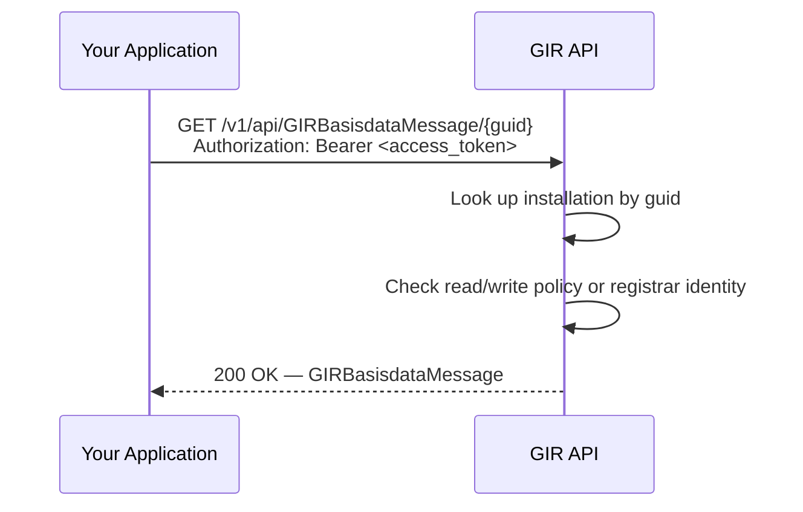

# Retrieve a GIRBasisdataMessage by GUID (`GET /v1/api/GIRBasisdataMessage/{guid}`)

🔗 [GIR API Docs ➚](https://gir-preview.poort8.nl/scalar/v1)

This guide explains how to retrieve a specific installation record from GIR using its GUID.

> Looking for the list endpoint with query filters? See [Get Multiple GIRBasisdataMessages](retrieve-installations.md).

## Prerequisites

- A valid DSGO bearer token. See [Obtaining a DSGO Bearer Token](connect-token.md).
- Your organization has a read policy, a write policy, or is the original registrar for the requested installation. See [Authorization](#authorization) below.

## How it works



## Request

```http
GET https://gir-preview.poort8.nl/v1/api/GIRBasisdataMessage/{guid}
Authorization: Bearer <ACCESS_TOKEN>
Accept: application/json
```

### Path parameter

| Parameter | Type | Description |
|-----------|------|--------------|
| `guid` | string (UUID) | The GUID of the GIRBasisdataMessage to retrieve |

### Example

```bash
curl https://gir-preview.poort8.nl/v1/api/GIRBasisdataMessage/550e8400-e29b-41d4-a716-446655440000 \
  -H "Authorization: Bearer <ACCESS_TOKEN>" \
  -H "Accept: application/json"
```

## Authorization

GIR checks three conditions to decide whether to return the record. Access is granted if **any one** of these is true:

| Condition | Who qualifies |
|-----------|---------------|
| Active **read policy** exists with your organization as subject and the installation owner as issuer, for the installation's VBO-ID | Data consumer with an approved Keyper read policy |
| Active **write policy** exists with your organization as subject and the installation owner as issuer, for the installation's VBO-ID | Registrar with an approved write policy |
| Your organization's DID matches the **registrar** who originally created the record | The registrar who registered the installation |

If the GUID exists but none of these conditions are met, GIR returns `403 Forbidden`.

To set up a read policy for your organization, see [Data-Consumer Flow](data-consumer-flow.md).

## Response

A successful `200` response returns a single `GIRBasisdataMessage` object:

```json
{
  "guid": "550e8400-e29b-41d4-a716-446655440000",
  "registrarChamberOfCommerceNumber": "30276543",
  "installationBaseData": {
    "installationID": { "value": "INST-987-001", "type": "GUID" },
    "name": "Main Transformer Station",
    "operationalStatus": "Operational",
    "lifeCycleStatus": "Installed",
    "installationOwnerChamberOfCommerceNumber": "12345678",
    "installationLocation": {
      "vboID": "0344010000126888"
    },
    "installationProperties": {
      "controlSystemType": "GBS"
    },
    "component": [...]
  },
  "metadata": {
    "issuer": "did:ishare:EU.NL.NTRNL-30276543",
    "createdAt": "2025-01-15T10:00:00Z",
    "updatedAt": null,
    "deletedAt": null,
    "status": "Active"
  }
}
```

### Response fields

| Field | Description |
|-------|-------------|
| `guid` | The GUID you requested |
| `registrarChamberOfCommerceNumber` | KvK number of the organization that registered this installation |
| `installationBaseData` | Full installation data — see [GIR API Docs ➚](https://gir-preview.poort8.nl/scalar/v1) for the complete schema |
| `metadata.issuer` | DID of the registrar |
| `metadata.createdAt` | When the record was first created |
| `metadata.updatedAt` | When the record was last updated, or `null` if never updated |
| `metadata.status` | `Active` or `Pending` — only `Active` installations are visible to other parties |

> If the same GUID has more than one version in the registry, GIR returns the most recently updated one.

## Status codes

| Status | Meaning | Action |
|--------|---------|--------|
| `200 OK` | Installation found and you are authorized to view it | — |
| `403 Forbidden` | Installation exists but your organization has no read policy, write policy, or registrar ownership for it | Request access via a Keyper approval link — see [Data-Consumer Flow](data-consumer-flow.md) |
| `404 Not Found` | No installation with this GUID exists in GIR | Verify the GUID is correct |
| `400 Bad Request` | Invalid request format | Check the GUID format |
| `401 Unauthorized` | Missing or expired DSGO bearer token | Obtain a new token — see [Obtaining a DSGO Bearer Token](connect-token.md) |

## API reference

- Interactive endpoint reference and full response schema: [GIR API Docs ➚](https://gir-preview.poort8.nl/scalar/v1)