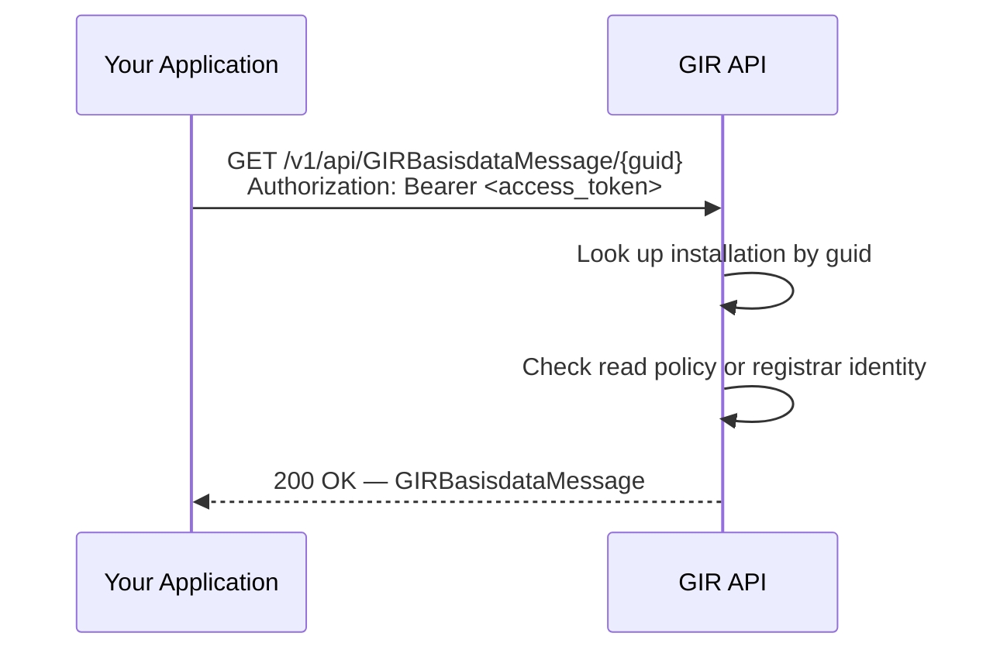

# Retrieve a GIRBasisdataMessage by GUID (`GET /v1/api/GIRBasisdataMessage/{guid}`)

🔗 [GIR API Docs ➚](https://gir-preview.poort8.nl/scalar/v1)

This guide explains how to retrieve a specific installation record from GIR using its GUID.

> Looking for the list endpoint with query filters? See [Get Multiple GIRBasisdataMessages](retrieve-installations.md).

## Prerequisites

- A valid DSGO bearer token. See [Obtaining a DSGO Bearer Token](connect-token.md).
- Your organization has a read policy, or is the original registrar for the requested installation, **or** you present a `delegation_evidence` header on behalf of one of those organizations. A write policy alone does not grant read access. See [Authorization](#authorization) below.

## How it works


```mermaid
sequenceDiagram
    participant App as Your Application
    participant GIR as GIR API

    App->>GIR: GET /v1/api/GIRBasisdataMessage/{guid}<br/>Authorization: Bearer <access_token>
    GIR->>GIR: Look up installation by guid
    GIR->>GIR: Check read policy or registrar identity
    GIR-->>App: 200 OK — GIRBasisdataMessage
```

## Request

```http
GET https://gir-preview.poort8.nl/v1/api/GIRBasisdataMessage/{guid}
Authorization: Bearer <ACCESS_TOKEN>
Accept: application/json
delegation_evidence: <DELEGATION_TOKEN>
```

The `delegation_evidence` header is optional. See [Supplier delegation](#supplier-delegation) below for when to include it.

### Path parameter

| Parameter | Type | Description |
|-----------|------|--------------|
| `guid` | string (UUID) | The GUID of the GIRBasisdataMessage to retrieve |

### Example

```bash
curl https://gir-preview.poort8.nl/v1/api/GIRBasisdataMessage/550e8400-e29b-41d4-a716-446655440000 \
  -H "Authorization: Bearer <ACCESS_TOKEN>" \
  -H "Accept: application/json"
```

## Authorization

GIR checks the following conditions to decide whether to return the record. Access is granted if **any one** of these is true:

| Condition | Who qualifies |
|-----------|---------------|
| Active **read policy** exists with your organization as subject and the installation owner as issuer, for the installation's VBO-ID | Data consumer with an approved Keyper read policy |
| Your organization's DID matches the **registrar** who originally created the record | The registrar who registered the installation |
| A **SupplierDelegation** policy authorizes your organization to act for another organization that itself holds an active **read policy**, and you present a matching `delegation_evidence` header scoped to that read policy | Software supplier calling on behalf of an installer that has its own read policy (see [Supplier delegation](#supplier-delegation)) |

> A **write policy** alone does not grant read access to a record — only a read policy, registrar identity, or delegated read access (see below) is checked here. Write policies govern the `POST /api/GIRBasisdataMessage` endpoint, not retrieval.

If the GUID exists but none of these conditions are met, GIR returns `403 Forbidden`.

To set up a read policy for your organization, see [Data-Consumer Flow](data-consumer-flow.md).

### Supplier delegation

If your organization was not the caller who obtained the read policy for a record, but you have a `SupplierDelegation` from that organization (see [Phase 2 — SupplierDelegation](digitaal-onderhoudsboekje-supplier-delegation.md)), you can still retrieve their record:

1. Call `POST /api/delegation` yourself (as the software supplier), with `policyIssuer` set to the installer's DID and `target.accessSubject` set to your own DID. Scope the request to the specific `vboID` and `installationID` you want to query, with `resource.type: "GIRBasisdataMessage"`, `actions: ["read"]`, and `environment.serviceProviders: ["did:ishare:EU.NL.NTRNL-27248698"]` (Techniek Nederland's DID — GIR rejects any other value). See [Step 3: Verify the AccessRight in GIR](digitaal-onderhoudsboekje-m2m-maintenance-data-transfer.md#step-3-verify-the-accessright-in-gir) for the request shape.
2. Take the resulting `delegation_token` from the response and pass it as the `delegation_evidence` header on your `GET` request.
3. GIR validates the token and checks that its scope (VBO-ID, installation ID, action, service provider) matches the record, then evaluates the **read policy** for the delegating installer instead of your own organization. The installer must have an active read policy for the same organization that granted them access in the first place — a write-only relationship is not enough.

> **Limitation**: delegation only works on behalf of an organization that itself holds an active read policy for the record. If the delegating organization is only the record's original registrar (see the registrar-identity row above) and has no separate read policy, GIR does **not** fall back to registrar identity for the delegated caller — the request is denied. Register a read policy for the delegating organization if it needs to delegate retrieval to a software supplier.

The `delegation_evidence` header only ever widens access to records that match the token's exact scope — it never grants broader access than the delegating organization already has.

## Response

A successful `200` response returns a single `GIRBasisdataMessage` object:

```json
{
  "guid": "550e8400-e29b-41d4-a716-446655440000",
  "registrarChamberOfCommerceNumber": "30276543",
  "installationBaseData": {
    "installationID": { "value": "INST-987-001", "type": "GUID" },
    "name": "Main Transformer Station",
    "operationalStatus": "Operational",
    "lifeCycleStatus": "Installed",
    "installationOwnerChamberOfCommerceNumber": "12345678",
    "installationLocation": {
      "vboID": "0344010000126888"
    },
    "installationProperties": {
      "controlSystemType": "GBS"
    },
    "component": [...]
  },
  "metadata": {
    "issuer": "did:ishare:EU.NL.NTRNL-30276543",
    "createdAt": "2025-01-15T10:00:00Z",
    "updatedAt": null,
    "status": "Active"
  }
}
```

### Response fields

| Field | Description |
|-------|-------------|
| `guid` | The GUID you requested |
| `registrarChamberOfCommerceNumber` | KvK number of the organization that registered this installation |
| `installationBaseData` | Full installation data — see [GIR API Docs ➚](https://gir-preview.poort8.nl/scalar/v1) for the complete schema |
| `metadata.issuer` | DID of the registrar |
| `metadata.createdAt` | When the record was first created |
| `metadata.updatedAt` | When the record was last updated, or `null` if never updated |
| `metadata.status` | `Active` or `Pending` — only `Active` installations are visible to other parties |

> If the same GUID has more than one version in the registry, GIR returns the most recently updated one.

## Status codes

| Status | Meaning | Action |
|--------|---------|--------|
| `200 OK` | Installation found and you are authorized to view it | — |
| `403 Forbidden` | Installation exists but your organization has no read policy, registrar ownership, or valid delegated read access for it | Request access via a Keyper approval link — see [Data-Consumer Flow](data-consumer-flow.md) |
| `404 Not Found` | No installation with this GUID exists in GIR | Verify the GUID is correct |
| `400 Bad Request` | Invalid request format | Check the GUID format |
| `401 Unauthorized` | Missing or expired DSGO bearer token | Obtain a new token — see [Obtaining a DSGO Bearer Token](connect-token.md) |

## API reference

- Interactive endpoint reference and full response schema: [GIR API Docs ➚](https://gir-preview.poort8.nl/scalar/v1)