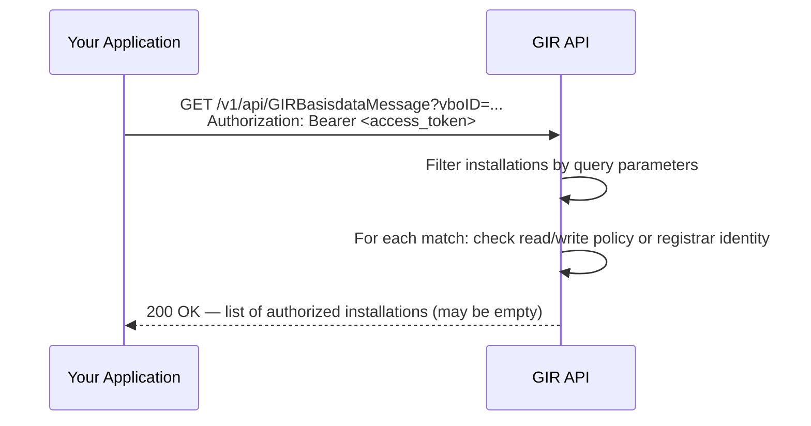

# Retrieve Multiple GIRBasisdataMessages (`GET /v1/api/GIRBasisdataMessage`)

🔗 [GIR API Docs ➚](https://gir-preview.poort8.nl/scalar/v1)

This guide explains how to retrieve a filtered list of installation records from GIR using query parameters.

> Looking for retrieval by a specific GUID? See [Retrieve an Installation](retrieve-installation.md).

## Prerequisites

- A valid DSGO bearer token. See [Obtaining a DSGO Bearer Token](connect-token.md).
- Your organization has a read policy, a write policy, or is the original registrar for the installations you want to retrieve. See [Authorization](#authorization) below.

## How it works



Note: this endpoint never returns `403` or `404`. Installations your organization is not authorized to view are silently excluded from the result. An empty array means either no records match the filters, or none of the matches are authorized for your organization.

## Request

```http
GET https://gir-preview.poort8.nl/v1/api/GIRBasisdataMessage
Authorization: Bearer <ACCESS_TOKEN>
Accept: application/json
```

### Query parameters

All parameters are optional. Combine them to narrow results. Omitting all parameters returns every installation your organization is authorized to view.

| Parameter | Type | Description |
|-----------|------|-------------|
| `vboID` | string | Filter by BAG VBO-ID (16-digit building identifier) |
| `installationOwnerChamberOfCommerceNumber` | string | Filter by the KvK number of the installation owner |
| `registrarChamberOfCommerceNumber` | string | Filter by the KvK number of the registrar who created the records |
| `installationIDValue` | string | Filter by the installation's own identifier value |
| `energyConnectionID` | string | Filter by EAN energy connection ID |

### Examples

**Filter by VBO-ID (most common):**

```bash
curl "https://gir-preview.poort8.nl/v1/api/GIRBasisdataMessage?vboID=0344010000126888" \
  -H "Authorization: Bearer <ACCESS_TOKEN>" \
  -H "Accept: application/json"
```

**Combine filters:**

```bash
curl "https://gir-preview.poort8.nl/v1/api/GIRBasisdataMessage?vboID=0344010000126888&registrarChamberOfCommerceNumber=30276543" \
  -H "Authorization: Bearer <ACCESS_TOKEN>" \
  -H "Accept: application/json"
```

## Authorization

Filtering and authorization are two separate steps. GIR first applies your query parameters, then checks each matching record individually. A record is included in the response if **any one** of these is true:

| Condition | Who qualifies |
|-----------|---------------|
| Active **read policy** exists with your organization as subject and the installation owner as issuer, for the installation's VBO-ID | Data consumer with an approved Keyper read policy |
| Active **write policy** exists with your organization as subject and the installation owner as issuer, for the installation's VBO-ID | Registrar with an approved write policy |
| Your organization's DID matches the **registrar** who originally created the record | The registrar who registered the installation |

Records that do not pass authorization are silently excluded — they do not cause an error.

To set up a read policy for your organization, see [Data-Consumer Flow](data-consumer-flow.md).

## Response

A successful `200` response returns an array of `GIRBasisdataMessage` objects (empty array `[]` if no authorized matches are found):

```json
[
  {
    "guid": "550e8400-e29b-41d4-a716-446655440000",
    "registrarChamberOfCommerceNumber": "30276543",
    "installationBaseData": {
      "installationID": { "value": "INST-987-001", "type": "GUID" },
      "name": "Main Transformer Station",
      "operationalStatus": "Operational",
      "lifeCycleStatus": "Installed",
      "installationOwnerChamberOfCommerceNumber": "12345678",
      "installationLocation": {
        "vboID": "0344010000126888"
      },
      "installationProperties": {
        "controlSystemType": "GBS"
      },
      "component": [...]
    },
    "metadata": {
      "issuer": "did:ishare:EU.NL.NTRNL-30276543",
      "createdAt": "2025-01-15T10:00:00Z",
      "updatedAt": null,
      "deletedAt": null,
      "status": "Active"
    }
  }
]
```

### Response fields

| Field | Description |
|-------|-------------|
| `guid` | Unique identifier of the installation record |
| `registrarChamberOfCommerceNumber` | KvK number of the organization that registered this installation |
| `installationBaseData` | Full installation data — see [GIR API Docs ➚](https://gir-preview.poort8.nl/scalar/v1) for the complete schema |
| `metadata.issuer` | DID of the registrar |
| `metadata.createdAt` | When the record was first created |
| `metadata.updatedAt` | When the record was last updated, or `null` if never updated |
| `metadata.status` | `Active` or `Pending` — only `Active` installations are returned |

## Status codes

| Status | Meaning | Action |
|--------|---------|--------|
| `200 OK` | Request successful; list may be empty if no authorized matches exist | — |
| `400 Bad Request` | Invalid request format | Check query parameter names and values |
| `401 Unauthorized` | Missing or expired DSGO bearer token | Obtain a new token — see [Obtaining a DSGO Bearer Token](connect-token.md) |

## Common questions

**Why is my result empty even though installations exist?**
GIR returns an empty list when no records pass both the filter step and the authorization step. Check that:
- Your query parameter values match exactly (filters are case-insensitive, but the field must exist on the record).
- Your organization has an active read policy, write policy, or registrar ownership for those installations.

**Does the response include `Pending` installations?**
No. Only `Active` installations are returned to organizations other than the registrar. Installations become `Active` after the registrar has an approved write policy from the owner. See [Register or Update an Installation](insert-installation.md#activation-after-write-approval) for the write-authorization lifecycle.

## API reference

- Interactive endpoint reference and full response schema: [GIR API Docs ➚](https://gir-preview.poort8.nl/scalar/v1)