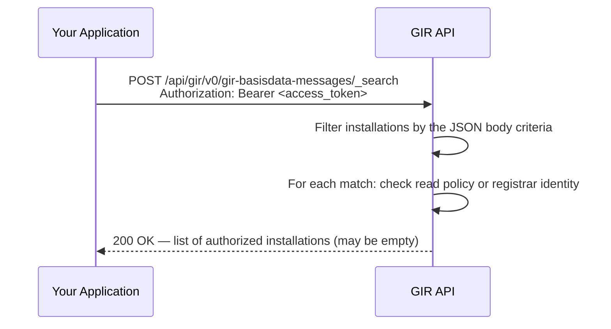

# Retrieve Multiple GIRBasisdataMessages (`POST /api/gir/v0/gir-basisdata-messages/_search`)

🔗 [GIR API Docs ➚](https://gir-preview.poort8.nl/scalar/v1)

This guide explains how to retrieve a filtered list of installation records from GIR by searching with a JSON body.

> Looking for retrieval by a specific GUID? See [Retrieve an Installation](retrieve-installation.md).

## Prerequisites

- A valid DSGO bearer token. See [Obtaining a DSGO Bearer Token](connect-token.md).
- Your organization has a read policy, or is the original registrar for the installations you want to retrieve, **or** you present a `delegation_evidence` header on behalf of one of those organizations. See [Authorization](#authorization) below.

## How it works


```mermaid
sequenceDiagram
    participant App as Your Application
    participant GIR as GIR API
    App->>GIR: POST /api/gir/v0/gir-basisdata-messages/_search<br/>Authorization: Bearer <access_token>
    GIR->>GIR: Filter installations by the JSON body criteria
    GIR->>GIR: For each match: check read policy or registrar identity
    GIR-->>App: 200 OK — list of authorized installations (may be empty)

```

Note: this endpoint never returns `403` or `404`. Installations your organization is not authorized to view are silently excluded from the result. An empty `data` array means either no records match the filters, or none of the matches are authorized for your organization.

## Request

```http
POST https://gir-preview.poort8.nl/api/gir/v0/gir-basisdata-messages/_search
Authorization: Bearer <ACCESS_TOKEN>
Content-Type: application/json
Accept: application/json
delegation_evidence: <DELEGATION_TOKEN>
```

### Body filters

All fields are optional and combine with AND. Omitting all fields returns every installation your organization is authorized to view.

| Field | Type | Description |
|-------|------|-------------|
| `vboID` | string | Filter by BAG VBO-ID (16-digit building identifier) |
| `installationOwnerChamberOfCommerceNumber` | string | Filter by the KvK number of the installation owner |
| `registrarChamberOfCommerceNumber` | string | Filter by the KvK number of the registrar who created the records |
| `installationID` | object (`{ value, type }`, `type` is `GUID` or `GIAI`) | Filter by the installation's own identifier — both `value` and `type` must match |
| `energyConnectionID` | string | Filter by EAN energy connection ID |
| `componentIdValue` | string | Filter by a component identifier recorded inside the installation |
| `componentIdType` | string | Optional, only valid together with `componentIdValue`: restricts the match to a specific component ID type (`SGTIN`, `SerialNumber`) |

### Examples

**Filter by VBO-ID (most common):**

```bash
curl -X POST "https://gir-preview.poort8.nl/api/gir/v0/gir-basisdata-messages/_search" \
  -H "Authorization: Bearer <ACCESS_TOKEN>" \
  -H "Content-Type: application/json" \
  -H "Accept: application/json" \
  -d '{ "vboID": "0344010000126888" }'
```

**Combine filters:**

```bash
curl -X POST "https://gir-preview.poort8.nl/api/gir/v0/gir-basisdata-messages/_search" \
  -H "Authorization: Bearer <ACCESS_TOKEN>" \
  -H "Content-Type: application/json" \
  -H "Accept: application/json" \
  -d '{ "vboID": "0344010000126888", "registrarChamberOfCommerceNumber": "30276543" }'
```

**Filter by component ID:**

```bash
curl -X POST "https://gir-preview.poort8.nl/api/gir/v0/gir-basisdata-messages/_search" \
  -H "Authorization: Bearer <ACCESS_TOKEN>" \
  -H "Content-Type: application/json" \
  -H "Accept: application/json" \
  -d '{ "componentIdValue": "COMP-001-ABC" }'
```

## Authorization

Filtering and authorization are two separate steps. GIR first applies your query parameters, then checks each matching record individually. A record is included in the response if **any one** of these is true:

| Condition | Who qualifies |
|-----------|---------------|
| Active **read policy** exists with your organization as subject and the installation owner as issuer, for the installation's VBO-ID | Data consumer with an approved Keyper read policy |
| Your organization's DID matches the **registrar** who originally created the record | The registrar who registered the installation |
| A **SupplierDelegation** policy authorizes your organization to act for another organization that itself holds an active **read** policy, and you present a matching `delegation_evidence` header scoped to that policy | Software supplier calling on behalf of an installer that has its own read policy (see [Supplier delegation](#supplier-delegation)) |

Records that do not pass authorization are silently excluded — they do not cause an error.

To set up a read policy for your organization, see [Data-Consumer Flow](data-consumer-flow.md).

### Supplier delegation

If your organization was not the caller who obtained the read policy for a record, but you have a `SupplierDelegation` from that organization (see [Phase 2 — SupplierDelegation](digitaal-onderhoudsboekje-supplier-delegation.md)), you can still retrieve their records:

1. Call `POST /v1/api/delegation` yourself (as the software supplier), with `policyIssuer` set to the installer's DID and `target.accessSubject` set to your own DID. Scope the request to the specific `vboID` and `installationID` you want to query, with `resource.type: "GIRBasisdataMessage"`, `actions: ["can_read"]`, and `environment.serviceProviders: ["did:ishare:EU.NL.NTRNL-76660680"]` (Poort8's DID — GIR rejects any other value). See [Step 3: Verify the AccessRight in GIR](digitaal-onderhoudsboekje-m2m-maintenance-data-transfer.md#step-3-verify-the-accessright-in-gir) for the request shape.
2. Take the resulting `delegation_token` from the response and pass it as the `delegation_evidence` header on your `GET` request.
3. GIR validates the token and checks that its scope (VBO-ID, installation ID, action, service provider) matches the record, then evaluates the **read policy** for the delegating installer instead of your own organization. The installer must have an active read policy for the same organization that granted them access in the first place.

The `delegation_evidence` header only ever widens access to records that match the token's exact scope — it never grants broader access than the delegating organization already has.

> **Limitation**: delegation only works on behalf of an organization that itself holds an active read policy for the record. If the delegating organization is only the record's original registrar (see the registrar-identity row above) and has no separate read policy, GIR does **not** fall back to registrar identity for the delegated caller — the request is denied. Register a read policy for the delegating organization if it needs to delegate retrieval to a software supplier.

## Response

A successful `200` response returns a `data`/`meta` envelope. `data` is an array of `GIRBasisdataMessage` objects (`[]` if no authorized matches are found). `meta.nextCursor` is always `null` and `meta.limit`/`meta.totalItems` reflect the actual result count, since cursor/limit pagination is not implemented — every matching, authorized record is returned in a single response:

```json
{
  "data": [
    {
      "guid": "550e8400-e29b-41d4-a716-446655440000",
      "registrarChamberOfCommerceNumber": "30276543",
      "installationBaseData": {
        "installationID": { "value": "INST-987-001", "type": "GUID" },
        "name": "Main Transformer Station",
        "operationalStatus": "Operational",
        "lifeCycleStatus": "Installed",
        "installationOwnerChamberOfCommerceNumber": "12345678",
        "installationLocation": {
          "vboID": "0344010000126888"
        },
        "installationProperties": {
          "controlSystemType": "GBS"
        },
        "component": [...]
      },
      "metadata": {
        "issuer": "did:ishare:EU.NL.NTRNL-30276543",
        "createdAt": "2025-01-15T10:00:00Z",
        "updatedAt": null,
        "status": "Active"
      }
    }
  ],
  "meta": {
    "nextCursor": null,
    "limit": 100,
    "totalItems": 1
  }
}
```

### Response fields

| Field | Description |
|-------|-------------|
| `data[].guid` | Unique identifier of the installation record |
| `data[].registrarChamberOfCommerceNumber` | KvK number of the organization that registered this installation |
| `data[].installationBaseData` | Full installation data — see [GIR API Docs ➚](https://gir-preview.poort8.nl/scalar/v1) for the complete schema |
| `data[].metadata.issuer` | DID of the registrar |
| `data[].metadata.createdAt` | When the record was first created |
| `data[].metadata.updatedAt` | When the record was last updated, or `null` if never updated |
| `data[].metadata.status` | `Active` or `Pending` — only `Active` installations are returned |
| `meta.nextCursor` | Always `null` in this version — cursor-based pagination is not implemented |
| `meta.limit` | Not the requested page size (there isn't one); reflects `data.Count` rounded up to the next multiple of 100 |
| `meta.totalItems` | Number of items in `data` |

## Status codes

| Status | Meaning | Action |
|--------|---------|--------|
| `200 OK` | Request successful; `data` may be empty if no authorized matches exist | — |
| `400 Bad Request` | Invalid request body, e.g. `componentIdType` provided without `componentIdValue` | Check the body against the [body filters](#body-filters) table |
| `401 Unauthorized` | Missing or expired DSGO bearer token | Obtain a new token — see [Obtaining a DSGO Bearer Token](connect-token.md) |

## Common questions

**Why is my result empty even though installations exist?**
GIR returns an empty list when no records pass both the filter step and the authorization step. Check that:
- Your body filter values match exactly (filters are case-insensitive, but the field must exist on the record).
- Your organization has an active read policy, write policy, or registrar ownership for those installations.


**Does the response include `Pending` installations?**
No. Only `Active` installations are returned to organizations other than the registrar. Installations become `Active` after the registrar has an approved write policy from the owner. See [Register or Update an Installation](insert-installation.md#activation-after-write-approval) for the write-authorization lifecycle.

## API reference

- Interactive endpoint reference and full response schema: [GIR API Docs ➚](https://gir-preview.poort8.nl/scalar/v1)