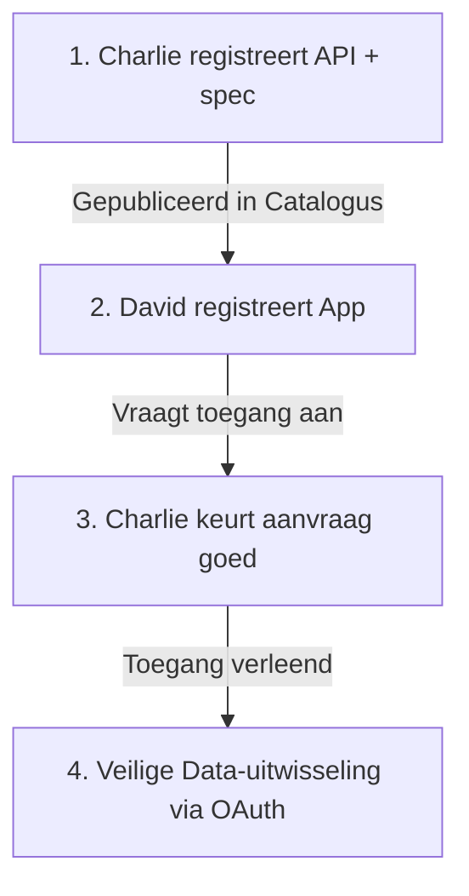

# Aansluiten App & API (Charlie & David)

Deze gids beschrijft hoe je als developer een API (data service provider - **Charlie**) en een App (data service consumer - **David**) registreert en koppelt via de PortlinQ Self-Service Portal.

Na deze registratie- en goedkeuringsstappen kunnen de App en de API op een veilige en gestandaardiseerde manier data uitwisselen op basis van **OAuth 2.0 client credentials**.

> 🔗 **Self-Service Portal:** [portlinq-preview.poort8.nl ➚](https://portlinq-preview.poort8.nl/portal)

---

## Overzicht van de stappen

Het aansluitproces bestaat uit drie eenvoudige fasen:



---

## 1. API Registratie (Charlie - Data Service Provider)

Als aanbieder van een datadienst (zoals een walstroom-API) registreer je jouw API in de portal om deze vindbaar en toegankelijk te maken voor geautoriseerde afnemers.

### Instructies:
1. Log in op het self-service portal: [portlinq-preview.poort8.nl ➚](https://portlinq-preview.poort8.nl/portal).
2. Registreer de API via het portal en upload de bijbehorende **OpenAPI specificatie (OAS)**.
3. Na registratie verschijnt jouw API in de centrale **Catalogus**. Andere deelnemers kunnen hier de documentatie inzien en toegang aanvragen.
4. De benodigde API-credentials (client ID en client secret) worden uitgegeven door PortlinQ's Associatieregister (ASR) en direct veilig getoond in het portal.
5. Als API-eigenaar heb je de volledige controle: je kunt toegangsaanvragen van applicaties direct goedkeuren of intrekken.
6. De instructies voor het aanpassen van de API worden gegeven in het self-service portal (en in het kort in stap 3)

---

## 2. App Registratie (David - Data Service Consumer)

Wanneer een eindgebruiker (zoals **Alice**) en de applicatie (**David**) tot dezelfde organisatie behoren, registreer je een *private application*.

### Instructies:
1. Log in op het self-service portal: [portlinq-preview.poort8.nl ➚](https://portlinq-preview.poort8.nl/portal).
2. Registreer de applicatie via het portal.
3. De benodigde applicatie-credentials (client ID en client secret) worden uitgegeven door PortlinQ's Associatieregister (ASR) en direct in het portal getoond.
4. Navigeer naar de **Catalogus**, zoek de gewenste API (Charlie) en klik op **Request Access** (Toegang aanvragen).
5. **Wacht op goedkeuring**: De API-eigenaar (Charlie) moet de toegangsaanvraag eerst goedkeuren in zijn portal voordat de data-uitwisseling kan beginnen.

---

## 3. Veilige Data-uitwisseling (OAuth Client Credentials)

Zodra de toegang door Charlie is goedgekeurd, kan David met zijn ASR client credentials een access token ophalen en beveiligde calls maken naar Charlie's API.

### Stap A: Token ophalen (David)
David stuurt een POST-verzoek naar het token endpoint om een OAuth access token te verkrijgen:

```http
POST https://auth.poort8.nl/realms/portlinq-preview/protocol/openid-connect/token
Content-Type: application/x-www-form-urlencoded

grant_type=client_credentials
&client_id=<DAVID_CLIENT_ID>
&client_secret=<DAVID_CLIENT_SECRET>
&scope=<TARGET_API_CLIENT_ID>
```

**Response:**
```json
{
  "access_token": "eyJhbGciOiJSUzI1...",
  "expires_in": 3600,
  "token_type": "Bearer",
  "scope": "target-api-client-id organization"
}
```

### Stap B: API aanroepen (David -> Charlie)
David gebruikt het verkregen token in de `Authorization` header om Charlie's API aan te roepen:

```http
GET https://charlie-api.com/api/walstroom/kast-001
Authorization: Bearer eyJhbGciOiJSUzI1...
```

### Stap C: Token valideren (Charlie)

Elk API-verzoek van David bevat een JWT access token in de `Authorization: Bearer {token}` header. Charlie **moet** dit token valideren volgens de onderstaande stappen voordat het verzoek wordt verwerkt.

#### 1. De 5 Essentiële Token Checks
Voer deze controles uit in de genoemde volgorde. Weiger het verzoek direct als een controle faalt:

| Check | Wat te verifiëren | On Failure |
|---|---|---|
| **1. Handtekening (Signature)** | De JWT handtekening is cryptografisch geldig tegenover de publieke sleutels (JWKS) van PortlinQ. | `401 Unauthorized` |
| **2. Vervaldatum (Expiration)** | De `exp` claim ligt in de toekomst (Unix timestamp). *Tip: sta een clock skew van 30-60s toe.* | `401 Unauthorized` |
| **3. Issuer (iss)** | De `iss` claim is exact gelijk aan `https://auth.poort8.nl/realms/portlinq-preview`. | `401 Unauthorized` |
| **4. Doelgroep (Audience - aud)** | De `aud` claim bevat Charlie's eigen API client ID. Dit is cruciaal om te voorkomen dat tokens voor andere API's bij jouw API worden hergebruikt. | `403 Forbidden` |
| **5. Organisatie (organization)** | De `organization` claim bevat de geverifieerde organisatie-identiteit van David (bijvoorbeeld `organization:kvk:87654321`). Dit dient als de `subject` bij fijnmazige autorisatie-checks via de `/api/authorization/explained-enforce` endpoint van het PortlinQ Autorisatieregister (AR). | `403 Forbidden` |

#### 2. Sleutels ophalen (JWKS & Discovery)
Om handtekeningen te valideren haalt Charlie de publieke sleutels op van PortlinQ's signing endpoint.

- **JWKS Certs Endpoint:**
  ```
  https://auth.poort8.nl/realms/portlinq-preview/protocol/openid-connect/certs
  ```
- **OIDC Discovery Endpoint:**
  ```
  https://auth.poort8.nl/realms/portlinq-preview/.well-known/openid-configuration
  ```

#### 3. Voorbeeld van een PortlinQ JWT payload
Een gedecodeerd token van de PortlinQ ASR ziet er als volgt uit:

```json
{
  "iss": "https://auth.poort8.nl/realms/portlinq-preview",
  "sub": "a1b2c3d4-e5f6-7890-abcd-ef1234567890",
  "aud": "CHARLIE_API_CLIENT_ID",
  "exp": 1711324800,
  "iat": 1711324500,
  "jti": "unique-token-id",
  "client_id": "DAVID_APP_CLIENT_ID",
  "organization": {
    "organization:kvk:87654321": {
      "id": "ORGANIZATION_UUID"
    }
  }
}
```

---

## Veilige Data-uitwisseling in de Praktijk

Met deze inrichting is een veilige en gestandaardiseerde data-uitwisseling mogelijk tussen ingeschreven partijen binnen PortlinQ, met expliciete toestemming van de API-eigenaar.

- **Eenvoudige toegangsaanvraag:** Apps kunnen via de self-service portal eenvoudig client credentials aanvragen voor de API's die geregistreerd staan in de PortlinQ catalogus.
- **API-beoordeling:** De API-eigenaar hoeft in de basis alleen de PortlinQ dataspace tokens te valideren (zoals hierboven beschreven) om te bepalen welke apps toegang krijgen en de data veilig te ontsluiten.

> **Note:** In deze gids is de toegang geregeld op **API-niveau** (grofmazige toegang tot de gehele API). In de volgende documenten leggen we uit hoe het **PortlinQ Autorisatieregister (AR)** ingezet kan worden om **fijnmaziger toegang** te verlenen tot specifieke resources en data, zoals een specifieke walstroomkast.

---

## Volgende stappen

- Ga aan de slag op de [PortlinQ Self-Service Portal ➚](https://portlinq-preview.poort8.nl/)
- Terug naar de [PortlinQ Introductie](README.md)
- Bekijk de gedetailleerde [Walstroom Toegangsflow](walstroom-toegang.md)
