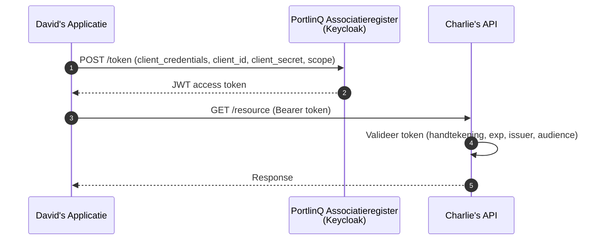
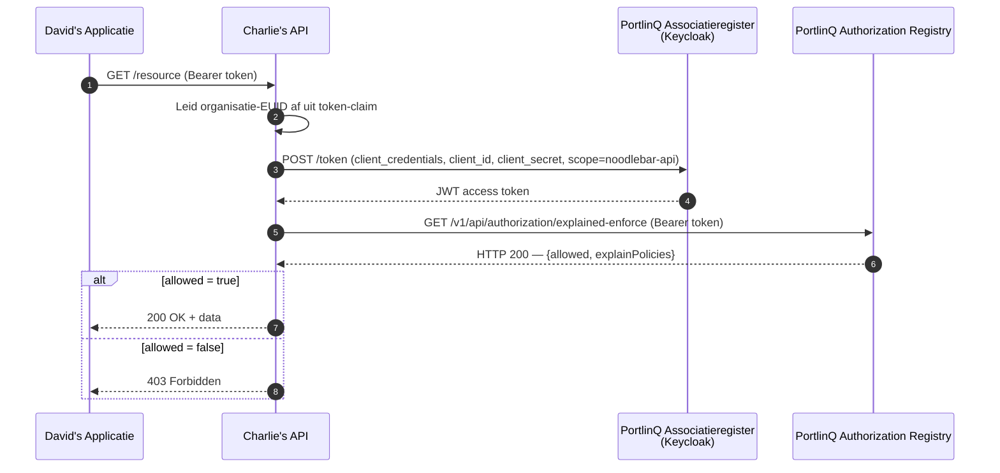

# Architectuur

Deze pagina legt uit hoe de PortlinQ-componenten samenwerken om soeverein, gecontroleerd datadelen mogelijk te maken.

## Componenten

PortlinQ bestaat uit drie kerncomponenten plus de OAuth-identityprovider:

### PortlinQ Associatieregister (ASR)

Het **Associatieregister (ASR)** is de bron van waarheid voor deelnemers en hun relaties:

- **Organisatie-identiteiten** — registratie, verificatie en goedkeuring
- **Gebruikersaccounts** — credentials, e-mailverificatie en organisatie-lidmaatschap
- **Applicatie-registraties** — OAuth-clients voor data service consumers (David)
- **API-registraties** — servicedefinities voor data service providers (Charlie)
- **Toegangsbeheer** — API-niveau toegangsverleningen tussen consumers en providers

Het ASR fungeert als OAuth authorization server en geeft de JWT access tokens uit die consumers aan providers presenteren.

### PortlinQ Authorization Registry (AR)

De **Authorization Registry** bewaart en handhaaft policies op dataniveau:

- **Organization Registry** — overzicht van alle deelnemende organisaties
- **Policy-opslag en -handhaving** — wie welke data mag benaderen

Data service providers bevragen de AR bij elk dataverzoek om te verifiëren dat de consumer geautoriseerd is.

### PortlinQ Identity Provider (IDP)

De **Identity Provider** identificeert schepen. Het voornemen is om in de toekomst meerdere Identity Providers te ondersteunen, waaronder een scheepsregister voor de identificatie van schepen.

## Authenticatie

Alle API-communicatie gebruikt OAuth met Keycloak als identityprovider.



**Token endpoint:**
```
https://auth.poort8.nl/realms/portlinq-preview/protocol/openid-connect/token
```

**JWKS endpoint:**
```
https://auth.poort8.nl/realms/portlinq-preview/protocol/openid-connect/certs
```

Tokens zijn kortlevend en bevatten een `organization`-claim met de geverifieerde organisatie-identiteit van de consumer (EUID).

## Autorisatiemodel

Authenticatie beantwoordt "wie ben je?" — autorisatie beantwoordt "wat mag je?".

PortlinQ gebruikt een **policy-gebaseerd** model. Zelfs met een geldig token en API-toegang wordt een dataverzoek alleen ingewilligd als er een passende policy in de Authorization Registry bestaat.



## Twee lagen van toegangscontrole

PortlinQ scheidt API-niveau toegang van dataniveau autorisatie:

| Laag | Wat het regelt | Wie beslist | Wanneer |
|------|----------------|-------------|---------|
| **API-toegang** | Mag David's app Charlie's API überhaupt aanroepen? | Charlie (via portal) | Bij onboarding |
| **Data-autorisatie** | Mag David specifieke data benaderen? | Data-rechthebbende (Bob), via policy | Per resource, op verzoek |

Beide lagen moeten vervuld zijn voordat data stroomt:
1. API-toegang (verleend door de provider via het portal)
2. Een geldige policy voor de specifieke resource

> ℹ️ Goedkeuring op dataniveau verloopt in de generieke dataspace via **Keyper Approval Links**. Keyper is in PortlinQ nog niet als onderdeel van deze dataspace ingericht — zie de [generieke Keyper-documentatie ➚](../keyper/).

## Beveiligingslagen

| Laag | Mechanisme | Doel |
|------|------------|------|
| Transport | HTTPS (TLS 1.2+) | Versleutelde communicatie |
| Authenticatie | OAuth + JWT | Geverifieerde deelnemer-identiteit |
| API-toegang | Keycloak audience/scope | Geautoriseerd om de API aan te roepen |
| Data-autorisatie | Policy-handhaving | Geautoriseerd voor specifieke data |
| Audit | Gelogde autorisatiebeslissingen | Compliance en incident-respons |

## Technische standaarden

| Standaard | Gebruik in PortlinQ |
|-----------|---------------------|
| OAuth (client credentials) | Machine-to-machine authenticatie |
| JWT (RS256) | Tokenformaat met organisatie-identiteit |
| JWKS | Distributie van publieke sleutels voor tokenvalidatie |
| REST / JSON | Alle API-communicatie |
| OpenAPI 3.x | API-specificatieformaat |
| iSHARE | Policy-model voor autorisatie-handhaving |

## Volgende stappen

- [Organisatie Registratie](onboarding.md) — deelnemer worden
- [API-toegang aanvragen](api-toegang-aanvragen.md) — voor consumers
- [Tokens valideren](access-tokens-valideren.md) en [Autorisatie valideren](autorisatie.md) — voor providers

Vragen? Neem contact op met Poort8 via **hello@poort8.nl**.