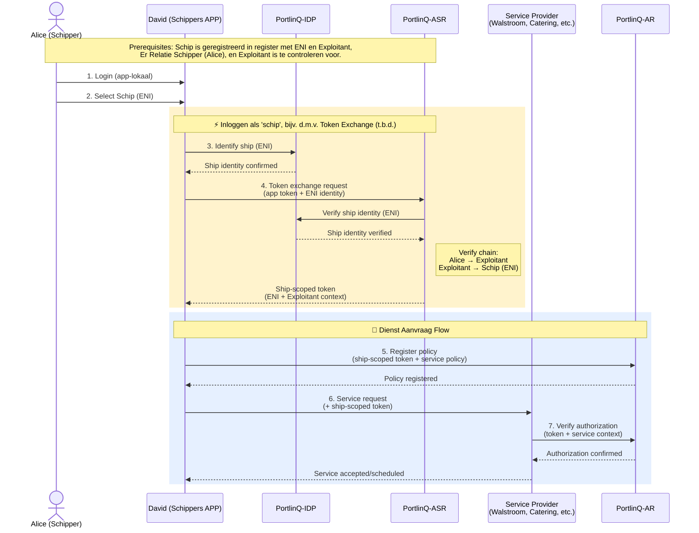

# Authenticatie Flow

Schippers authenticeren via hun app en verkrijgen een schip-scoped token om namens hun schip diensten aan te vragen. Deze flow beschrijft de authenticatie stappen die voorafgaan aan alle PortlinQ dienst aanvragen.

🔗 **[API Docs ➚](https://portlinq-preview.poort8.nl/scalar/v1)** — Interactieve endpoint testing

## Overzicht

De authenticatie flow combineert **app-lokale login** en **ASR token exchange** om een schip-scoped token te verkrijgen. De PortlinQ-IDP identificeert schepen tijdens de token exchange. Dit token wordt gebruikt bij alle dienst aanvragen (walstroom, aanmeldingen, afvalinzameling, catering, havengeld).

> **Belangrijk:** App-lokale login en schipper authenticatie vallen buiten PortlinQ scope.

## Sequence Diagram



## Voorwaarden (Prerequisites)

| Prerequisite | Wat | Wie |
|--------------|-----|-----|
| **Schip registratie** | Schip is geregistreerd in register met ENI en Exploitant | Exploitant |
| **Schipper relatie** | Relatie Schipper (Alice) en Exploitant is te controleren | Exploitant |

## Stappen

### Stap 1: App-lokale login

De schipper logt in via de app met hun app-specifieke credentials. Deze login en authenticatie vallen buiten PortlinQ scope.

### Stap 2-4: Schip selectie en token exchange _(PortlinQ IDP + ASR)_ 🔜

Alice selecteert het schip (ENI) waarvoor ze diensten wil aanvragen. De app vraagt schip identificatie op via PortlinQ-IDP en vervolgens een schip-scoped token via ASR token exchange.

> 🔜 **Binnenkort beschikbaar**: Token exchange functionaliteit wordt momenteel ontwikkeld.

**Tijdelijke workaround**: Haal een bearer token op via Auth0 met de volgende request:

```bash
curl --request POST \
  --url https://poort8.eu.auth0.com/oauth/token \
  --header 'content-type: application/json' \
  --data '{
    "client_id":"***",
    "client_secret":"***",
    "audience":"PortlinQ-Dataspace-CoreManager",
    "grant_type":"client_credentials"
  }'
```

**Response:**

```json
{
  "access_token": "***",
  "token_type": "Bearer"
}
```

Het `access_token` is een JWT bearer token met de volgende claims:

```json
{
  "organizationId": "schip:123456",
  "iss": "https://poort8.eu.auth0.com/",
  "sub": "GA2GoSLKwZnczBNR1fyFCeOoYhE1aLGb@clients",
  "aud": "PortlinQ-Dataspace-CoreManager",
  "iat": 1771360767,
  "exp": 1771447167,
  "scope": "read:ar:delegated write:ar:delegated",
  "jti": "fVuhHyHVeEVBnvoceCtfam",
  "client_id": "GA2GoSLKwZnczBNR1fyFCeOoYhE1aLGb"
}
```

> In deze tijdelijke workaround bevat het veld `organizationId` het ENI id van het schip (bijv. `schip:123456`).

> **Alternatieven**: Andere methoden voor schip-token verkrijging worden onderzocht (bijv. directe schip credentials, roster-based auth).

## Dienst Aanvraag Proces

Met het schip-scoped token kan de app namens het schip diensten aanvragen bij diverse service providers:

- **Walstroom (shore power)** — Energie levering tijdens ligplaats
- **Aankomst/vertrek meldingen** — Geofence-based automatische haven notificaties
- **Afvalinzameling** — Inzameling van scheepsafval
- **Catering** — Levering van voorraden en maaltijden
- **Havengeld** — Betaling van haven toegangsrechten

Elke dienst vereist autorisatie verificatie via PortlinQ-AR voordat de service provider de aanvraag accepteert.

## Volgende stappen

- Bekijk de [Walstroom Toegangsflow](walstroom-toegang.md) voor schipper-initiated diensten
- Bekijk de [Geofence Arrival Flow](geofence-arrival.md) voor automatische haven aanmeldingen
- Zie de [PortlinQ API docs ➚](https://portlinq-preview.poort8.nl/scalar/v1) voor endpoint details
