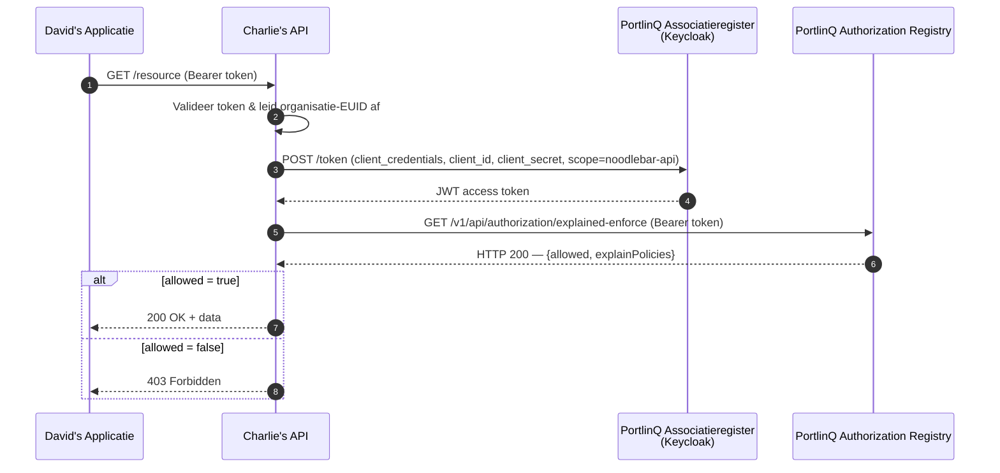

# Autorisatie valideren

Deze gids is voor **Charlie** — een data service provider die wil verifiëren dat inkomende dataverzoeken geautoriseerd zijn voordat hij data levert. Hij beschrijft hoe je de PortlinQ Authorization Registry (AR) bevraagt om te controleren of een geldige policy bestaat.

## Wanneer gebruik je dit?

Tokenvalidatie (zie [Tokens valideren](access-tokens-valideren.md)) bevestigt de identiteit van de aanroeper. Autorisatie-validatie bevestigt dat hij toestemming heeft voor *specifieke data*. Beide zijn vereist voordat je data levert.

## Procesoverzicht



## Policy-model

Een policy in de AR legt vast wie welke data mag benaderen. De identifiers zijn EUID-waarden (`NLNHR.{kvkNummer}`).

| Veld | Beschrijving | Voorbeeld |
|------|--------------|-----------|
| `issuerId` | Data-rechthebbende die toegang verleende (Bob) | `NLNHR.87654321` |
| `subjectId` | Organisatie die data afneemt (David) | `NLNHR.11223344` |
| `serviceProvider` | Jouw organisatie (Charlie) | `NLNHR.23456789` |
| `type` | Resource-type | (use-case-specifiek) |
| `resourceId` | Identifier van de resource | (use-case-specifiek) |
| `attribute` | Data-attributen | `*` |
| `action` | Toegestane actie | (use-case-specifiek) |

## Stap 1 — Haal een access token op

Authenticeer met de OAuth client credentials-grant, met de applicatie die toegang heeft tot de NoodleBar API (zie [Tokens valideren — Voorwaarden](access-tokens-valideren.md)):

```bash
curl -X POST https://auth.poort8.nl/realms/portlinq-preview/protocol/openid-connect/token \
  -H "Content-Type: application/x-www-form-urlencoded" \
  -d "grant_type=client_credentials" \
  -d "client_id=YOUR_APP_CLIENT_ID" \
  -d "client_secret=YOUR_APP_CLIENT_SECRET" \
  -d "scope=noodlebar-api"
```

> ℹ️ Dit token authenticeert jouw platform als *applicatie* tegenover de Authorization Registry. Het is geen identiteitstoken tussen David en jouw platform — de organisatie-identiteit van de consumer geef je expliciet mee als `subject`-queryparameter.

## Stap 2 — Bevraag het explained-enforce endpoint

```bash
curl -G https://portlinq-preview.poort8.nl/v1/api/authorization/explained-enforce \
  -H "Authorization: Bearer {token}" \
  --data-urlencode "issuer={DATA_RECHTHEBBENDE}" \
  --data-urlencode "subject={DATA_CONSUMER}" \
  --data-urlencode "serviceProvider={JOUW_ORG}" \
  --data-urlencode "action={ACTION}" \
  --data-urlencode "resource={RESOURCE_ID}" \
  --data-urlencode "type={RESOURCE_TYPE}" \
  --data-urlencode "attribute=*" \
  --data-urlencode "useCase={USECASE}"
```

### Query parameters

| Parameter | Beschrijving | Voorbeeld |
|-----------|--------------|-----------|
| `issuer` | Data-rechthebbende die toegang verleende (Bob), als EUID | `NLNHR.87654321` |
| `subject` | Organisatie die data opvraagt (David), als EUID | `NLNHR.11223344` |
| `serviceProvider` | Jouw organisatie (Charlie), als EUID | `NLNHR.23456789` |
| `action` | Gevraagde actie | (use-case-specifiek) |
| `resource` | Identifier van de resource | (use-case-specifiek) |
| `type` | Resource-type | (use-case-specifiek) |
| `attribute` | Data-attributen | `*` |
| `useCase` | Use case-model | (use-case-specifiek) |

> ℹ️ De waarden voor `action`, `resource`, `type` en `useCase` zijn afhankelijk van de concrete dienst. Zie de use-case-gidsen voor ingevulde voorbeelden.

## Stap 3 — Response

> ℹ️ **`explained-enforce` retourneert altijd HTTP 200**, ook wanneer autorisatie wordt geweigerd. Of het verzoek is toegestaan lees je af aan het `allowed`-veld, niet aan de HTTP-statuscode.

**Toegestaan:**

```json
{
  "allowed": true,
  "explainPolicies": [
    {
      "policyId": "a1b2c3d4-e5f6-7890-abcd-ef1234567890",
      "useCase": "...",
      "issuedAt": 1738368000,
      "notBefore": 1738368000,
      "expiration": 1769904000,
      "issuerId": "NLNHR.87654321",
      "subjectId": "NLNHR.11223344",
      "serviceProvider": "NLNHR.23456789",
      "action": "...",
      "resourceId": "...",
      "type": "...",
      "attribute": "*",
      "license": null,
      "rules": null,
      "properties": []
    }
  ]
}
```

**Geweigerd:**

```json
{
  "allowed": false,
  "explainPolicies": []
}
```

## Stap 4 — Valideer en reageer

| Check | Vereiste |
|-------|----------|
| **Allowed** | `allowed` moet `true` zijn |
| **Subject-match** | `explainPolicies[].subjectId` moet overeenkomen met de EUID die je uit de `organization`-claim van het inkomende token hebt afgeleid |
| **Service provider** | `explainPolicies[].serviceProvider` moet overeenkomen met jouw organisatie-EUID |
| **Resource** | `explainPolicies[].resourceId` moet overeenkomen met de bevraagde resource |

### Aanbevolen statuscodes richting de consumer

| Code | Betekenis | Wanneer |
|------|-----------|---------|
| `200 OK` | Geautoriseerd | `allowed: true` en alle validaties slagen — lever data |
| `401 Unauthorized` | Ongeldig token | Inkomend bearer token ontbreekt, is ongeldig of verlopen |
| `403 Forbidden` | Niet geautoriseerd | `allowed: false` of validatie mislukt |
| `400 Bad Request` | Ongeldige invoer | Verzoek niet correct geformatteerd |
| `500 Internal Server Error` | Technische fout | Onverwachte fout — log en implementeer retry-logica |

## Implementatiepatroon

```
1. Ontvang verzoek met Bearer token en resource-identifier
2. Valideer token (handtekening, exp, issuer, audience)
3. Leid de organisatie-EUID af uit de `organization`-claim
4. Bepaal de data-rechthebbende (issuer) voor de gevraagde resource
5. Haal een access token op voor de AR (client credentials, scope noodlebar-api)
6. Roep explained-enforce aan met subject=consumer, serviceProvider=jij, resource=...
7. Enforce retourneert altijd HTTP 200 — check het `allowed`-veld
8. allowed=true en subject-match → lever data (200)
9. allowed=false → weiger (403)
```

> **Issuer bepalen:** je platform moet weten welke data-rechthebbende (issuer) bij elke resource hoort. Deze mapping wordt doorgaans vastgelegd tijdens de onboarding van de resource in jouw platform.

## Gerelateerd

- [Tokens valideren](access-tokens-valideren.md) — tokenvalidatie (voorwaarde)
- [PortlinQ API docs ➚](https://portlinq-preview.poort8.nl/scalar/v1)

Vragen? Neem contact op met Poort8 via **hello@poort8.nl**.