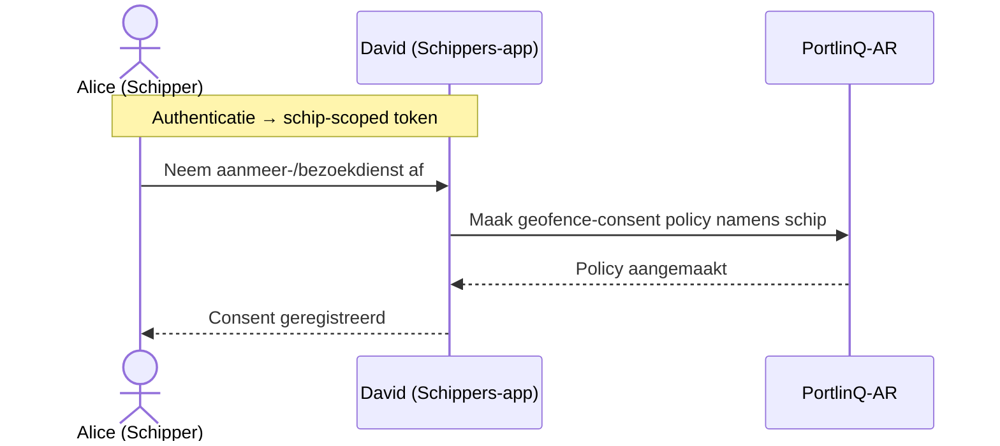
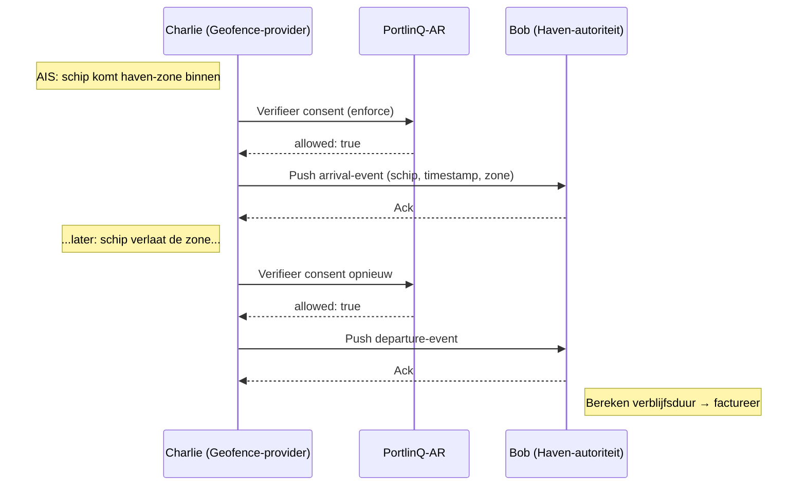

# Port Visit — Geofence Arrival & Departure Flow

Haven-autoriteiten ontvangen automatisch arrival- en departure-events wanneer schepen een haven-zone binnenkomen of verlaten. Een geofence-provider (Charlie) detecteert schip-bewegingen via AIS en **pusht** de events naar de haven (Bob) — maar alleen als de PortlinQ Authorization Registry (AR) bevestigt dat het schip daar consent voor heeft gegeven. De schippers-app (David) legt die consent namens het schip (Alice) vast als policy in de AR. Tijdens runtime is de flow volledig machine-to-machine.

> ℹ️ **Identifiers.** Organisaties zijn EUID's (`NLNHR.{kvkNummer}`); placeholders zoals `{havenbedrijf_id}` zijn dus EUID-waarden. Een zelfstandige schip-identifier (bijv. op basis van ENI) is nog niet vastgelegd — voor nu wordt een schip vertegenwoordigd door de EUID van de eigenaar-organisatie (`{schip_id}` is een placeholder). De **issuer van de consent is het schip/de eigenaar**, niet de schipper als persoon; de schipper bedient enkel de app.

> ℹ️ **AIS-toegang staat los van PortlinQ.** Dat de geofence-provider de AIS-gegevens van het schip mag ophalen, is een aparte, doorlopende toestemming die buiten PortlinQ is geregeld (bij de AIS-bron, bijv. EuRIS). PortlinQ regelt uitsluitend of de haven het arrival/departure-event mag ontvangen.

## Rollen

| Persona | Rol |
| -- | -- |
| Alice | Schipper / schip (consent-gever, via de eigenaar-EUID) |
| David | Schippers-app |
| Charlie | Geofence-provider (detecteert via AIS, pusht events) |
| Bob | Haven-autoriteit (ontvangt events) |

## Setup: consent vastleggen

De haven biedt een **ontvang-endpoint** aan voor de events (het push-doel) en registreert dat. De schippers-app legt namens het schip de geofence-consent vast — in de PortlinQ-app gebeurt dit bij het afnemen van de aanmeer-/bezoekdienst van een haven.


```mermaid
sequenceDiagram
    actor Alice as Alice (Schipper)
    participant David as David (Schippers-app)
    participant AR as PortlinQ-AR
    Note over Alice,David: Authenticatie → schip-scoped token
    Alice->>David: Neem aanmeer-/bezoekdienst af
    David->>AR: Maak geofence-consent policy namens schip
    AR-->>David: Policy aangemaakt
    David-->>Alice: Consent geregistreerd
```

De policy zegt: het schip (issuer) staat de haven (subject) toe om, via de geofence-provider, het binnenvaren/verlaten van díe haven te ontvangen.

## Runtime: automatische events (push, M2M)


```mermaid
sequenceDiagram
    participant Charlie as Charlie (Geofence-provider)
    participant AR as PortlinQ-AR
    participant Bob as Bob (Haven-autoriteit)
    Note left of Charlie: AIS: schip komt haven-zone binnen
    Charlie->>AR: Verifieer consent (enforce)
    AR-->>Charlie: allowed: true
    Charlie->>Bob: Push arrival-event (schip, timestamp, zone)
    Bob-->>Charlie: Ack
    Note left of Charlie: ...later: schip verlaat de zone...
    Charlie->>AR: Verifieer consent opnieuw
    AR-->>Charlie: allowed: true
    Charlie->>Bob: Push departure-event
    Bob-->>Charlie: Ack
    Note right of Bob: Bereken verblijfsduur → factureer
```

## Autorisatie-check

Voordat de geofence-provider een event pusht, controleert die bij de PortlinQ Authorization Registry of de haven het mag ontvangen:

```
GET /v1/api/authorization/explained-enforce
  subject={havenbedrijf_id}      # de haven die het event ontvangt
  issuer={schip_id}              # het schip/eigenaar dat toestemming gaf
  serviceProvider={charlie_id}   # de geofence-provider
  type=geo-fence
  action=monitor
  useCase=portlinq
```

`explained-enforce` retourneert altijd HTTP 200; de uitkomst zit in `allowed`. Bij `allowed: false` stopt de provider de flow en wordt er geen event gepusht.

> ℹ️ **useCase.** Deze flow gebruikt `useCase: "portlinq"`, dat in de Authorization Registry op het iSHARE-model wordt afgebeeld.

## Policies

- **Geofence-consent** — `POST /v1/api/policies` met `type: geo-fence`, `action: monitor`, issuer = het schip (eigenaar-EUID), subject = de haven, serviceProvider = de geofence-provider.

## Foutafhandeling

Consent ontbreekt of is verlopen → `allowed: false`, geen event. Deelnemer niet gevonden → stop. Haven-endpoint onbereikbaar → retry met backoff.
