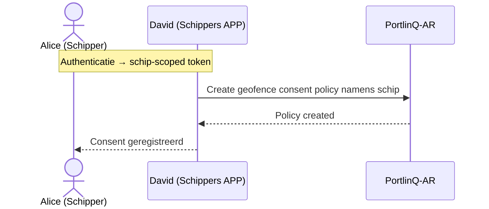
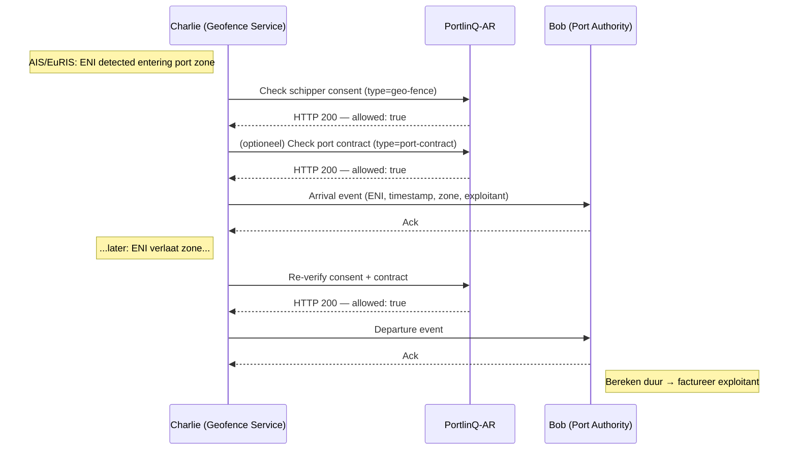

# Geofence Arrival & Departure Flow

> 🚧 **Under construction** — deze use-case-gids wordt nog uitgewerkt als implementatie van de generieke stappen.

Haven-autoriteiten ontvangen automatisch arrival/departure-events wanneer schepen een haven-zone binnenkomen of verlaten. Een geofence-provider (Charlie) detecteert schip-bewegingen via AIS/EuRIS en stuurt events naar de haven (Bob). De schippers-app legt vooraf een geofence-consent policy vast namens het schip. Tijdens runtime verifieert Charlie autorisaties via PortlinQ AR — volledig machine-to-machine.

> ℹ️ **Identifiers:** organisaties zijn EUID's (`NLNHR.{kvkNummer}`); placeholders zoals `{havenbedrijf_id}` en `{exploitant_id}` zijn dus EUID-waarden. Een zelfstandige schip-identifier (bijv. op basis van ENI) is nog niet vastgelegd — voor nu wordt een schip vertegenwoordigd door de EUID van de eigenaar-organisatie (`{SchipId}` is een placeholder).

## Setup: Policy Registratie (vooraf)


```mermaid
sequenceDiagram
    actor Alice as Alice (Schipper)
    participant David as David (Schippers APP)
    participant AR as PortlinQ-AR
    Note over Alice,David: Authenticatie → schip-scoped token
    David->>AR: Create geofence consent policy namens schip
    AR-->>David: Policy created
    David-->>Alice: Consent geregistreerd
```

## Runtime: Automatische events (M2M)


```mermaid
sequenceDiagram
    participant Charlie as Charlie (Geofence Service)
    participant AR as PortlinQ-AR
    participant Bob as Bob (Port Authority)
    Note left of Charlie: AIS/EuRIS: ENI detected entering port zone
    Charlie->>AR: Check schipper consent (type=geo-fence)
    AR-->>Charlie: HTTP 200 — allowed: true
    Charlie->>AR: (optioneel) Check port contract (type=port-contract)
    AR-->>Charlie: HTTP 200 — allowed: true
    Charlie->>Bob: Arrival event (ENI, timestamp, zone, exploitant)
    Bob-->>Charlie: Ack
    Note left of Charlie: ...later: ENI verlaat zone...
    Charlie->>AR: Re-verify consent + contract
    AR-->>Charlie: HTTP 200 — allowed: true
    Charlie->>Bob: Departure event
    Bob-->>Charlie: Ack
    Note right of Bob: Bereken duur → factureer exploitant
```

## Schipper consent verificatie (AR)

```bash
curl -G https://portlinq-preview.poort8.nl/v1/api/authorization/explained-enforce \
  -H "Authorization: Bearer {charlie_service_token}" \
  --data-urlencode "subject={havenbedrijf_id}" \
  --data-urlencode "resource=*" \
  --data-urlencode "action=monitor" \
  --data-urlencode "useCase=portlinq" \
  --data-urlencode "issuer={schipper_organization_id}" \
  --data-urlencode "serviceProvider={Charlie_organization_id}" \
  --data-urlencode "type=geo-fence" \
  --data-urlencode "attribute={haven_locatie_id}"
```

> ℹ️ **`explained-enforce` retourneert altijd HTTP 200.** Bij `allowed: false` stopt Charlie de flow (geen event).

> ℹ️ **useCase.** Deze flows gebruiken `useCase: "portlinq"`, dat in de Authorization Registry op het **iSHARE**-model wordt afgebeeld. `useCase` is optioneel in de `POST /v1/api/policies`-body.

## Port contract verificatie (optioneel) (AR)

```bash
curl -G https://portlinq-preview.poort8.nl/v1/api/authorization/explained-enforce \
  -H "Authorization: Bearer {charlie_service_token}" \
  --data-urlencode "subject={havenbedrijf_id}" \
  --data-urlencode "resource={SchipId}" \
  --data-urlencode "action=invoicing" \
  --data-urlencode "useCase=portlinq" \
  --data-urlencode "issuer={exploitant_id}" \
  --data-urlencode "serviceProvider={havenbedrijf_id}" \
  --data-urlencode "type=port-contract" \
  --data-urlencode "attribute=*"
```

## Consent Management (policies aanmaken)

Schipper geofence consent — `POST /v1/api/policies` met `type: geo-fence`, `action: monitor`, `resourceId: *`, `useCase: portlinq`.
Haven port contract — `POST /v1/api/policies` met `type: port-contract`, `action: invoicing`, `resourceId: {SchipId}`, `useCase: portlinq`.

## Foutafhandeling

Participant/exploitant niet gevonden → stop. Consent/contract ontbreekt of verlopen → `allowed: false`, geen event. Port authority onbereikbaar → retry met backoff.
