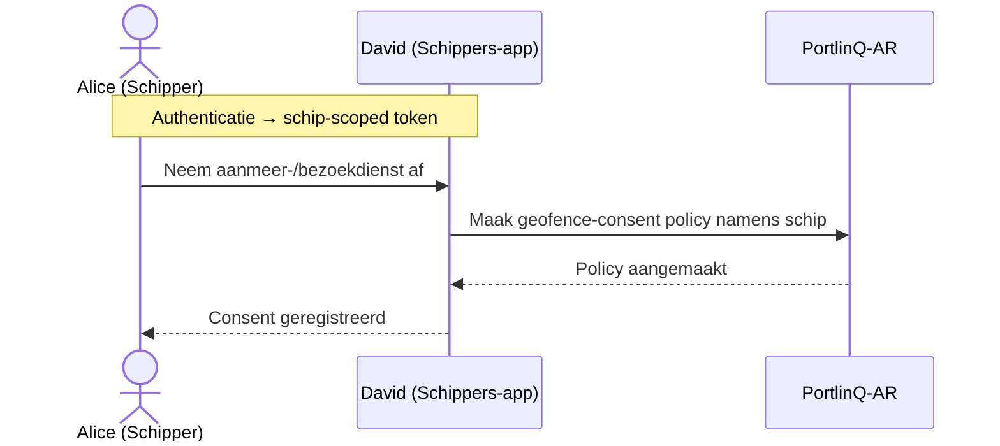
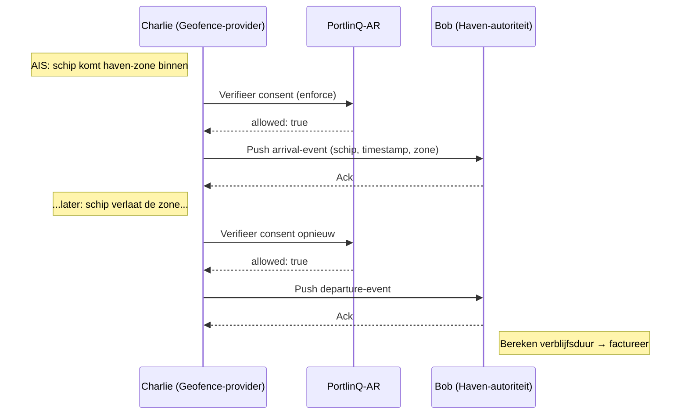

# Port Visit — Geofence Arrival & Departure Flow

Haven-autoriteiten ontvangen automatisch arrival- en departure-events wanneer schepen een haven-zone binnenkomen of verlaten. Een geofence-provider (Charlie) detecteert schip-bewegingen via AIS en **pusht** de events naar de haven (Bob) — maar alleen als de PortlinQ Authorization Registry (AR) bevestigt dat het schip daar consent voor heeft gegeven. De schippers-app (David) legt die consent namens het schip (Alice) vast als policy in de AR. Tijdens runtime is de flow volledig machine-to-machine.

> ℹ️ **Identifiers.** Organisaties zijn EUID's (`NLNHR.{kvkNummer}`); placeholders zoals `{havenbedrijf_id}` en `{schip_organization_id}` zijn dus EUID-waarden. `{schip_id}` identificeert het schip zelf, bijvoorbeeld met een ENI. De **issuer van de consent is de eigenaar-organisatie** (`{schip_organization_id}`), niet de schipper als persoon; het schip is de resource (`{schip_id}`).

> ℹ️ **AIS-toegang staat los van PortlinQ.** Dat de geofence-provider de AIS-gegevens van het schip mag ophalen, is een aparte, doorlopende toestemming die buiten PortlinQ is geregeld (bij de AIS-bron, bijv. EuRIS). PortlinQ regelt uitsluitend of de haven het arrival/departure-event mag ontvangen.

## Rollen

| Persona | Rol |
| -- | -- |
| Alice | Schipper / schip (consent-gever, via de eigenaar-EUID) |
| David | Schippers-app |
| Charlie | Geofence-provider (detecteert via AIS, pusht events) |
| Bob | Haven-autoriteit (ontvangt events) |

## Setup: consent vastleggen

De haven biedt een **ontvang-endpoint** aan voor de events (het push-doel) en registreert dat. De schippers-app legt namens het schip de geofence-consent vast — in de PortlinQ-app gebeurt dit bij het afnemen van de aanmeer-/bezoekdienst van een haven.


```mermaid
sequenceDiagram
    actor Alice as Alice (Schipper)
    participant David as David (Schippers-app)
    participant AR as PortlinQ-AR
    Note over Alice,David: Authenticatie → schip-scoped token
    Alice->>David: Neem aanmeer-/bezoekdienst af
    David->>AR: Maak geofence-consent policy namens schip
    AR-->>David: Policy aangemaakt
    David-->>Alice: Consent geregistreerd
```
* Tijdens de Living Lab Demo werken de schipper app(s) met credentials van de schepen om schip-scoped token te verkrijgen.

De policy zegt: de eigenaar-organisatie (issuer) staat de haven (subject) toe om, via de geofence-provider, arrival- en departure-events voor het schip (resource) te ontvangen.

## Runtime: automatische events (push, M2M)


```mermaid
sequenceDiagram
    participant Charlie as Charlie (Geofence-provider)
    participant AR as PortlinQ-AR
    participant Bob as Bob (Haven-autoriteit)
    Note left of Charlie: AIS: schip komt haven-zone binnen
    Charlie->>AR: Verifieer consent (enforce)
    AR-->>Charlie: allowed: true
    Charlie->>Bob: Push arrival-event (schip, timestamp, zone)
    Bob-->>Charlie: Ack
    Note left of Charlie: ...later: schip verlaat de zone...
    Charlie->>AR: Verifieer consent opnieuw
    AR-->>Charlie: allowed: true
    Charlie->>Bob: Push departure-event
    Bob-->>Charlie: Ack
    Note right of Bob: Bereken verblijfsduur → factureer
```

## Autorisatie-check

Voordat de geofence-provider een event pusht, controleert die bij de PortlinQ Authorization Registry of de haven het mag ontvangen:

```
GET /v1/api/authorization/explained-enforce
  subject={havenbedrijf_id}      # de haven die het event ontvangt
  issuer={schip_organization_id} # de eigenaar-organisatie die toestemming gaf
  resource={schip_id}            # het schip, bijvoorbeeld ENI
  serviceProvider={charlie_id}   # de geofence-provider
  type=geo-fence
  action=monitor
  useCase=portlinq
```

`explained-enforce` retourneert altijd HTTP 200; de uitkomst zit in `allowed`. Bij `allowed: false` stopt de provider de flow en wordt er geen event gepusht.

## Policies

- **Geofence-consent** — `POST /v1/api/policies` met `type: geo-fence`, `action: monitor`, issuer = de eigenaar-organisatie (EUID), resource = het schip (bijvoorbeeld ENI), subject = de haven en serviceProvider = de geofence-provider.

> ℹ️ **Rolverdeling en tags.** De schippers-app legt namens het schip de consent-policy vast in de Authorization Registry (zolang er nog geen formeel scheepsregister is). Tags zoals `port` en `shorepower` zijn alleen bedoeld voor catalogusfiltering in NoodleBar en spelen geen rol in autorisatie of consent-checks.

Voorbeeld request body (MS Amare → Port of Twente via Sturdy):

```json
{
  "useCase": "portlinq",
  "issuerId": "NLNHR.<KVK_SCHEEPSEIGENAAR>",
  "subjectId": "NLNHR.57518580",
  "serviceProvider": "NLNHR.88429156",
  "type": "geo-fence",
  "action": "monitor",
  "resourceId": "<ENI_SCHIP>",
  "attribute": "*"
}
```


