# Geofence Arrival & Departure Flow

Haven autoriteiten kunnen automatisch aankomst- en vertrekmeldingen ontvangen wanneer schepen hun haven zone binnenkomen of verlaten. Deze flow beschrijft hoe geofence services schip locaties monitoren en arrival/departure events genereren met PortlinQ autorisatie.

🔗 **[API Docs ➚](https://portlinq-preview.poort8.nl/scalar/v1)** — Interactieve endpoint testing

## Overzicht

De geofence arrival flow is een **automatische, consent-gebaseerde** service waarbij een geofence provider (Charlie) schip bewegingen detecteert via AIS/EuRIS en arrival/departure events naar haven autoriteiten (Bob) stuurt. De schipper geeft vooraf consent voor geofence monitoring, en de exploitant heeft een contract met de haven autoriteit. Charlie verifieert beide autorisaties via PortlinQ AR voordat events worden verstuurd.

> **Belangrijk:** Deze flow toont hoe PortlinQ consent-based automation ondersteunt zonder actieve schipper betrokkenheid bij elke haven aanmelding.

## Sequence Diagram

```mermaid
sequenceDiagram
    participant Charlie as Charlie (Geofence Service)
    participant ASR as PortlinQ-ASR
    participant AR as PortlinQ-AR
    participant Bob as Bob (Port Authority)
    Note over Charlie,Bob: Prerequisites:<br/>Schip (ENI) + Exploitant + relationships registered in ASR.<br/>Schipper has pre-authorized Charlie for geofence via AR (consent policy).<br/>Bob has registered port contract with Exploitant in AR.

    %% Ship detected
    Note left of Charlie: AIS/EuRIS: ENI detected<br/>entering port zone

    %% Participant verification
    rect rgb(255, 243, 205)
        Note over Charlie,ASR: ⚡ ASR tokens for vessels (not yet in scope)
        Charlie->>ASR: 1. Verify participant (ENI)
        ASR-->>Charlie: ENI confirmed
        Charlie->>ASR: 2. Resolve exploitant for ENI
        ASR-->>Charlie: Exploitant (Bob's KvK)
    end

    %% Authorization checks
    Charlie->>AR: 3. Check schipper consent<br/>(issuer=ship, subject=Charlie,<br/>resource=geofence)
    Note right of AR: Evaluate schipper's<br/>consent policy
    AR-->>Charlie: Permit
    Charlie->>AR: 4. Check port contract<br/>(issuer=Bob, subject=Exploitant,<br/>resource=port-services)
    Note right of AR: Evaluate Bob's<br/>contract policy
    AR-->>Charlie: Permit

    %% Arrival event
    Charlie->>Bob: 5. Arrival event<br/>(ENI, timestamp, zone, exploitant)
    Bob-->>Charlie: Ack

    %% Departure
    Note left of Charlie: ...time passes...<br/>ENI detected leaving port zone
    Charlie->>AR: 6. Re-verify consent + contract
    AR-->>Charlie: Permit
    Charlie->>Bob: 7. Departure event<br/>(ENI, timestamp, zone, exploitant)
    Bob-->>Charlie: Ack

    %% Invoicing
    Note right of Bob: Calculate duration<br/>→ Invoice exploitant
```



## Voorwaarden (Prerequisites)

Deze stappen worden uitgevoerd vooraf door verschillende partijen:

| Prerequisite | Wat | Wie |
|--------------|-----|-----|
| **Schip registratie** | Schip (ENI) + exploitant relatie geregistreerd in ASR | Exploitant |
| **Schipper consent** | Schipper heeft Charlie geautoriseerd voor geofence monitoring via AR policy | Schipper |
| **Port contract** | Haven autoriteit (Bob) heeft contract geregistreerd met exploitant in AR | Haven (Bob) |

## Stappen

### Schip detectie _(extern)_

Charlie's geofence service ontvangt AIS of EuRIS locatie data en detecteert dat een schip (ENI) een haven geofence zone binnenkomt.

> ℹ️ AIS/EuRIS locatie data integratie valt buiten PortlinQ scope. Charlie moet deze data via officiële kanalen verkrijgen.

### Stap 1: Participant verificatie _(PortlinQ ASR)_ 🔜

Charlie verifieert dat het gedetecteerde schip (ENI) een geregistreerde participant is in PortlinQ via ASR.

> 🔜 **Binnenkort beschikbaar**: De ASR participant verificatie functionaliteit wordt momenteel ontwikkeld en zal binnenkort beschikbaar zijn.

Als de participant niet gevonden wordt, stopt Charlie de flow (geen event verzonden).

### Stap 2: Exploitant resolutie _(PortlinQ ASR)_ 🔜

Charlie vraagt de exploitant op die verantwoordelijk is voor dit schip via ASR relationship queries.

> 🔜 **Binnenkort beschikbaar**: De ASR relationship query functionaliteit wordt momenteel ontwikkeld en zal binnenkort beschikbaar zijn.

Charlie gebruikt de exploitant KvK voor de volgende autorisatie checks.

### Stap 3: Schipper consent verificatie _(PortlinQ AR)_

Charlie controleert via AR of de schipper consent heeft gegeven voor geofence monitoring.

```http
GET https://portlinq-preview.poort8.nl/api/authorization/explained-enforce
  ?subject={havenbedrijf_id}
  &resource=*
  &action=monitor
  &issuer={schipper_organization_id}
  &serviceProvider={Charlie_organization_id}
  &type=geo-fence
  &attribute={haven_locatie_id}
Authorization: Bearer {charlie_service_token}
```

**AR evaluatie:**
1. AR zoekt naar consent policy waar:
   - `issuer` = Schipper organisatie — de schipper heeft deze policy aangemaakt
   - `subject` = Havenbedrijf
   - `resource` = * (alle resources)
   - `action` = monitor
   - `attribute` = Specifieke haven locatie
2. Als een geldige consent policy bestaat → `Permit`
3. Anders → `Deny`

**Response (Permit):**

```json
{
  "allowed": true,
  "explainPolicies": [
    {
      "policyId": "pol_geofence_consent_123",
      "issuerId": "{schipper_organization_id}",
      "subjectId": "{havenbedrijf_id}",
      "resourceId": "*",
      "action": "monitor",
      "useCase": "portlinq-geofence",
      "issuedAt": 1738368000,
      "notBefore": 1738368000,
      "expiration": 1769904000,
      "serviceProvider": null,
      "type": "geo-fence",
      "attribute": "{haven_locatie_id}",
      "license": null,
      "rules": null,
      "properties": []
    }
  ]
}
```

**Response (Deny):**

```json
{
  "allowed": false,
  "explainPolicies": []
}
```

Als `allowed` = `false`, stopt Charlie de flow (geen event verzonden).

### Stap 4: Port contract verificatie _(PortlinQ AR)_

Charlie controleert via AR of de exploitant een contract heeft met de haven autoriteit voor invoicing van het schip.

```http
GET https://portlinq-preview.poort8.nl/api/authorization/explained-enforce
  ?subject={havenbedrijf_id}
  &resource={ENI}
  &action=invoicing
  &issuer={Exploitant_KvK}
  &serviceProvider={havenbedrijf_id}
  &type=port-contract
  &attribute=*
Authorization: Bearer {charlie_service_token}
```

**AR evaluatie:**
1. AR zoekt naar port contract policy waar:
   - `issuer` = Exploitant (scheepvaart bedrijf)
   - `subject` = Havenbedrijf (Bob)
   - `resource` = Schip (ENI)
   - `action` = invoicing
2. Als een geldig contract bestaat → `Permit`
3. Anders → `Deny`

**Response (Permit):**

```json
{
  "allowed": true,
  "explainPolicies": [
    {
      "policyId": "pol_port_contract_456",
      "issuerId": "{Exploitant_KvK}",
      "subjectId": "{havenbedrijf_id}",
      "resourceId": "{ENI}",
      "action": "invoicing",
      "useCase": "portlinq-port-contract",
      "issuedAt": 1738368000,
      "notBefore": 1738368000,
      "expiration": 1798732800,
      "serviceProvider": "{havenbedrijf_id}",
      "type": "port-contract",
      "attribute": "*",
      "license": null,
      "rules": null,
      "properties": []
    }
  ]
}
```

**Response (Deny):**

```json
{
  "allowed": false,
  "explainPolicies": []
}
```

Als `allowed` = `false`, stopt Charlie de flow (exploitant heeft geen contract met deze haven).

### Stap 5: Arrival event verzenden _(extern)_

Als beide autorisaties succesvol zijn, stuurt Charlie een arrival event naar Bob's port authority system met schip identificatie (ENI), exploitant informatie, timestamp en haven zone.

> ℹ️ De port authority API endpoints en event formaten zijn haven-specifiek en vallen buiten de PortlinQ scope.

Bob's systeem registreert de aankomst en start een port sessie voor facturering.

### Stap 6-7: Departure event _(PortlinQ AR + extern)_

Wanneer Charlie detecteert dat het schip de haven zone verlaat, herhaalt Charlie de autorisatie checks (stap 3-4) en stuurt een departure event naar Bob met schip identificatie, exploitant informatie, timestamp en referentie naar het arrival event.

> ℹ️ De port authority API endpoints en event formaten zijn haven-specifiek en vallen buiten de PortlinQ scope.

Bob's systeem sluit de port sessie, berekent de duration en genereert een factuur voor de exploitant.

## Foutafhandeling

**Verwachte scenario's:**

- **Participant niet gevonden**: Charlie stopt de flow; schip niet geregistreerd in PortlinQ
- **Exploitant niet gevonden**: Charlie stopt de flow; schip heeft geen exploitant relatie
- **Schipper consent ontbreekt**: AR retourneert `Deny`; Charlie stuurt geen event
- **Port contract ontbreekt**: AR retourneert `Deny`; exploitant heeft geen contract met deze haven
- **Policy verlopen**: AR retourneert `Deny`; schipper of haven moet policy verlengen
- **Port authority onbereikbaar**: Charlie retries met exponential backoff en logt failure

## Consent Management

### Schipper geofence consent

De schipper geeft consent voor geofence monitoring door een policy aan te maken in AR:

```http
POST https://portlinq-preview.poort8.nl/api/policies
Authorization: Bearer {schipper_auth_token}
Content-Type: application/json
```
```json
{
  "subjectId": "{havenbedrijf_id}",
  "action": "monitor",
  "resourceId": "*",
  "issuerId": "{schipper_organization_id}",
  "issuedAt": 1738368000,
  "notBefore": 1738368000,
  "expiration": 1769904000,
  "serviceProvider": "{Charlie_organization_id}",
  "type": "geo-fence",
  "attribute": "{haven_locatie_id}"
}
```

**Response:**

```json
{
  "policyId": "pol_geofence_consent_123",
  "issuerId": "{schipper_organization_id}",
  "subjectId": "{havenbedrijf_id}",
  "resourceId": "*",
  "action": "monitor",
  "useCase": "portlinq-geofence",
  "issuedAt": 1738368000,
  "notBefore": 1738368000,
  "expiration": 1769904000,
  "serviceProvider": "{Charlie_organization_id}",
  "type": "geo-fence",
  "attribute": "{haven_locatie_id}",
  "license": null,
  "rules": null,
  "properties": []
}
```

Deze policy kan via een schipper portal of app interface worden aangemaakt.

### Haven port contract

De exploitant registreert een contract waarmee het havenbedrijf mag factureren voor het schip:

```http
POST https://portlinq-preview.poort8.nl/api/policies
Authorization: Bearer {exploitant_auth_token}
Content-Type: application/json
```
```json
{
  "subjectId": "{havenbedrijf_id}",
  "action": "invoicing",
  "resourceId": "{ENI}",
  "issuerId": "{Exploitant_KvK}",
  "issuedAt": 1738368000,
  "notBefore": 1738368000,
  "expiration": 1798732800,
  "serviceProvider": "{havenbedrijf_id}",
  "type": "port-contract",
  "attribute": "*"
}
```

**Response:**

```json
{
  "policyId": "pol_port_contract_456",
  "issuerId": "{Exploitant_KvK}",
  "subjectId": "{havenbedrijf_id}",
  "resourceId": "{ENI}",
  "action": "invoicing",
  "useCase": "portlinq-port-contract",
  "issuedAt": 1738368000,
  "notBefore": 1738368000,
  "expiration": 1798732800,
  "serviceProvider": "{havenbedrijf_id}",
  "type": "port-contract",
  "attribute": "*",
  "license": null,
  "rules": null,
  "properties": []
}
```

## Architectuur Voordelen

Deze geofence flow demonstreert belangrijke PortlinQ capabilities:

1. **Consent-based automation**: Schippers hoeven niet handmatig aan te melden bij elke haven
2. **Multi-party authorization**: Zowel schipper consent als port contract worden gecontroleerd
3. **Participant verification**: ASR garandeert schip identiteit en exploitant relaties
4. **Fine-grained policies**: AR ondersteunt verschillende policy types (consent, contract)
5. **Privacy preserving**: Locatie data blijft bij geofence provider; alleen events worden gedeeld

## Productie-omgeving

[TBD — Eventuele verschillen tussen preview en productie worden hier gedocumenteerd zodra de productie-omgeving beschikbaar is.]

**Verwacht:**

- Preview: `https://portlinq-preview.poort8.nl` (huidige pilot fase)
- Productie: `https://portlinq.poort8.nl` (na succesvolle pilot validatie)

## Volgende stappen

- Terug naar de [Introductie](README.md) voor een overzicht
- Bekijk de [PortlinQ API docs ➚](https://portlinq-preview.poort8.nl/scalar/v1) voor endpoint details
- Bekijk de [Walstroom Toegangsflow](walstroom-toegang.md) voor schipper-initiated services
- Zie de [NoodleBar documentatie](../noodlebar/) voor achtergrond over Authorization Registry

## Context: Automatische Haven Diensten

De geofence arrival flow is een voorbeeld van hoe PortlinQ automatische, consent-based diensten mogelijk maakt:

- **Schippers** geven eenmalig consent voor monitoring (geen handmatige aanmeldingen)
- **Havens** ontvangen automatisch arrival/departure events met exploitant context
- **Geofence providers** vertrouwen op PortlinQ's autorisatie infrastructuur
- **Exploitanten** ontvangen facturen op basis van werkelijke haven tijd
- **Privacy** blijft behouden: alleen events worden gedeeld, geen ruwe locatie data

Deze architectuur is herbruikbaar voor andere automatische diensten zoals dynamische vaarweg toegang en slot reserveringen.
