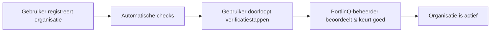

# Organisatie Registratie

Deze pagina beschrijft hoe organisaties deelnemer worden van PortlinQ — van self-service registratie via verificatie tot goedkeuring. Na goedkeuring is de organisatie een actieve participant in het PortlinQ Associatieregister (ASR) en kan zij apps en API's aansluiten.

> 🔗 **Self-Service Portal:** [portlinq-preview.poort8.nl/portal ➚](https://portlinq-preview.poort8.nl/portal)

## Registratieproces in het kort

## Self-service registratie

Elke gebruiker kan zijn organisatie registreren via de [Self-Service Portal](https://portlinq-preview.poort8.nl/portal). De registrerende gebruiker:

1. **Vult organisatiegegevens in** — KvK-nummer en organisatienaam
2. **Vult gebruikersgegevens in** — naam, e-mailadres en telefoonnummer
3. **Ontvangt een e-mail om een wachtwoord in te stellen** en het account te activeren

Na registratie staat de organisatie ter beoordeling voor goedkeuring door de PortlinQ-beheerder.

## Verificaties

Elke organisatie doorloopt verificatiestappen — automatisch, door de gebruiker, en door de dataspace-beheerder:

| Verificatiestap | Eigenaar | Wat het doet | Uitkomst |
|-----------------|----------|--------------|----------|
| **Handelsregister (KvK)** | Automatisch | Valideert het KvK-nummer via de KvK API en controleert de officiële naam tegen de bij onboarding ingevoerde naam | Bij een match gaat de onboarding verder. Bij geen match wordt de gebruiker gevraagd te bevestigen of de KvK-geregistreerde organisatie bedoeld is |
| **E-mailverificatie onboarding-gebruiker** | Oorspronkelijke onboarding-gebruiker | Verifieert via een verificatielink dat de persoon die de onboarding startte het opgegeven e-mailadres beheert. Deze gebruiker wordt automatisch **administrator** van de organisatie in de dataspace | Goedgekeurd zodra de gebruiker het e-mailadres bevestigt |
| **Goedkeuring onboarding** | Dataspace-beheerder (PortlinQ) | Definitieve beslissing over deelname | Goedgekeurd, afgewezen of ingetrokken |

## Goedkeuringsproces

Na registratie beoordeelt de PortlinQ-beheerder de gegevens van de organisatie en keurt deelname goed of af. Tot de organisatie is goedgekeurd, kunnen gebruikers van die organisatie nog geen dataspace-systemen gebruiken.

## Organisatie-identifiers

Elke organisatie in PortlinQ wordt geïdentificeerd via een EUID (European Unique Identifier), conform de NoodleBar-standaard:

| Land | Formaat | Voorbeeld |
|------|---------|-----------|
| Nederland | `NLNHR.{kvkNummer}` | `NLNHR.11223344` |

Deze identifier wordt in de hele dataspace gebruikt voor policies, tokens en autorisatie-checks.

## Productie-omgeving

[TBD — Eventuele verschillen tussen preview en productie worden hier gedocumenteerd zodra de productie-omgeving beschikbaar is.]

Vragen? Neem contact op met Poort8 via **hello@poort8.nl**.