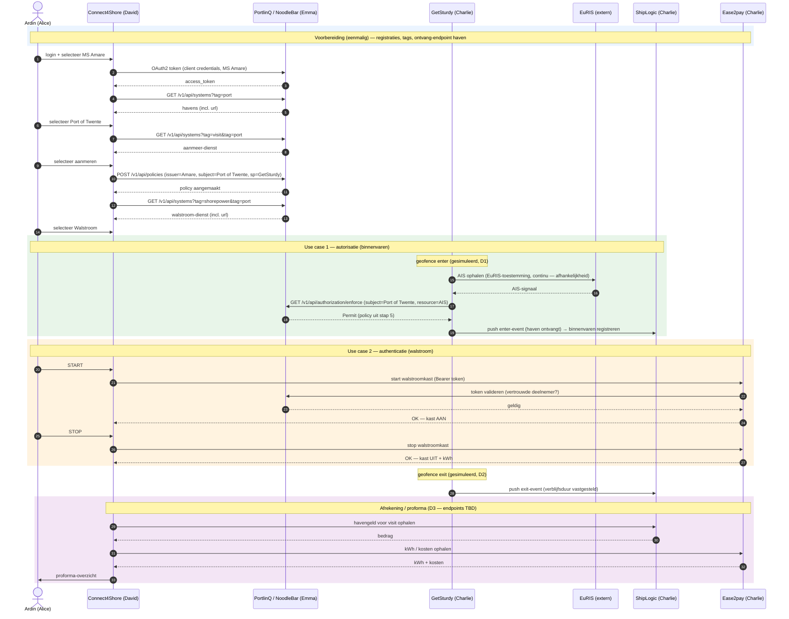

# PortlinQ — Referentie-implementatie (havenbezoek & walstroom)

> 🚧 **Under construction**

Referentie-implementatie van het havenbezoek- en walstroomproces in PortlinQ, met de concrete API-calls op basis van de PortlinQ API-spec (`portlinq-preview.poort8.nl`). Bedoeld zodat een developer de flow kan naspelen. Instance-specifieke waarden staan als `{PLACEHOLDER}` of `[TBD]` — die worden tijdens de technische configuratie ingevuld.

## Overzicht

Twee use cases, elk met een ander type poort:

1. **Visit** — het binnenvaren (en verlaten) van de haven; aankomst en vertrek worden geregistreerd. → **mét policy check** (autorisatie).
2. **Walstroom** — het afnemen van walstroom; de kast wordt aan- en uitgezet. → **zónder policy check, mét token-validatie** (authenticatie).

Wie doet mee: schipper **Ardin** op de **MS Amare**, die aanmeert bij de haven **Port of Twente**. Diensten komen van **GetSturdy** (geofence/AIS), **ShipLogic** (havenmanagement) en **Ease2pay** (walstroom); de app is **Connect4Shore**; **PortlinQ / Poort8** beheert het stelsel.

Kernkeuzes (hoog over — technische uitwerking verderop):

- Policy-issuer = de **MS Amare** (Ardin handelt via de app namens het schip).
- AIS/geofence-events gaan via **push** (GetSturdy → haven).
- Diensten worden gevonden via **tags** (discovery).
- Token voor nu via de **client credentials van de Amare**.

## Flow (sequence diagram)



## Technische uitgangspunten

- **Base URL:** `https://portlinq-preview.poort8.nl`
- **Auth:** alle PortlinQ-calls gaan met `Authorization: Bearer <ACCESS_TOKEN>` (JWT). Voor nu is gekozen dat **direct de client credentials van de MS Amare** gebruikt worden (het schip als deelnemer authenticeert zelf). De IdP-setup zelf (audiences, scopes, client credentials) valt buiten deze doc. *

> \* Later op te pakken (zie Openstaande werkzaamheden — Scheepsregister): als alternatief op de directe client credentials van de Amare kan token exchange via een externe IdP (RFC 8693) worden ingezet, waarbij Connect4Shore namens het schip handelt.

## Actoren en identifiers

| Partij | Persona | Rol | Identifier (placeholder) |
| -- | -- | -- | -- |
| Ardin Mudde / MS Amare | Alice | Schipper / schip (deelnemer) | `{AMARE_ID}` |
| Port of Twente | Bob | Haven / data rights holder | `{PORT_OF_TWENTE_ID}` |
| Ease2pay | Charlie | Walstroom | `{EASE2PAY_ID}` |
| ShipLogic | Charlie | HMS + havengeldberekening | `{SHIPLOGIC_ID}` |
| GetSturdy | Charlie | Geofence / AIS-leverancier | `{GETSTURDY_ID}` |
| Connect4Shore | David | App / dienstconsument | `{C4S_ID}` |
| PortlinQ / Poort8 | Emma | Dataspace-beheerder | — |

Aanvullende instance-specifieke waarden: `useCase = "portlinq"` `[TBD exact]`, AIS-resource `{AIS_RESOURCE_ID}` `[TBD]`.

## Voorbereiding (onboarding & registratie)

Eenmalig vooraf; hierop draait de uitvoering.

**V1 — Deelnemers registreren.** MS Amare `{AMARE_ID}` (liefst door Ardin zelf ingeschreven — met/zonder ENI is open, NB-1609 *), Port of Twente, Ease2pay, ShipLogic, GetSturdy, Connect4Shore krijgen elk een identiteit + client credentials.

> \* Zie Openstaande werkzaamheden (ENI / scheepsidentifier, NB-1609).

**V2 — Systemen publiceren + taggen.** Diensten worden als systemen geregistreerd en getagd: aanmeren/scheepsbezoek → `visit`, havendienst → `port`, walstroom → `shorepower`, vaartuig → `vessel`. Elk systeem krijgt een `url`.

**V3 — Ontvang-endpoint voor de events (push).** Omdat we voor het **push-model** kiezen (zie Overzicht → kernkeuzes), biedt de haven/ShipLogic een **ontvang-endpoint** aan waar GetSturdy het enter-/exit-event naartoe pusht, en registreert dat. De AIS-"resource" `{AIS_RESOURCE_ID}` is verder alleen een **logische identifier** waar de policy naar wijst — geen aparte dienst die GetSturdy hoeft te exposen.

**V4 — Havengeldtarieven** vastleggen in het HMS (ShipLogic).

## Uitvoering van de demo

### Stap 1 — Inloggen + schip selecteren
Ardin logt in bij Connect4Shore en selecteert de MS Amare. App-interne actie.

### Stap 2 — Token ophalen namens de MS Amare
Connect4Shore handelt namens de Amare. Voor nu gebruiken we de client credentials van de Amare zelf (geen scheepsregister → workaround). Token exchange via een externe IdP is een latere variant (zie de voetnoot bij Auth en Openstaande werkzaamheden).

```http
POST https://<IDP_TOKEN_URL>/oauth/token        # client credentials (MS Amare) — [TBD]
```

Response: `access_token` (JWT). Deze gaat mee als `Authorization: Bearer` in alle vervolg-calls.

### Stap 3 — Havens ophalen
```http
GET https://portlinq-preview.poort8.nl/v1/api/systems?tag=port
Authorization: Bearer <ACCESS_TOKEN>
```
Response: systemen getagd als `port`, elk met `organizationName` en `url`.

### Stap 4 — Haven selecteren
Ardin selecteert Port of Twente. App-interne selectie op basis van stap 3.

### Stap 5 — Aanmeren selecteren + policy inschieten
Ardin selecteert de aanmeer-/bezoekdienst van de haven (tag `visit`). Bij die selectie schiet de app de **policy** in: de MS Amare geeft Port of Twente toestemming om straks haar AIS-gegevens (geleverd door GetSturdy) te ontvangen. Issuer = de Amare (Ardin handelt via de app namens het schip).

```http
GET https://portlinq-preview.poort8.nl/v1/api/systems?tag=visit&tag=port
Authorization: Bearer <ACCESS_TOKEN>
```
```http
POST https://portlinq-preview.poort8.nl/v1/api/policies
Authorization: Bearer <ACCESS_TOKEN>
Content-Type: application/json

{
  "useCase": "portlinq",
  "issuerId": "{AMARE_ID}",
  "subjectId": "{PORT_OF_TWENTE_ID}",
  "serviceProvider": "{GETSTURDY_ID}",
  "action": "read",
  "resourceId": "{AIS_RESOURCE_ID}",
  "expiration": <UNIX_TIMESTAMP>
}
```

### Stap 6 — Walstroom selecteren
Als het schip in de buurt is, selecteert Ardin de walstroom-dienst.

```http
GET https://portlinq-preview.poort8.nl/v1/api/systems?tag=shorepower&tag=port
Authorization: Bearer <ACCESS_TOKEN>
```
Response: walstroom-dienst(en) van de haven, met de `url` van Ease2pay om aan te roepen.

### Stap 7 — Binnenvaren: autorisatie (use case 1)
Geofence enter-event (gesimuleerd, D1). GetSturdy volgt de Amare (AIS is beschikbaar via de EuRIS-toestemming — zie afhankelijkheden) en controleert bij PortlinQ of de haven het binnenvaren mag ontvangen:

```http
GET https://portlinq-preview.poort8.nl/v1/api/authorization/enforce
  ?subject={PORT_OF_TWENTE_ID}
  &resource={AIS_RESOURCE_ID}
  &action=read
  &useCase=portlinq
Authorization: Bearer <ACCESS_TOKEN>
```
Response: `Permit` (de policy uit stap 5). Gebruik `/v1/api/authorization/explained-enforce` voor de uitleg welke policy matchte — handig om live in de zaal te tonen. Bij `Permit` **pusht** GetSturdy het enter-event naar het ontvang-endpoint van de haven/ShipLogic; ShipLogic registreert het binnenvaren voor de visit.

> **Tegenscenario (autorisatie):** ontbreekt de policy, dan geeft enforce `Deny` → GetSturdy pusht niet en het binnenvaren wordt niet geregistreerd.

### Stap 8 — Walstroom AAN (START): authenticatie (use case 2)
Ardin drukt START. Connect4Shore roept het walstroom-endpoint van Ease2pay aan (URL uit stap 6), met het Bearer-token:

```http
POST {EASE2PAY_WALSTROOM_URL}/start        # url uit systems-response
Authorization: Bearer <ACCESS_TOKEN>
```
Ease2pay valideert het token (is dit een vertrouwde deelnemer?) → kast AAN, `200 OK`. **Geen policy/enforce — dit is puur authenticatie.**

> **Tegenscenario (authenticatie):** een onbekende/niet-vertrouwde partij heeft geen geldig token → `401/403` → kast blijft uit.

### Stap 9 — Walstroom UIT (STOP)
```http
POST {EASE2PAY_WALSTROOM_URL}/stop
Authorization: Bearer <ACCESS_TOKEN>
```
Kast UIT, `200 OK` + afgenomen kWh.

### Stap 10 — Vertrek: geofence exit
Geofence exit-event (gesimuleerd, D2). GetSturdy detecteert vertrek en stopt met volgen; ShipLogic legt de eindtijd vast → verblijfsduur (enter + exit) definitief.

### Stap 11 — Afrekening / proforma
Connect4Shore stelt het overzicht samen uit twee bronnen. **Deze endpoints moeten nog gebouwd worden (D3).**

```http
GET {SHIPLOGIC_URL}/visits/{visitId}/havengeld     # [TBD] — havengeld o.b.v. timestamps + tarieven
GET {EASE2PAY_URL}/sessions/{sessionId}/kosten      # [TBD] — kWh + kosten
Authorization: Bearer <ACCESS_TOKEN>
```
Connect4Shore toont de proforma aan Ardin.

## Afhankelijkheden

- **EuRIS-toestemming (buiten PortlinQ).** Bij EuRIS is vastgelegd dat de AIS-data van zes schepen (incl. de Amare) continu opgehaald mag worden; GetSturdy haalt die op als AIS-leverancier namens PortlinQ. Dit leeft in het EuRIS-register, niet in PortlinQ — randvoorwaarde voor stap 7.
- **D1 — Simulatie binnenvaren** (geofence enter-event) zodat use case 1 live getoond kan worden.
- **D2 — Simulatie vertrek** (geofence exit-event).
- **D3 — Kosten-endpoints** nog te leveren door ShipLogic (havengeld) en Ease2pay (kWh/kosten).

> Gemaakte keuze: de policy wordt dynamisch ingeschoten bij het selecteren van de aanmeer-dienst (stap 5), met de MS Amare als issuer.

## Openstaande werkzaamheden

1. **Scheepsregister — Out of scope.** Er is (nog) geen scheepsregister. In deze opzet gebruikt de app tijdelijk de client credentials van de MS Amare en handelt daarmee "als de Amare". De nette variant — de app die namens het schip handelt via delegatie / token exchange (RFC 8693) in plaats van geleende credentials — hoort bij een echt scheepsregister en valt buiten de scope van deze implementatie.
2. **NAW-gegevens** — organisatie-endpoint dat NAW-gegevens teruggeeft (NB-1608).
3. **ENI / scheepsidentifier** — inschatting om ENI als identifier toe te voegen bij inschrijving van het schip (NB-1609).
4. **Organisatielijst (leden) API** — endpoint om in één keer alle ingeschreven leden op te halen (NB-1671).

## Referenties

- PortlinQ API (Scalar): `https://portlinq-preview.poort8.nl/scalar/v1`
