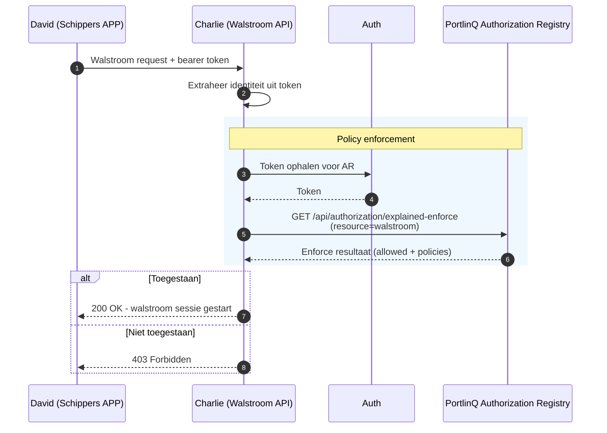

# Walstroom Autorisatie voor Dienstaanbieders

Deze gids is voor ontwikkelaars die een walstroom platform bouwen en autorisatiebeleid moeten verifiëren voordat zij toegang geven tot walstroom. De gids is een verdieping op stap 4 uit de [Walstroom Toegangsflow](walstroom-toegang.md): hoe **Charlie (Walstroom API)** het `explained-enforce` endpoint van de PortlinQ Authorization Registry bevraagt om te controleren of een geldige policy bestaat voor **David (Schippers APP)**.

Walstroom dienstaanbieders zijn in PortlinQ terminologie een type **data service provider**: een platform dat diensten levert aan app-aanbieders. Hoewel deze gids zich richt op walstroom, is hetzelfde enforcement patroon toepasbaar op andere dienstaanbieders.

[PortlinQ API Docs ➚](https://portlinq-preview.poort8.nl/scalar/v1)

## Voor wie is deze gids?

Deze gids is voor walstroom dienstaanbieders die:

- Walstroomkasten beheren in binnenhavens
- Moeten verifiëren of een app-aanbieder geautoriseerd is om walstroom te gebruiken
- Het PortlinQ autorisatiepatroon willen implementeren via `explained-enforce`

## Wat deze gids beschrijft

- Hoe policies werken in PortlinQ en wat zij toestaan
- Hoe je een token ophaalt voor de Authorization Registry
- Hoe je het `explained-enforce` endpoint bevraagt
- Hoe je de response valideert

Deze gids beschrijft niet hoe app-aanbieders een token ophalen, hoe policies worden aangemaakt, of hoe de fysieke koppeling met de walstroomkast werkt. Zie daarvoor de [Authenticatie Flow](authenticatie.md) en de [Walstroom Toegangsflow](walstroom-toegang.md).

## Procesbeschrijving

Wanneer een app-aanbieder (David) een verzoek stuurt om walstroom te gebruiken, volg je deze stappen:

1. **Ontvang het verzoek**: David stuurt een verzoek naar jouw API met een bearer token en de gegevens die jouw walstroom API nodig heeft, zoals een kast-ID.
2. **Extraheer de identiteit**: haal de organisatie-identiteit van de aanvrager op uit het bearer token.
3. **Bevraag de Authorization Registry**: roep `explained-enforce` aan om te controleren of een geldige policy bestaat.
4. **Valideer de response**: verifieer dat het verzoek is toegestaan en dat de policy bij de aanvrager hoort.
5. **Start of weiger**: bij autorisatie start je de walstroom sessie. Anders retourneer je `403 Forbidden`.



## Autorisatiemodel

De [Walstroom Toegangsflow](walstroom-toegang.md) beschrijft hoe de policy wordt aangemaakt namens het schip. Jouw platform bevraagt die bestaande policy via `explained-enforce`.

### Policy velden

| Veld | Beschrijving | Voorbeeld |
|------|--------------|-----------|
| `issuerId` | Issuer die in de walstroom-flow wordt gebruikt | `{issuer_id}` |
| `subjectId` | App-aanbieder die jouw dienst gebruikt (David) | `organization:kvk:87654321` |
| `serviceProvider` | Jouw walstroom platform (Charlie) | `organization:kvk:23456789` |
| `type` | Resource type | `walstroom-service` |
| `resourceId` | PortlinQ resource uit de walstroom policy | `walstroom` |
| `attribute` | Data attributen | `*` |
| `action` | Toegestane actie | `use` |
| `useCase` | Use case model uit de walstroom flow | `unspecified` |

### Voorbeeldresources

| Aanvraag | PortlinQ resource | Toegang |
|----------|-------------------|---------|
| Walstroom sessie voor kast 001 | `walstroom` | Policy aanwezig |
| Walstroom sessie voor kast 002 | `walstroom` | Geen passende policy of lokale validatie faalt |

## Stap 1: Token ophalen voor de Authorization Registry

Authenticeer met de PortlinQ Authorization Registry via OAuth2 client credentials:

```http
POST https://auth.poort8.nl/realms/portlinq-preview/protocol/openid-connect/token
Content-Type: application/x-www-form-urlencoded

client_id=<YOUR_CLIENT_ID>
&client_secret=<YOUR_CLIENT_SECRET>
&grant_type=client_credentials
&scope=noodlebar-api
```

Neem contact op met Poort8 via **hello@poort8.nl** om client credentials aan te vragen.

## Stap 2: Explained-enforce request

Roep `explained-enforce` aan om autorisatie te controleren:

```http
GET https://portlinq-preview.poort8.nl/api/authorization/explained-enforce
  ?issuer={issuer_id}
  &subject=organization:kvk:87654321
  &serviceProvider=organization:kvk:23456789
  &action=use
  &resource=walstroom
  &type=walstroom-service
  &attribute=*
  &useCase=unspecified
Authorization: Bearer {charlie_token}
```

Gebruik voor `issuer`, `resource`, `type`, `attribute` en `useCase` dezelfde waarden als in de [Walstroom Toegangsflow](walstroom-toegang.md). De kast-ID is onderdeel van jouw eigen walstroom API request; de huidige PortlinQ flow gebruikt `resource=walstroom` voor de AR-check.

### Query parameters

| Parameter | Beschrijving | Voorbeeld |
|-----------|--------------|-----------|
| `issuer` | Issuer die in de walstroom-flow wordt gebruikt | `{issuer_id}` |
| `subject` | App-aanbieder (David) | `organization:kvk:87654321` |
| `serviceProvider` | Jouw platform (Charlie) | `organization:kvk:23456789` |
| `action` | Gevraagde actie | `use` |
| `resource` | PortlinQ resource uit de walstroom policy | `walstroom` |
| `type` | Resource type | `walstroom-service` |
| `attribute` | Data attributen | `*` |
| `useCase` | Use case model | `unspecified` |

## Stap 3: Explained-enforce response

**Toegestaan:**

```json
{
  "allowed": true,
  "explainPolicies": [
    {
      "policyId": "a1b2c3d4-e5f6-7890-abcd-ef1234567890",
      "useCase": "unspecified",
      "issuedAt": 1738368000,
      "notBefore": 1738368000,
      "expiration": 1769904000,
      "issuerId": "{issuer_id}",
      "subjectId": "organization:kvk:87654321",
      "serviceProvider": "organization:kvk:23456789",
      "action": "use",
      "resourceId": "walstroom",
      "type": "walstroom-service",
      "attribute": "*",
      "license": null,
      "rules": null,
      "properties": []
    }
  ]
}
```

**Geweigerd:**

```json
{
  "allowed": false,
  "explainPolicies": []
}
```

## Stap 4: Validatie en response

Verifieer het volgende voordat je de walstroom sessie start:

| Check | Vereiste |
|-------|----------|
| **Allowed** | `allowed` moet `true` zijn |
| **Ship / issuer** | De ship- of issuer-identiteit in het bearer token moet overeenkomen met de context waarvoor je de aanvraag verwerkt |
| **Subject** | Vergelijk `explainPolicies[].subjectId` alleen met een geverifieerde app-/provider-identiteit als die identiteit expliciet aanwezig is in het bearer token; gebruik hiervoor niet de ship-/issuer-identiteit |
| **Service provider** | `explainPolicies[].serviceProvider` moet overeenkomen met jouw organisatie-ID |
| **Resource** | `explainPolicies[].resourceId` moet overeenkomen met de PortlinQ resource die je hebt bevraagd |

Het bearer token in deze flow identificeert dus primair de ship/issuer-context. `subjectId` representeert David als app-aanbieder en mag alleen aan een token-claim worden gekoppeld als die claim die app-/provider-identiteit aantoonbaar en betrouwbaar bevat.

Valideer de kast-ID daarnaast in je eigen walstroom API. PortlinQ bepaalt of David de walstroom resource mag gebruiken; kast-specifieke technische checks blijven onderdeel van Charlie's domein.

Als één van deze checks faalt, behandel het verzoek als niet geautoriseerd.

### Foutafhandeling

| Code | Betekenis | Wanneer |
|------|-----------|---------|
| `200 OK` | Geautoriseerd | `allowed: true` en alle validaties slagen |
| `401 Unauthorized` | Ongeldig token | Bearer token ontbreekt, is ongeldig of is verlopen |
| `403 Forbidden` | Niet geautoriseerd | `allowed: false` of validatie mislukt |
| `400 Bad Request` | Ongeldig verzoek | Verzoek is niet correct geformatteerd |
| `500 Internal Server Error` | Technische fout | Onverwachte fout; log de fout en implementeer retry-logica waar passend |

## Voorbereiding

Voordat de enforcement flow werkt, moet het volgende zijn ingericht:

| Wat | Wie |
|-----|-----|
| Connect4Shore geregistreerd in PortlinQ OR | Poort8 / Connect4Shore |
| `kast-001` en `kast-002` geregistreerd als endpoints | Connect4Shore |
| Haven Bergen op Zoom geregistreerd in PortlinQ OR | Poort8 / Haven |
| Easy2Pay geregistreerd in PortlinQ OR | Poort8 / Easy2Pay |
| Walstroom policy geregistreerd in AR volgens de [Walstroom Toegangsflow](walstroom-toegang.md) | Schipper app / Poort8 |
| Testscenario zonder passende policy, ter demonstratie van weigering | - |

## Testomgeving

| Service | URL |
|---------|-----|
| Token endpoint | `https://auth.poort8.nl/realms/portlinq-preview/protocol/openid-connect/token` |
| PortlinQ Authorization Registry | `https://portlinq-preview.poort8.nl` |
| Explained-enforce endpoint | `https://portlinq-preview.poort8.nl/api/authorization/explained-enforce` |
| API documentatie | [PortlinQ API docs ➚](https://portlinq-preview.poort8.nl/scalar/v1) |

## Volgende stappen

- Bekijk de [Walstroom Toegangsflow](walstroom-toegang.md) voor de app- en policy-aanmaakflow
- Bekijk de [Authenticatie Flow](authenticatie.md) voor tokenverkrijging door app-aanbieders
- Bekijk de [PortlinQ API docs ➚](https://portlinq-preview.poort8.nl/scalar/v1) voor endpoint details

Vragen? Neem contact op met Poort8 via **hello@poort8.nl**.
