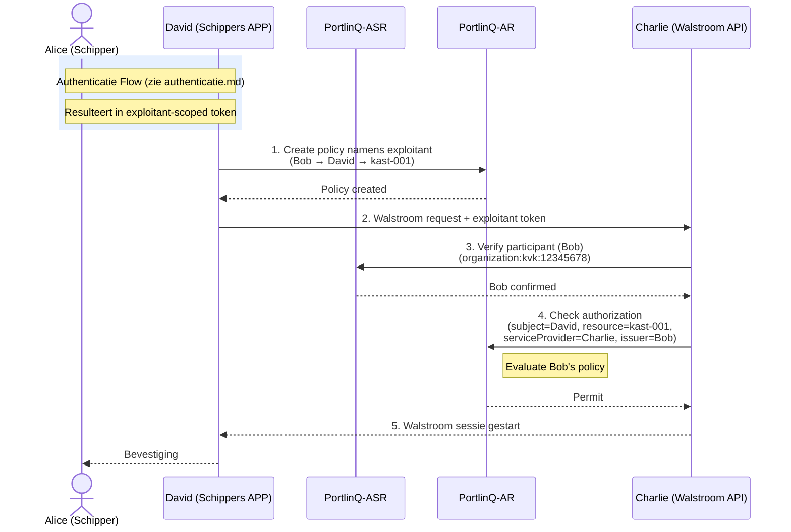

# Walstroom Toegangsflow

Schippers kunnen walstroom (shore power) reserveren en afnemen via hun gekozen app. Deze flow beschrijft de authenticatie, autorisatie en walstroom sessie flow met PortlinQ's Associatieregister (ASR) en Authorization Registry (AR).

[PortlinQ API Docs ➚](https://portlinq-preview.poort8.nl/scalar/v1)

## Overzicht

De walstroom flow combineert **app-lokale authenticatie**, **policy aanmaak** door de schipper app namens de exploitant, en **autorisatie verificatie** via AR. De schipper app maakt een autorisatie policy aan namens de exploitant, waarna de app een exploitant-scoped token gebruikt. Dit token wordt gebruikt bij de walstroom API die de autorisatie verifieert via PortlinQ AR.

## Sequence Diagram


```mermaid
sequenceDiagram
    actor Alice as Alice (Schipper)
    participant David as David (Schippers APP)
    participant ASR as PortlinQ-ASR
    participant AR as PortlinQ-AR
    participant Charlie as Charlie (Walstroom API)

    rect rgb(230, 240, 255)
        Note over Alice,David: Authenticatie Flow (zie authenticatie.md)
        Note over Alice,David: Resulteert in exploitant-scoped token
    end

    David->>AR: 1. Create policy namens exploitant<br/>(Bob → David → kast-001)
    AR-->>David: Policy created

    David->>Charlie: 2. Walstroom request + exploitant token
    Charlie->>ASR: 3. Verify participant (Bob)<br/>(organization:kvk:12345678)
    ASR-->>Charlie: Bob confirmed
    Charlie->>AR: 4. Check authorization<br/>(subject=David, resource=kast-001,<br/>serviceProvider=Charlie, issuer=Bob)
    Note right of AR: Evaluate Bob's policy
    AR-->>Charlie: Permit
    Charlie-->>David: 5. Walstroom sessie gestart
    David-->>Alice: Bevestiging
```

## Stappen

### Authenticatie & Exploitant Token

Zie [Authenticatie Flow](authenticatie.md) voor de volledige authenticatie stappen. De app verkrijgt een exploitant-scoped token.

**Resultaat:** Een access token (`{exploitant_token}`) waarmee de app gemachtigd is om namens Bob (`organization:kvk:12345678`) te handelen.

### Stap 1: Policy aanmaak _(PortlinQ AR)_

De schipper app maakt namens de exploitant (Bob) een autorisatie policy aan die David (de app) toestemming geeft om walstroom te gebruiken.

```http
POST https://portlinq-preview.poort8.nl/api/policies
Authorization: Bearer {exploitant_token}
Content-Type: application/json
```
```json
{
  "subjectId": "organization:kvk:87654321",
  "action": "use",
  "resourceId": "kast-001",
  "issuerId": "organization:kvk:12345678",
  "issuedAt": 1738368000,
  "notBefore": 1738368000,
  "expiration": 1769904000,
  "serviceProvider": "organization:kvk:23456789",
  "type": "walstroom-service",
  "attribute": "*",
  "useCase": "unspecified"
}
```

**Response:**

```json
{
  "policyId": "3fa85f64-5717-4562-b3fc-2c963f66afa6",
  "useCase": "unspecified",
  "issuedAt": 1738368000,
  "notBefore": 1738368000,
  "expiration": 1769904000,
  "issuerId": "organization:kvk:12345678",
  "subjectId": "organization:kvk:87654321",
  "serviceProvider": "organization:kvk:23456789",
  "action": "use",
  "resourceId": "kast-001",
  "type": "walstroom-service",
  "attribute": "*",
  "license": null,
  "rules": null,
  "properties": []
}
```

> **Tip: Toegang laten goedkeuren via e-mail?**
> Als alternatief voor het direct inschrijven van de policy (waarvoor de app direct gemachtigd moet zijn namens de exploitant), kan de app gebruikmaken van **Keyper Approval Links**. Hiermee genereert de app een verzoek dat automatisch per e-mail naar de goedkeurder (Bob) wordt gestuurd. Zodra Bob akkoord geeft, schrijft Keyper de policy automatisch in het AR.
>
> [→ Lees hoe je Keyper Approval Links integreert](../keyper/)

### Stap 2: Walstroom reservering _(extern)_

De app stuurt een walstroom reservering naar de walstroom API (Charlie) met het exploitant token.

> ℹ️ De walstroom API endpoints en request/response formaten zijn service provider-specifiek. Raadpleeg de documentatie van de dienstaanbieder voor specifieke API details.

### Stap 3: Participant verificatie _(PortlinQ ASR)_

De walstroom API (Charlie) verifieert via het Associatieregister (ASR) dat de exploitant (Bob, `organization:kvk:12345678`) een actieve en geregistreerde participant is binnen PortlinQ. Hiervoor wordt de Organization Registry API geraadpleegd:

```http
GET https://portlinq-preview.poort8.nl/api/organization-registry/organization:kvk:12345678
Authorization: Bearer {charlie_service_token}
```

Zie de [Organization Registry API docs ➚](https://portlinq-preview.poort8.nl/scalar/#tag/organization-registry/GET/api/organization-registry/{id}) voor de volledige details van deze ASR-check.

Als Bob niet gevonden wordt of niet actief is in het ASR, weigert Charlie de aanvraag.

### Stap 4: Autorisatie verificatie _(PortlinQ AR)_

De walstroom API controleert via AR of David (de app) toestemming heeft om walstroom te gebruiken namens Bob (de exploitant).

```http
GET https://portlinq-preview.poort8.nl/api/authorization/explained-enforce
  ?subject=organization:kvk:87654321
  &resource=kast-001
  &action=use
  &useCase=unspecified
  &issuer=organization:kvk:12345678
  &serviceProvider=organization:kvk:23456789
  &type=walstroom-service
  &attribute=*
Authorization: Bearer {charlie_service_token}
```

**AR evaluatie:**
1. AR zoekt naar policies waar:
  - `issuer` = `organization:kvk:12345678` (de scheepsoperator/exploitant)
  - `subject` = `organization:kvk:87654321` (de schippers-app)
  - `resource` = `kast-001` (het specifieke walstroomkast-ID)
  - `serviceProvider` = `organization:kvk:23456789` (Charlie)
2. Als een geldige policy bestaat → `Permit`
3. Anders → `Deny`

**Response (Permit):**

```json
{
  "allowed": true,
  "explainPolicies": [
    {
      "policyId": "3fa85f64-5717-4562-b3fc-2c963f66afa6",
      "useCase": "unspecified",
      "issuedAt": 1738368000,
      "notBefore": 1738368000,
      "expiration": 1769904000,
      "issuerId": "organization:kvk:12345678",
      "subjectId": "organization:kvk:87654321",
      "serviceProvider": "organization:kvk:23456789",
      "action": "use",
      "resourceId": "kast-001",
      "type": "walstroom-service",
      "attribute": "*",
      "license": null,
      "rules": null,
      "properties": []
    }
  ]
}
```

**Response (Deny):**

```json
{
  "allowed": false,
  "explainPolicies": []
}
```

### Stap 5: Walstroom sessie gestart _(extern)_

Als alle verificaties slagen, start Charlie de walstroom sessie en retourneert de sessie details aan de app.

> ℹ️ De sessie response formaten zijn service provider-specifiek. Raadpleeg de documentatie van de dienstaanbieder voor specifieke details over sessie management en verbruiksdata.

De app toont de bevestiging aan Alice met sessie informatie.

## Foutafhandeling

Zie de [PortlinQ API docs ➚](https://portlinq-preview.poort8.nl/scalar/v1) voor actuele foutcodes.

**Verwachte scenario's:**

- **Ongeldige token exchange**: ASR retourneert 403 als Alice niet gelinkt is aan de exploitant.
- **Participant niet gevonden**: Charlie weigert de aanvraag met `403 Forbidden` als Bob (de exploitant) niet geregistreerd of actief is in het Associatieregister (ASR).
- **Policy niet gevonden**: AR retourneert `Deny`; exploitant moet policy aanmaken.
- **Policy verlopen**: AR retourneert `Deny`; exploitant moet policy verlengen.
- **Service onbereikbaar**: Standaard HTTP foutafhandeling (retry-mechanisme, timeout).

## Productie-omgeving

[TBD — Eventuele verschillen tussen preview en productie worden hier gedocumenteerd zodra de productie-omgeving beschikbaar is.]

**Verwacht:**

- Preview: `https://portlinq-preview.poort8.nl` (huidige living lab fase)
- Productie: `https://portlinq.poort8.nl` (na succesvolle living lab validatie)

## Volgende stappen

- Terug naar de [Introductie](README.md) voor een overzicht
- Bekijk de [PortlinQ API docs ➚](https://portlinq-preview.poort8.nl/scalar/v1) voor endpoint details
- Bekijk hoe je [Keyper Approval Links](../keyper/) integreert om policies te laten goedkeuren
- Bekijk de [Walstroom Autorisatie voor Dienstaanbieders](walstroom-autorisatie.md) voor de Charlie runtime check
- Bekijk de [Geofence Arrival Flow](geofence-arrival.md) voor automatische haven aanmeldingen
- Zie de [NoodleBar documentatie](../noodlebar/) voor achtergrond over Authorization Registry

## Context: PortlinQ Diensten

PortlinQ faciliteert digitale havendiensten via een federatief model met sterke authenticatie en autorisatie. De walstroom dienst is de eerste die deze architectuur gebruikt, waarbij:

- **Schippers** authenticeren via hun account bij de schippers-app
- **Exploitanten** beheren schepen en policies
- **Service providers** (zoals walstroom leveranciers) vertrouwen op PortlinQ's autorisatie infrastructuur
- **ASR** garandeert participant identiteit en relaties
- **AR** handhaaft exploitant-gedefinieerde toegangsregels

Deze patronen zijn herbruikbaar voor havengeld inning en ligplaats aanmelding.
