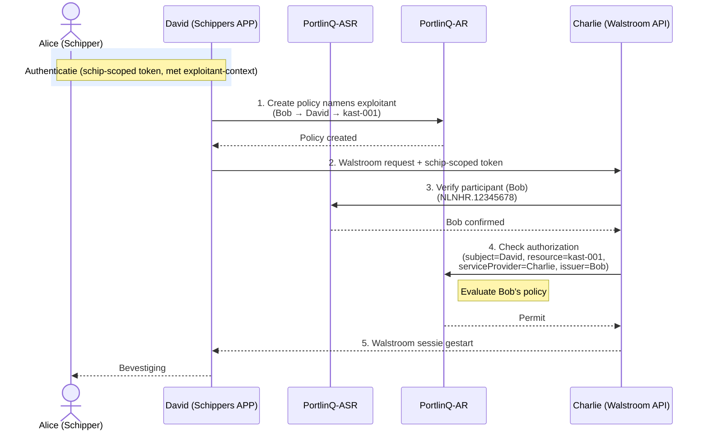

# Walstroom Toegangsflow

> 🚧 **Under construction** — deze use-case-gids wordt nog uitgewerkt als implementatie van de generieke stappen ([Organisatie Registratie](onboarding.md), [API-toegang aanvragen](api-toegang-aanvragen.md), [Tokens valideren](access-tokens-valideren.md), [Autorisatie valideren](autorisatie.md)). De schip-token-authenticatie wordt hierin opgenomen.

Schippers kunnen walstroom (shore power) reserveren en afnemen via hun gekozen app. Deze flow beschrijft de authenticatie, autorisatie en walstroom-sessieflow met PortlinQ's Associatieregister (ASR) en Authorization Registry (AR).

[PortlinQ API Docs ➚](https://portlinq-preview.poort8.nl/scalar/v1)

## Overzicht

De walstroom flow combineert **app-lokale authenticatie**, **policy-aanmaak** door de schippers-app namens de exploitant, en **autorisatie-verificatie** via AR. De app verkrijgt een schip-scoped token (met exploitant-context) en maakt daarmee een autorisatie-policy aan namens de exploitant. Datzelfde token wordt gebruikt bij de walstroom-API, die de autorisatie verifieert via PortlinQ AR.

## Sequence Diagram


```mermaid
sequenceDiagram
    actor Alice as Alice (Schipper)
    participant David as David (Schippers APP)
    participant ASR as PortlinQ-ASR
    participant AR as PortlinQ-AR
    participant Charlie as Charlie (Walstroom API)

    rect rgb(230, 240, 255)
        Note over Alice,David: Authenticatie (schip-scoped token, met exploitant-context)
    end

    David->>AR: 1. Create policy namens exploitant<br/>(Bob → David → kast-001)
    AR-->>David: Policy created

    David->>Charlie: 2. Walstroom request + schip-scoped token
    Charlie->>ASR: 3. Verify participant (Bob)<br/>(NLNHR.12345678)
    ASR-->>Charlie: Bob confirmed
    Charlie->>AR: 4. Check authorization<br/>(subject=David, resource=kast-001,<br/>serviceProvider=Charlie, issuer=Bob)
    Note right of AR: Evaluate Bob's policy
    AR-->>Charlie: Permit
    Charlie-->>David: 5. Walstroom sessie gestart
    David-->>Alice: Bevestiging
```

## Stappen

### Authenticatie & Schip-token

De app verkrijgt een **schip-scoped token** (met exploitant-context). **Resultaat:** een access token (`{schip_token}`) waarmee de app gemachtigd is om namens Bob (`NLNHR.12345678`) te handelen.

### Stap 1: Policy aanmaak _(PortlinQ AR)_

De schippers-app maakt namens de exploitant (Bob) een autorisatie-policy aan die David (de app) toestemming geeft om walstroom te gebruiken.

```bash
curl -X POST https://portlinq-preview.poort8.nl/v1/api/policies \
  -H "Authorization: Bearer {schip_token}" \
  -H "Content-Type: application/json" \
  -d '{
    "subjectId": "NLNHR.87654321",
    "action": "use",
    "resourceId": "kast-001",
    "issuerId": "NLNHR.12345678",
    "issuedAt": 1738368000,
    "notBefore": 1738368000,
    "expiration": 1769904000,
    "serviceProvider": "NLNHR.23456789",
    "type": "walstroom-service",
    "attribute": "*",
    "useCase": "portlinq"
  }'
```

> ℹ️ Identifiers zijn EUID's (`NLNHR.{kvkNummer}`). `useCase: "portlinq"` wordt in de AR op het **iSHARE**-model afgebeeld.

> **Tip: Toegang laten goedkeuren via e-mail?** Als alternatief voor het direct inschrijven van de policy kan de app **Keyper Approval Links** gebruiken. [→ Keyper](../keyper/)

### Stap 2: Walstroom reservering _(extern)_

De app stuurt een walstroom-reservering naar de walstroom-API (Charlie) met het schip-scoped token. De endpoints en formaten zijn service provider-specifiek.

### Stap 3: Participant verificatie _(PortlinQ ASR)_

Charlie verifieert via het ASR dat de exploitant (Bob) een actieve participant is:

```bash
curl -G https://portlinq-preview.poort8.nl/v1/api/organization-registry/NLNHR.12345678/validate \
  -H "Authorization: Bearer {charlie_service_token}"
```

**Response:**
```json
{ "isValid": true, "reason": "OrganizationActive" }
```

> ℹ️ Het `validate`-endpoint retourneert alleen de status (`isValid` + `reason`), niet het volledige organisatie-object. Bij `isValid: false` weigert Charlie de aanvraag.

### Stap 4: Autorisatie verificatie _(PortlinQ AR)_

```bash
curl -G https://portlinq-preview.poort8.nl/v1/api/authorization/explained-enforce \
  -H "Authorization: Bearer {charlie_service_token}" \
  --data-urlencode "subject=NLNHR.87654321" \
  --data-urlencode "resource=kast-001" \
  --data-urlencode "action=use" \
  --data-urlencode "useCase=portlinq" \
  --data-urlencode "issuer=NLNHR.12345678" \
  --data-urlencode "serviceProvider=NLNHR.23456789" \
  --data-urlencode "type=walstroom-service" \
  --data-urlencode "attribute=*"
```

> ℹ️ **`explained-enforce` retourneert altijd HTTP 200**, ook bij een weigering. Het resultaat staat in het `allowed`-veld. Charlie vertaalt dit zelf naar 200 (toegang) of 403 (weigering). Zie [Autorisatie valideren](autorisatie.md).

**Response (allowed):**
```json
{
  "allowed": true,
  "explainPolicies": [
    {
      "policyId": "3fa85f64-5717-4562-b3fc-2c963f66afa6",
      "useCase": "portlinq",
      "issuerId": "NLNHR.12345678",
      "subjectId": "NLNHR.87654321",
      "serviceProvider": "NLNHR.23456789",
      "action": "use",
      "resourceId": "kast-001",
      "type": "walstroom-service",
      "attribute": "*"
    }
  ]
}
```

**Response (geweigerd):**
```json
{ "allowed": false, "explainPolicies": [] }
```

### Stap 5: Walstroom sessie gestart _(extern)_

Als alle verificaties slagen, start Charlie de walstroom-sessie en toont de app de bevestiging aan Alice.

## Foutafhandeling

- **Participant niet gevonden**: `403 Forbidden` als Bob niet geregistreerd/actief is in ASR
- **Policy niet gevonden / verlopen**: AR retourneert `allowed: false`
- **Service onbereikbaar**: standaard HTTP foutafhandeling (retry, timeout)
