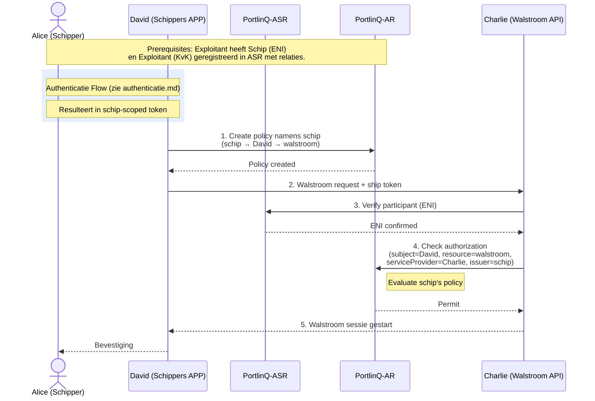

# Walstroom Toegangsflow

Schippers kunnen walstroom (shore power) reserveren en afnemen via hun gekozen app. Deze flow beschrijft de authenticatie, autorisatie en walstroom sessie flow met PortlinQ's Associatieregister (ASR) en Authorization Registry (AR).

🔗 **[API Docs ➚](https://portlinq-preview.poort8.nl/scalar/v1)** — Interactieve endpoint testing

## Overzicht

De walstroom flow combineert **app-lokale authenticatie**, **token exchange met ASR** voor schip-context, **policy aanmaak** door de schipper app namens het schip, en **autorisatie verificatie** via AR. De schipper app maakt een autorisatie policy aan namens het schip, waarna de app een schip-scoped token verkrijgt via Portlinq ASR. Dit token wordt gebruikt bij de walstroom API die de autorisatie verifieert via Portlinq AR.

> **Belangrijk:** Deze flow toont de volledige authenticatie en autorisatie keten. De prerequisite stappen (schip onboarding) worden uitgevoerd door de exploitant vooraf.

## Sequence Diagram


```mermaid
sequenceDiagram
    actor Alice as Alice (Schipper)
    participant David as David (Schippers APP)
    participant ASR as PortlinQ-ASR
    participant AR as PortlinQ-AR
    participant Charlie as Charlie (Walstroom API)
    Note over Alice,AR: Prerequisites: Exploitant heeft Schip (ENI)<br/>en Exploitant (KvK) geregistreerd in ASR met relaties.

    rect rgb(230, 240, 255)
        Note over Alice,David: Authenticatie Flow (zie authenticatie.md)
        Note over Alice,David: Resulteert in schip-scoped token
    end

    David->>AR: 1. Create policy namens schip<br/>(schip → David → walstroom)
    AR-->>David: Policy created

    David->>Charlie: 2. Walstroom request + ship token
    Charlie->>ASR: 3. Verify participant (ENI)
    ASR-->>Charlie: ENI confirmed
    Charlie->>AR: 4. Check authorization<br/>(subject=David, resource=walstroom,<br/>serviceProvider=Charlie, issuer=schip)
    Note right of AR: Evaluate schip's policy
    AR-->>Charlie: Permit
    Charlie-->>David: 5. Walstroom sessie gestart
    David-->>Alice: Bevestiging
```

## Voorwaarden (Prerequisites)

Deze stappen worden uitgevoerd door de exploitant vooraf:

| Prerequisite | Wat | Wie |
|--------------|-----|-----|
| **Schip registratie** | Schip (ENI) geregistreerd in ASR | Exploitant |
| **Relaties** | Exploitant → Schip relaties in ASR | Exploitant |

## Stappen

### Authenticatie & Schip Token

Zie [Authenticatie Flow](authenticatie.md) voor de volledige authenticatie stappen. De schipper selecteert het schip, en de app verkrijgt een schip-scoped token via ASR token exchange.

**Resultaat:** `{ship_scoped_token}` met scope `ship:{ENI} exploitant:{KvK}`

### Stap 1: Policy aanmaak _(PortlinQ AR)_

De schipper app maakt namens het schip een autorisatie policy aan die David (de app) toestemming geeft om walstroom te gebruiken.

```http
POST https://portlinq-preview.poort8.nl/api/policies
Authorization: Bearer {ship_scoped_token}
Content-Type: application/json
```
```json
{
  "subjectId": "{David_organization_id}",
  "action": "use",
  "resourceId": "walstroom",
  "issuerId": "{schip_organization_id}",
  "issuedAt": 1738368000,
  "notBefore": 1738368000,
  "expiration": 1769904000,
  "serviceProvider": "{Charlie_organization_id}",
  "type": "walstroom-service",
  "attribute": "*"
}
```

**Response:**

```json
{
  "policyId": "pol_walstroom_123",
  "issuerId": "{schip_organization_id}",
  "subjectId": "{David_organization_id}",
  "resourceId": "walstroom",
  "action": "use",
  "useCase": "portlinq-walstroom"
}
```

### Stap 2: Walstroom reservering _(extern)_

De app stuurt een walstroom reservering naar de walstroom API (Charlie) met het ship-scoped token.

> ℹ️ De walstroom API endpoints en request/response formaten zijn service provider-specifiek. Raadpleeg de documentatie van de dienstaanbieder voor specifieke API details.

### Stap 3: Participant verificatie _(PortlinQ ASR)_

De walstroom API verifieert dat het schip (ENI) een geregistreerde participant is in PortlinQ via ASR.

```http
GET https://portlinq-asr.poort8.nl/participants/{ENI}
Authorization: Bearer {charlie_service_token}
```

**Response:**

```json
{
  "eni": "{ENI}",
  "name": "MS Example Ship",
  "exploitant": {
    "kvk": "{Bob_KvK}",
    "name": "Exploitant BV"
  },
  "status": "active"
}
```

Als de participant niet gevonden wordt, weigert Charlie de aanvraag.

### Stap 4: Autorisatie verificatie _(PortlinQ AR)_

De walstroom API controleert via AR of David (de app) toestemming heeft om walstroom te gebruiken namens Bob's schepen.

```http
GET https://portlinq-preview.poort8.nl/api/authorization/explained-enforce
  ?subject={David_organization_id}
  &resource=walstroom
  &action=use
  &useCase=portlinq-walstroom
  &issuer={Bob_KvK}
  &serviceProvider={Charlie_organization_id}
  &type=walstroom-service
  &attribute=*
  &context={}
Authorization: Bearer {charlie_service_token}
```

**AR evaluatie:**
1. AR zoekt naar policies waar:
   - `issuer` = Schip (via ship-scoped token)
   - `subject` = David (app provider)
   - `resource` = walstroom
   - `serviceProvider` = Charlie
2. Als een geldige policy bestaat → `Permit`
3. Anders → `Deny`

**Response (Permit):**

```json
{
  "allowed": true,
  "explainPolicies": [
    {
      "policyId": "pol_walstroom_123",
      "issuerId": "{schip_organization_id}",
      "subjectId": "{David_organization_id}",
      "resourceId": "walstroom",
      "action": "use",
      "useCase": "portlinq-walstroom",
      "issuedAt": 1738368000,
      "notBefore": 1738368000,
      "expiration": 1769904000,
      "serviceProvider": "{Charlie_organization_id}",
      "type": "walstroom-service",
      "attribute": "*",
      "license": null,
      "rules": null,
      "properties": []
    }
  ]
}
```

**Response (Deny):**

```json
{
  "allowed": false,
  "explainPolicies": []
}
```

### Stap 5: Walstroom sessie gestart _(extern)_

Als alle verificaties slagen, start Charlie de walstroom sessie en retourneert de sessie details aan de app.

> ℹ️ De sessie response formaten zijn service provider-specifiek. Raadpleeg de documentatie van de dienstaanbieder voor specifieke details over sessie management en verbruiksdata.

De app toont de bevestiging aan Alice met sessie informatie.

## Foutafhandeling

[TBD — Wordt aangevuld zodra de API-specificatie beschikbaar is. Zie de [PortlinQ API docs ➚](https://portlinq-preview.poort8.nl/scalar/v1) voor actuele foutcodes.]

**Verwachte scenario's:**

- **Ongeldige token exchange**: ASR retourneert 403 als Alice niet gelinkt is aan exploitant of schip
- **Participant niet gevonden**: Charlie weigert aanvraag als ENI niet geregistreerd in ASR
- **Policy niet gevonden**: AR retourneert `Deny`; exploitant moet policy aanmaken
- **Policy verlopen**: AR retourneert `Deny`; exploitant moet policy verlengen
- **Service onbereikbaar**: Standaard HTTP foutafhandeling (retry-mechanisme, timeout)

## Architectuur Componenten

### PortlinQ-IDP (Identity Provider)
Authenticeert schippers via OIDC. Retourneert identity tokens met schipper claims.

### PortlinQ-ASR (Associatieregister)
- Beheert participants (schepen, schippers, exploitanten)
- Beheert relaties tussen participants
- Biedt token exchange voor ship-scoped tokens
- Verifieert participant status

### PortlinQ-AR (Authorization Registry)
- Beheert autorisatie policies
- Evalueert access control beslissingen
- Ondersteunt fine-grained policies per resource/service provider

## Productie-omgeving

[TBD — Eventuele verschillen tussen preview en productie worden hier gedocumenteerd zodra de productie-omgeving beschikbaar is.]

**Verwacht:**

- Preview: `https://portlinq-preview.poort8.nl` (huidige pilot fase)
- Productie: `https://portlinq.poort8.nl` (na succesvolle pilot validatie)

## Volgende stappen

- Terug naar de [Introductie](README.md) voor een overzicht
- Bekijk de [PortlinQ API docs ➚](https://portlinq-preview.poort8.nl/scalar/v1) voor endpoint details
- Bekijk de [Geofence Arrival Flow](geofence-arrival.md) voor automatische haven aanmeldingen
- Zie de [NoodleBar documentatie](../noodlebar/) voor achtergrond over Authorization Registry

## Context: PortlinQ Diensten

PortlinQ faciliteert digitale havendiensten via een federatief model met sterke authenticatie en autorisatie. De walstroom dienst is de eerste die deze architectuur gebruikt, waarbij:

- **Schippers** authenticeren via hun account bij de schippers-app
- **Exploitanten** beheren schepen en policies
- **Service providers** (zoals walstroom leveranciers) vertrouwen op PortlinQ's autorisatie infrastructuur
- **ASR** garandeert participant identiteit en relaties
- **AR** handhaaft exploitant-gedefinieerde toegangsregels

Deze patronen zijn herbruikbaar voor havengeld inning en ligplaats aanmelding.
