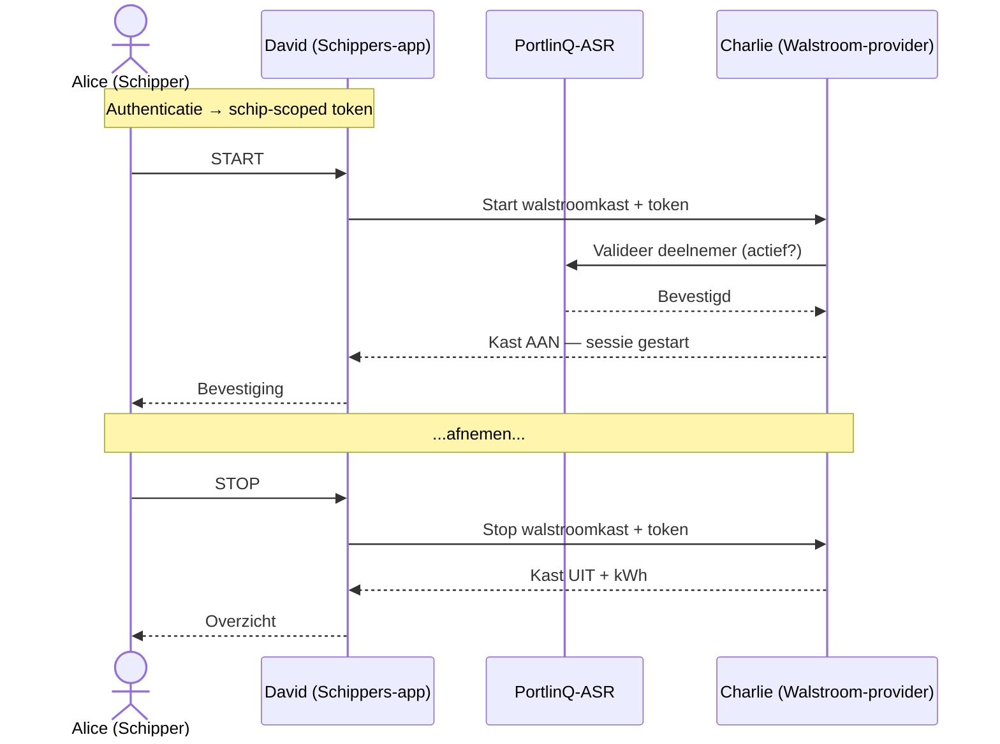

# Walstroom Toegangsflow

Schippers nemen walstroom (shore power) af via hun gekozen app. Anders dan bij het havenbezoek is hier **geen autorisatie/policy** nodig: het aansturen van de walstroomkast draait puur op **authenticatie**. De app roept de walstroom-API aan met een geldig token; de walstroom-provider (Charlie) controleert dat het token van een vertrouwde, actieve deelnemer komt en start dan de sessie. Er wordt géén fijnmazige policy in de Authorization Registry geëvalueerd.

[PortlinQ API Docs ➚](https://portlinq-preview.poort8.nl/scalar/v1)

> ℹ️ **Identifiers.** Organisaties zijn EUID's (`NLNHR.{kvkNummer}`); placeholders zoals `{exploitant_id}` zijn dus EUID-waarden.

> ℹ️ **Authenticatie, geen autorisatie.** Het verschil met de geofence/port-visit-flow: daar geeft het schip via een policy consent (autorisatie). Walstroom kent dat niet — een geauthenticeerde, vertrouwde deelnemer mag de kast aansturen. Het tegenscenario is dus een **mislukte authenticatie**, geen geweigerde policy.

## Rollen

| Persona | Rol |
| -- | -- |
| Alice | Schipper |
| David | Schippers-app |
| Charlie | Walstroom-provider (kast) |
| ASR | PortlinQ Associatieregister (deelnemervalidatie) |

## Sequence Diagram


```mermaid
sequenceDiagram
    actor Alice as Alice (Schipper)
    participant David as David (Schippers-app)
    participant ASR as PortlinQ-ASR
    participant Charlie as Charlie (Walstroom-provider)

    Note over Alice,David: Authenticatie → schip-scoped token

    Alice->>David: START
    David->>Charlie: Start walstroomkast + token
    Charlie->>ASR: Valideer deelnemer (actief?)
    ASR-->>Charlie: Bevestigd
    Charlie-->>David: Kast AAN — sessie gestart
    David-->>Alice: Bevestiging
    Note over Alice,Charlie: ...afnemen...
    Alice->>David: STOP
    David->>Charlie: Stop walstroomkast + token
    Charlie-->>David: Kast UIT + kWh
    David-->>Alice: Overzicht
```

## Stappen

### Authenticatie & schip-token

De app verkrijgt een **schip-scoped token** (met exploitant-context). Dit token bewijst dat de app namens een vertrouwde deelnemer handelt en gaat mee bij elke call naar de walstroom-provider.

### Walstroom starten

De app roept het start-endpoint van de walstroom-provider aan met het token. Charlie controleert:

- dat het token geldig is (uitgegeven door een vertrouwde uitgever), en
- dat de deelnemer actief is in het ASR.

```
GET /v1/api/organization-registry/{exploitant_id}/validate
→ { "isValid": true, "reason": "OrganizationActive" }
```

Bij een geldig token en een actieve deelnemer zet Charlie de kast AAN en start de sessie. **Er is geen policy- of enforce-check.**

> **Tegenscenario (authenticatie).** Een onbekende of niet-vertrouwde partij heeft geen geldig token (of is geen actieve deelnemer) → de call wordt geweigerd (`401/403`) en de kast blijft uit.

### Walstroom stoppen

De app roept het stop-endpoint aan (zelfde token). Charlie zet de kast UIT en geeft het verbruik (kWh) terug, waarmee de app het overzicht kan tonen.

## Foutafhandeling

Ongeldig of ontbrekend token → `401/403`. Deelnemer niet actief in ASR → geweigerd. Walstroom-provider onbereikbaar → standaard HTTP foutafhandeling (retry, timeout).
