# Walstroom Toegangsflow

Schippers kunnen walstroom (shore power) reserveren en afnemen via hun gekozen app. Deze flow beschrijft de authenticatie, autorisatie en walstroom sessie flow met PortlinQ's Authorization Subject Registry (ASR) en Authorization Registry (AR).

🔗 **[API Docs ➚](https://portlinq-preview.poort8.nl/scalar/v1)** — Interactieve endpoint testing

## Overzicht

De walstroom flow combineert **authenticatie via PortlinQ-IDP**, **token exchange met ASR** voor schip-context, en **autorisatie verificatie** via AR. De exploitant (havenbedrijf) heeft vooraf het schip, de schipper en hun relaties geregistreerd in ASR, en een autorisatie policy aangemaakt in AR. Bij gebruik authenticeert de schipper, selecteert hun schip, en de app vraagt een schip-scoped token op via ASR. Dit token wordt gebruikt bij de walstroom API die de autorisatie verifieert via AR.

> **Belangrijk:** Deze flow toont de volledige authenticatie en autorisatie keten. De prerequisite stappen (schip onboarding, policy registratie) worden uitgevoerd door de exploitant vooraf.

## Sequence Diagram

```mermaid
sequenceDiagram
    actor Alice as Alice (Schipper)
    participant David as David (Schippers APP)
    participant IDP as PortlinQ-IDP
    participant ASR as PortlinQ-ASR
    participant Charlie as Charlie (Walstroom API)
    participant AR as PortlinQ-AR
    Note over Alice,AR: Prerequisites: Bob (Exploitant) has onboarded Schip (ENI),<br/>Schipper (Alice), and Exploitant (KvK) in ASR with relationships.<br/>Bob has created authorization policy in AR.

    %% Authentication
    Alice->>David: 1. Login (app-local)
    David->>IDP: 2. Authenticate Alice (OIDC)
    IDP-->>David: Identity token (Alice)

    %% Ship selection & token exchange
    Alice->>David: 3. Select Schip (ENI)
    rect rgb(255, 243, 205)
        Note over David,ASR: ⚡ Token Exchange (soon)
        David->>ASR: 4. Token exchange request<br/>(Alice token + ENI)
        Note right of ASR: Verify chain:<br/>Alice → Exploitant (Bob)<br/>Bob → Schip (ENI)
        ASR-->>David: Ship-scoped token<br/>(ENI + Exploitant context)
    end

    %% Service request
    David->>Charlie: 5. Walstroom request + ship token
    Charlie->>ASR: 6. Verify participant (ENI)
    ASR-->>Charlie: ENI confirmed
    Charlie->>AR: 7. Check authorization<br/>(subject=David, resource=walstroom,<br/>serviceProvider=Charlie, issuer=Bob)
    Note right of AR: Evaluate Bob's policy
    AR-->>Charlie: Permit
    Charlie-->>David: 8. Walstroom sessie gestart
    David-->>Alice: Bevestiging
```



## Voorwaarden (Prerequisites)

Deze stappen worden uitgevoerd door de exploitant (havenbedrijf) vooraf:

| Prerequisite | Wat | Wie |
|--------------|-----|-----|
| **Schip registratie** | Schip (ENI) geregistreerd in ASR | Exploitant (Bob) |
| **Schipper registratie** | Schipper (Alice) geregistreerd in ASR | Exploitant (Bob) |
| **Relaties** | Alice → Exploitant, Bob → Schip relaties in ASR | Exploitant (Bob) |
| **Autorisatie policy** | Policy in AR: David mag walstroom gebruiken namens Bob's schepen | Exploitant (Bob) |

## Stappen

### Stap 1-2: Schipper authenticatie _(PortlinQ)_

De schipper logt in via de app, die vervolgens de schipper authenticeert via PortlinQ-IDP met OIDC. De IDP retourneert een identity token voor Alice.

**Authentication flow:**

```http
POST https://portlinq-idp.poort8.nl/oauth/token
Content-Type: application/x-www-form-urlencoded

grant_type=authorization_code
&code={authorization_code}
&redirect_uri={app_redirect_uri}
&client_id={david_client_id}
&client_secret={david_client_secret}
```

De IDP retourneert een identity token met claims over Alice (schipper).

> ℹ️ De exacte IDP endpoints en OIDC flows worden gedocumenteerd in de [PortlinQ API docs ➚](https://portlinq-preview.poort8.nl/scalar/v1).

### Stap 3-4: Schip selectie en token exchange _(PortlinQ ASR)_ 🔜

Alice selecteert het schip (ENI) waarvoor ze walstroom wil reserveren. De app vraagt een schip-scoped token op via ASR token exchange.

**Token exchange request:**

```http
POST https://portlinq-asr.poort8.nl/token-exchange
Authorization: Bearer {alice_identity_token}
Content-Type: application/json
```
```json
{
  "subject_token": "{alice_identity_token}",
  "subject_token_type": "urn:ietf:params:oauth:token-type:access_token",
  "requested_token_type": "urn:ietf:params:oauth:token-type:access_token",
  "resource": "urn:portlinq:ship:{ENI}"
}
```

**ASR verificatie proces:**
1. ASR verifieert Alice's identity token
2. ASR controleert de relatie keten: Alice → Exploitant (Bob) → Schip (ENI)
3. Als de keten geldig is, retourneert ASR een ship-scoped token met ENI + exploitant context

**Response:**

```json
{
  "access_token": "{ship_scoped_token}",
  "token_type": "Bearer",
  "expires_in": 3600,
  "scope": "ship:{ENI} exploitant:{Bob_KvK}"
}
```

> 🔜 **Binnenkort beschikbaar**: De token exchange functionaliteit wordt momenteel ontwikkeld en zal binnenkort beschikbaar zijn in ASR.

### Stap 5: Walstroom reservering _(extern)_

De app stuurt een walstroom reservering naar de walstroom API (Charlie) met het ship-scoped token.

```http
POST https://walstroom-api.example.com/sessions
Authorization: Bearer {ship_scoped_token}
Content-Type: application/json
```
```json
{
  "ship_eni": "{ENI}",
  "port": "{port_code}",
  "requested_start": "2026-02-15T08:00:00Z",
  "requested_duration_hours": 12
}
```

> ℹ️ De walstroom API endpoints zijn service provider-specifiek. Dit is een voorbeeld structuur.

### Stap 6: Participant verificatie _(PortlinQ ASR)_

De walstroom API verifieert dat het schip (ENI) een geregistreerde participant is in PortlinQ via ASR.

```http
GET https://portlinq-asr.poort8.nl/participants/{ENI}
Authorization: Bearer {charlie_service_token}
```

**Response:**

```json
{
  "eni": "{ENI}",
  "name": "MS Example Ship",
  "exploitant": {
    "kvk": "{Bob_KvK}",
    "name": "Exploitant BV"
  },
  "status": "active"
}
```

Als de participant niet gevonden wordt, weigert Charlie de aanvraag.

### Stap 7: Autorisatie verificatie _(PortlinQ AR)_

De walstroom API controleert via AR of David (de app) toestemming heeft om walstroom te gebruiken namens Bob's schepen.

```http
GET https://portlinq-preview.poort8.nl/api/authorization/explained-enforce
  ?subject={David_organization_id}
  &resource=walstroom
  &action=use
  &useCase=portlinq-walstroom
  &issuer={Bob_KvK}
  &serviceProvider={Charlie_organization_id}
  &type=walstroom-service
  &attribute=*
  &context={}
Authorization: Bearer {charlie_service_token}
```

**AR evaluatie:**
1. AR zoekt naar policies waar:
   - `issuer` = Bob (exploitant)
   - `subject` = David (app provider)
   - `resource` = walstroom
   - `serviceProvider` = Charlie
2. Als een geldige policy bestaat → `Permit`
3. Anders → `Deny`

**Response (Permit):**

```json
{
  "allowed": true,
  "explainPolicies": [
    {
      "policyId": "pol_walstroom_123",
      "issuerId": "{Bob_KvK}",
      "subjectId": "{David_organization_id}",
      "resourceId": "walstroom",
      "action": "use",
      "useCase": "portlinq-walstroom",
      "issuedAt": 1738368000,
      "notBefore": 1738368000,
      "expiration": 1769904000,
      "serviceProvider": "{Charlie_organization_id}",
      "type": "walstroom-service",
      "attribute": "*",
      "license": null,
      "rules": null,
      "properties": []
    }
  ]
}
```

**Response (Deny):**

```json
{
  "allowed": false,
  "explainPolicies": []
}
```

### Stap 8: Walstroom sessie gestart _(extern)_

Als alle verificaties slagen, start Charlie de walstroom sessie en retourneert de sessie details aan de app.

**Response:**

```json
{
  "session_id": "ws-session-12345",
  "ship_eni": "{ENI}",
  "port": "{port_code}",
  "status": "active",
  "start_time": "2026-02-15T08:00:00Z",
  "estimated_end": "2026-02-15T20:00:00Z",
  "charging_point": "WS-42",
  "current_consumption_kWh": 0
}
```

De app toont de bevestiging aan Alice met sessie informatie en real-time verbruiksdata.

## Foutafhandeling

[TBD — Wordt aangevuld zodra de API-specificatie beschikbaar is. Zie de [PortlinQ API docs ➚](https://portlinq-preview.poort8.nl/scalar/v1) voor actuele foutcodes.]

**Verwachte scenario's:**

- **Ongeldige token exchange**: ASR retourneert 403 als Alice niet gelinkt is aan exploitant of schip
- **Participant niet gevonden**: Charlie weigert aanvraag als ENI niet geregistreerd in ASR
- **Policy niet gevonden**: AR retourneert `Deny`; exploitant moet policy aanmaken
- **Policy verlopen**: AR retourneert `Deny`; exploitant moet policy verlengen
- **Service onbereikbaar**: Standaard HTTP foutafhandeling (retry-mechanisme, timeout)

## Architectuur Componenten

### PortlinQ-IDP (Identity Provider)
Authenticeert schippers via OIDC. Retourneert identity tokens met schipper claims.

### PortlinQ-ASR (Authorization Subject Registry)
- Beheert participants (schepen, schippers, exploitanten)
- Beheert relaties tussen participants
- Biedt token exchange voor ship-scoped tokens
- Verifieert participant status

### PortlinQ-AR (Authorization Registry)
- Beheert autorisatie policies
- Evalueert access control beslissingen
- Ondersteunt fine-grained policies per resource/service provider

## Productie-omgeving

[TBD — Eventuele verschillen tussen preview en productie worden hier gedocumenteerd zodra de productie-omgeving beschikbaar is.]

**Verwacht:**

- Preview: `https://portlinq-preview.poort8.nl` (huidige pilot fase)
- Productie: `https://portlinq.poort8.nl` (na succesvolle pilot validatie)

## Volgende stappen

- Terug naar de [Introductie](README.md) voor een overzicht
- Bekijk de [PortlinQ API docs ➚](https://portlinq-preview.poort8.nl/scalar/v1) voor endpoint details
- Bekijk de [Geofence Arrival Flow](geofence-arrival.md) voor automatische haven aanmeldingen
- Zie de [NoodleBar documentatie](../noodlebar/) voor achtergrond over Authorization Registry

## Context: PortlinQ Diensten

PortlinQ faciliteert digitale havendiensten via een federatief model met sterke authenticatie en autorisatie. De walstroom dienst is de eerste die deze architectuur gebruikt, waarbij:

- **Schippers** authenticeren via PortlinQ-IDP
- **Exploitanten** beheren schepen, schippers en policies
- **Service providers** (zoals walstroom leveranciers) vertrouwen op PortlinQ's autorisatie infrastructuur
- **ASR** garandeert participant identiteit en relaties
- **AR** handhaaft exploitant-gedefinieerde toegangsregels

Deze patronen zijn herbruikbaar voor havengeld inning en ligplaats aanmelding.
