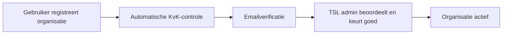

# Onboarding bij TSL

Deze pagina beschrijft hoe organisaties en applicaties aansluiten op de TSL-dataspace: van registratie in het Participantenregister, via het aanvragen van API-toegang, tot het ophalen van tokens en het valideren van inkomende API-aanroepen.

## Overzicht

Er zijn twee gebruikersrollen:

| Rol | Beschrijving | Beginpunt |
|-----|-------------|-----------|
| **Data service consumer** | Wil data ophalen via een API van een data service aanbieder | [Registreer een applicatie](#registreer-een-applicatie) |
| **Data service aanbieder** | Biedt een API aan waarop consumenten data kunnen ophalen | [Registreer een API](#registreer-een-api) |

Beide rollen vereisen dat je organisatie eerst geregistreerd en goedgekeurd is in het TSL Participantenregister.

---

## Organisatieregistratie

Voordat je applicaties of API's kunt registreren, moet je organisatie zijn opgenomen in het TSL Participantenregister.

### Registratieproces



1. Ga naar het [TSL Self-Service Portal](https://tsl.poort8.nl/portal).
2. Registreer je organisatie met KvK-nummer en organisatienaam.
3. Vul je eigen gegevens in (naam, e-mail, telefoonnummer) - je ontvangt een e-mail om je account te activeren.
4. Verifieer je e-mailadres via de ontvangen link.
5. Een TSL admin beoordeelt de aanvraag en keurt je organisatie goed of af.

Na goedkeuring is je organisatie actief en kun je applicaties en API's registreren.

### Verificatiestappen

| Stap | Wie | Wat |
|------|-----|-----|
| KvK-controle | Automatisch | Valideert het KvK-nummer en vergelijkt de officiële naam |
| E-mailverificatie | Registrerende gebruiker | Bevestigt dat de opgegeven gebruiker het e-mailadres beheert |
| Goedkeuring | TSL admin | Definitieve beslissing over deelname |

### Organisatie-identifiers

Elke organisatie in TSL wordt geïdentificeerd met een EUID (European Unique Identifier):

| Land | Formaat | Voorbeeld |
|------|---------|-----------|
| Nederland | `NLNHR.{kvkNummer}` | `NLNHR.12345678` |

Deze identifier wordt door de hele dataspace gebruikt in policies, tokens en autorisatiechecks.

---

## Registreer een applicatie

Een applicatie vertegenwoordigt een systeem dat namens jouw organisatie API-aanroepen doet — als data service consumer of als aanbieder die zelf de autorisatieregisters bevraagt.

### Stap 1 — Registreer je applicatie

1. Log in op het [TSL Self-Service Portal](https://tsl.poort8.nl/portal).
2. Navigeer naar **Systems** → **Register Application**.
3. Vul de applicatiegegevens in (naam, beschrijving).
4. Dien de registratie in.

Na registratie toont het portal je **client credentials**:

| Credential | Beschrijving |
|------------|-------------|
| `client_id` | De unieke identifier van je applicatie |
| `client_secret` | Het geheim van je applicatie — **sla dit veilig op** |

> **Belangrijk:** Het client secret wordt maar één keer getoond. Sla het op in een secrets manager. Als je het kwijtraakt, moet je een nieuw secret genereren.

### Stap 2 — Vraag toegang aan tot de NoodleBar API

Om tokens te kunnen ophalen voor het TSL Autorisatieregister (en dus `/enforce`, `/explained-enforce` of het delegatie-endpoint te kunnen aanroepen), moet je applicatie toegang hebben tot de **NoodleBar API**.

1. Navigeer naar de **Catalogue** in het portal.
2. Zoek naar **NoodleBar API**.
3. Klik op **Request Access**.

Je verzoek heeft nu de status **Pending**. Zodra het verzoek is goedgekeurd, kan je applicatie tokens ophalen.

### Stap 3 — Haal een access token op

Na goedkeuring gebruik je de OAuth 2.0 Client Credentials grant:

```http
POST https://auth.poort8.nl/realms/tsl/protocol/openid-connect/token
Content-Type: application/x-www-form-urlencoded

grant_type=client_credentials
&client_id=<YOUR_CLIENT_ID>
&client_secret=<YOUR_CLIENT_SECRET>
&scope=noodlebar-api
```

**Voorbeeld in cURL:**
```bash
curl -X POST https://auth.poort8.nl/realms/tsl/protocol/openid-connect/token \
  -H "Content-Type: application/x-www-form-urlencoded" \
  -d "grant_type=client_credentials" \
  -d "client_id=YOUR_CLIENT_ID" \
  -d "client_secret=YOUR_CLIENT_SECRET" \
  -d "scope=noodlebar-api"
```

**Voorbeeld in C#:**
```csharp
using var httpClient = new HttpClient();

var tokenRequest = new Dictionary<string, string>
{
    ["grant_type"] = "client_credentials",
    ["client_id"] = "YOUR_CLIENT_ID",
    ["client_secret"] = "YOUR_CLIENT_SECRET",
    ["scope"] = "noodlebar-api",
};

var response = await httpClient.PostAsync(
    "https://auth.poort8.nl/realms/tsl/protocol/openid-connect/token",
    new FormUrlEncodedContent(tokenRequest));

var tokenResponse = await response.Content.ReadFromJsonAsync<JsonDocument>();
var accessToken = tokenResponse!.RootElement.GetProperty("access_token").GetString();
```

**Token levensduur:** Access tokens zijn **5 minuten** geldig. Vraag een nieuw token aan vóór het verlopen van het huidige token.

### Stap 4 — Roep de API aan

Stuur het access token mee als Bearer token in de `Authorization` header:

```http
GET https://tsl.poort8.nl/v1/api/authorization/explained-enforce?...
Authorization: Bearer <access_token>
```

Zie de [TSL API documentatie ➚](https://tsl.poort8.nl/scalar/v1) voor alle beschikbare endpoints.

---

## Registreer een API

Als data service aanbieder registreer je jouw API in het TSL portal zodat consumenten hem kunnen ontdekken en toegang kunnen aanvragen.

### Stap 1 — Registreer je API

1. Log in op het [TSL Self-Service Portal](https://tsl.poort8.nl/portal).
2. Navigeer naar **Systems** → **Register API**.
3. Vul de API-gegevens in (naam, beschrijving, basis-URL).
4. Upload je **OpenAPI-specificatie** — deze wordt in de catalogus getoond aan consumenten.
5. Dien de registratie in.

Na registratie verschijnt je API in de **Catalogue** en kunnen consumenten toegang aanvragen.

### Stap 2 — Behandel toegangsverzoeken

Wanneer een consumer toegang aanvraagt tot jouw API:

1. Je ontvangt een melding in het portal.
2. Navigeer naar de detailpagina van je API om openstaande verzoeken te bekijken.
3. Beoordeel de aanvragende organisatie.
4. **Keur goed** of **wijs af**.

Je kunt toegang op elk moment **intrekken**.

### Stap 3 — Valideer inkomende tokens

Consumenten sturen een Bearer token mee bij elke API-aanroep. Valideer dit token voordat je data uitgeeft.

#### Validatiestappen

Voer deze checks in volgorde uit. Wijs het verzoek direct af als een check faalt.

| # | Check | Vereiste | Bij fout |
|---|-------|----------|----------|
| 1 | **Handtekening** | Geldig JWT-handtekening via TSL JWKS | `401 Unauthorized` |
| 2 | **Verloopdatum** | `exp` claim ligt in de toekomst | `401 Unauthorized` |
| 3 | **Issuer** | `iss` is `https://auth.poort8.nl/realms/tsl` | `401 Unauthorized` |
| 4 | **Audience** | `aud` bevat jouw API's client ID | `403 Forbidden` |
| 5 | **Organization** | `organization` claim aanwezig en bevat een EUID | Gebruik voor bedrijfslogica |

> **De audience-controle (#4) is kritisch.** Zonder audience-validatie zou een token bestemd voor een andere API bij jou kunnen worden gebruikt.

#### JWKS-endpoint

```
https://auth.poort8.nl/realms/tsl/protocol/openid-connect/certs
```

Haal deze sleutels op bij het opstarten van je applicatie. De meeste JWT-bibliotheken handelen sleutelrotatie automatisch af.

#### Token claims

Een gedecodeerd access token van een TSL-consumer:

```json
{
  "iss": "https://auth.poort8.nl/realms/tsl",
  "sub": "a1b2c3d4-e5f6-7890-abcd-ef1234567890",
  "aud": "YOUR_API_CLIENT_ID",
  "exp": 1711324800,
  "iat": 1711324500,
  "client_id": "CONSUMER_APP_CLIENT_ID",
  "organization": {
    "NLNHR.12345678": {
      "KVK": ["12345678"],
      "EORI": ["NL123456789"],
      "EUID": ["NLNHR.12345678"],
      "id": "550e8400-e29b-41d4-a716-446655440000"
    }
  }
}
```

#### Organisatie-identifier afleiden

Leid de EUID van de aanroepende organisatie af uit de `organization` claim:

1. Itereer door de organisaties in het `organization`-object.
2. Controleer per organisatie of het `EUID`-attribuut bestaat en een niet-lege array heeft.
3. Gebruik het eerste array-item als organisatie-identifier.

Wijs het verzoek af met `403 Forbidden` als:
- de `organization` claim ontbreekt
- de `organization` claim geen geldig JSON-object is
- het `EUID`-attribuut ontbreekt of leeg is

**Voorbeeld in C# (.NET):**
```csharp
var organizationClaim = ctx.User.FindFirst("organization")?.Value;

if (string.IsNullOrWhiteSpace(organizationClaim))
    return Results.Forbid();

using var document = JsonDocument.Parse(organizationClaim);
foreach (var organization in document.RootElement.EnumerateObject())
{
    if (organization.Value.TryGetProperty("EUID", out var identifiers)
        && identifiers.ValueKind == JsonValueKind.Array
        && identifiers.GetArrayLength() > 0)
    {
        var euid = identifiers[0].GetString();
        // gebruik euid als subject bij /explained-enforce
    }
}
```

### Stap 4 — Gebruik de autorisatie-endpoints

Na tokenvalidatie en EUID-afleiding gebruik je het TSL Autorisatieregister om te controleren of de consumer ook daadwerkelijk gemachtigd is voor de gevraagde data. Hiervoor heb je een **aparte applicatie** nodig met toegang tot de **NoodleBar API** (zie [Registreer een applicatie](#registreer-een-applicatie)).

#### explained-enforce

Vraagt of een geldige policy bestaat en geeft de matchende policies terug:

```http
GET https://tsl.poort8.nl/v1/api/authorization/explained-enforce
  ?issuer=<EUID_VAN_RECHTHEBBENDE>
  &subject=<EUID_VAN_CONSUMER>
  &serviceProvider=<JOUW_EUID>
  &action=GET
  &resource=<RESOURCE_ID>
  &type=<RESOURCE_TYPE>
  &attribute=*
  &useCase=unspecified
Authorization: Bearer <noodlebar_api_token>
```

De response bevat altijd HTTP 200. Controleer het `allowed`-veld:

```json
{ "allowed": true, "explainPolicies": [ /* ... */ ] }
```

```json
{ "allowed": false, "explainPolicies": [] }
```

#### enforce

Geeft alleen `true` of `false` terug, zonder de onderliggende policies:

```http
GET https://tsl.poort8.nl/v1/api/authorization/enforce
  ?subject=...&action=GET&resource=...&useCase=unspecified
Authorization: Bearer <noodlebar_api_token>
```

#### unsigned-delegation

Genereert een niet-ondertekend delegatiebewijs (o.a. voor testdoeleinden):

```http
POST https://tsl.poort8.nl/v1/api/authorization/unsigned-delegation
Authorization: Bearer <noodlebar_api_token>
Content-Type: application/json

{
  "delegationRequest": {
    "policyIssuer": "<EUID_VAN_RECHTHEBBENDE>",
    "target": {
      "accessSubject": "<EUID_VAN_CONSUMER>"
    },
    "policySets": [
      {
        "policies": [
          {
            "target": {
              "resource": {
                "type": "<RESOURCE_TYPE>",
                "identifiers": ["<RESOURCE_ID>"],
                "attributes": ["*"]
              },
              "actions": ["GET"],
              "environment": {
                "serviceProviders": ["<JOUW_EUID>"]
              }
            },
            "rules": [
              {
                "effect": "Permit"
              }
            ]
          }
        ]
      }
    ]
  }
}
```

---

## Gerelateerde pagina's

- [Transport Emissie Data Autorisatie](transport-emissie-data-autorisatie.md) — Gedetailleerde implementatiegids voor de transport-emissie usecase
- [TSL API Documentatie ➚](https://tsl.poort8.nl/scalar/v1) — Interactieve API-referentie
