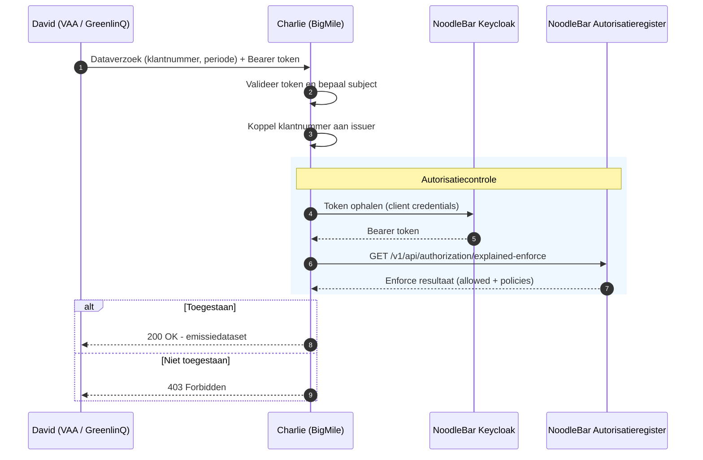

# Transport Emissie Data Autorisatie

Deze gids is voor ontwikkelaars die een transport-emissiedatadienst bouwen en autorisatiebeleid moeten verifiëren voordat zij emissiedata uitleveren aan een dataservice consumer. De gids beschrijft hoe **Charlie (BigMile)** het `explained-enforce` endpoint bevraagt om te controleren of een geldige policy bestaat voor **David (VAA / GreenlinQ)** namens **Bob (wegvervoerder / data-rechthebbende)**.

> Deze PoC draait tijdelijk tegen de NoodleBar preview-omgeving met Keycloak, omdat TSL nog niet naar Keycloak is gemigreerd. De definitieve TSL-omgeving en production-URLs zijn `[TBD - na TSL Keycloak migratie]`.

[NoodleBar API Docs ➚](https://noodlebar-preview.poort8.nl/scalar/v1)

## Voor wie is deze gids?

Deze gids is voor datadienst-aanbieders die:

- transport-emissiedata uitleveren binnen de TSL usecase;
- moeten verifiëren of een dataservice consumer geautoriseerd is om emissiedata voor een specifiek klantnummer op te halen;
- het NoodleBar/TSL autorisatiepatroon willen implementeren via `explained-enforce`.

De gids beschrijft niet hoe policies worden aangemaakt via Keyper of de approval-flow, en ook niet hoe BigMile intern emissies berekent.

## Rollen in deze usecase

| Rol | Partij | AR-veld | Voorbeeld |
| --- | --- | --- | --- |
| Data-rechthebbende / machtiger | Bob, wegvervoerder | `issuer` / `issuerId` | `NLNHR.11223344` |
| Dataservice consumer | David, VAA / GreenlinQ | `subject` / `subjectId` | `NLNHR.55667788` |
| Datadienst-aanbieder | Charlie, BigMile | `serviceProvider` | `NLNHR.99001122` |
| Onderliggende rechthebbende-op-toegang | Teler | `resource` / `resourceId` via klantnummer | `KLANT-7788` |

In deze PoC is de **dataservice consumer** de `subject` in de policy en de enforce-call. De teler wordt niet als `subject` gebruikt; de toegang wordt afgebakend via het klantnummer als `resourceId`.

## Procesbeschrijving

Wanneer BigMile een dataverzoek verwerkt voor een specifiek klantnummer namens een wegvervoerder, volg je deze stappen:

1. **Ontvang het verzoek**: BigMile ontvangt een dataverzoek met minimaal het klantnummer en de periode, plus een bearer token van David.
2. **Valideer het inkomende token**: verifieer het bearer token en haal de organisatie-identifier van David uit de `organization` claim.
3. **Bepaal de issuer**: koppel het klantnummer in BigMile's administratie aan de wegvervoerder die als `issuer` optreedt.
4. **Haal een register-token op**: authenticeer BigMile tegen de NoodleBar preview-omgeving via OAuth 2.0 client credentials.
5. **Bevraag het Autorisatieregister**: roep `explained-enforce` aan met issuer, subject, serviceProvider, action, resource, type en useCase.
6. **Lever uit of weiger**: bij `allowed: true` levert BigMile de emissiedataset aan David. Anders retourneert BigMile `403 Forbidden`.



## Autorisatiemodel

De policy machtigt David om voor een specifiek klantnummer transport-emissiedata op te halen. Het klantnummer is rechtstreeks de `resourceId`; voor deze PoC wordt geen resource group-hierarchie gebruikt.

Het gedocumenteerde `useCase` is `unspecified`. In NoodleBar mapt deze waarde naar het iSHARE-autorisatiemodel. Daarom zijn naast `subject`, `resource` en `action` ook `issuer`, `serviceProvider`, `type` en `attribute` relevant voor de inhoudelijke check.

### Policy velden

| Veld | Beschrijving | Voorbeeld |
| --- | --- | --- |
| `issuerId` | Data-rechthebbende, Bob / wegvervoerder, als EUID | `NLNHR.11223344` |
| `subjectId` | Dataservice consumer, David / VAA, als EUID | `NLNHR.55667788` |
| `serviceProvider` | Datadienst-aanbieder, Charlie / BigMile, als EUID | `NLNHR.99001122` |
| `action` | Toegestane actie | `GET` |
| `resourceId` | Klantnummer van de teler | `KLANT-7788` |
| `type` | Resource type | `transport-emissie-data` |
| `attribute` | Data-attributen | `*` |
| `useCase` | Use case | `unspecified` |
| `expiration` | Geldigheid van het mandaat als Unix timestamp | `2147483647` |

## Stap 1: Valideer het inkomende token

Voordat BigMile de autorisatiecheck uitvoert, valideert BigMile het bearer token dat David heeft meegestuurd. Hiermee stelt BigMile vast dat het token authentiek is en welke organisatie David vertegenwoordigt.

Gebruik de OpenID Connect metadata van het NoodleBar preview-realm:

```text
https://auth.poort8.nl/realms/noodlebar-preview/.well-known/openid-configuration
```

Voer minimaal deze checks uit:

| Check | Vereiste |
| --- | --- |
| Signature | Het token is ondertekend door het NoodleBar preview-realm |
| Issuer | `iss` is `https://auth.poort8.nl/realms/noodlebar-preview` |
| Audience | `aud` bevat de client ID van de BigMile API |
| Expiry | `exp` ligt in de toekomst en `nbf` ligt, indien aanwezig, in het verleden |
| Organization | De `organization` claim bevat de EUID van David |

Zie ook [Validating API Access Tokens](../noodlebar/validating-api-tokens.md) voor het algemene patroon voor datadienst-aanbieders.

### Organisatie-identifier afleiden

De `organization` claim bevat de organisatie-identiteit van David. In deze PoC gebruikt BigMile de `EUID` waarde als `subject` in de `explained-enforce` call.

```json
{
  "organization": {
    "NLNHR.55667788": {
      "KVK": ["55667788"],
      "EORI": ["NL553344778"],
      "ISHARE": ["did:ishare:EU.NL.NTRNL-55667788"],
      "EUID": ["NLNHR.55667788"],
      "id": "0fcb7593-f45d-48cc-97ac-3d50b498d5c5"
    }
  }
}
```

Weiger het verzoek met `403 Forbidden` als de `organization` claim ontbreekt, geen geldig JSON-object is, of geen bruikbare `EUID` bevat.

## Stap 2: Haal een register-token op

Authenticeer BigMile tegen de NoodleBar preview-omgeving via OAuth 2.0 client credentials:

```http
POST https://auth.poort8.nl/realms/noodlebar-preview/protocol/openid-connect/token
Content-Type: application/x-www-form-urlencoded

grant_type=client_credentials
&client_id=<YOUR_CLIENT_ID>
&client_secret=<YOUR_CLIENT_SECRET>
&scope=noodlebar-api
```

Het verkregen access token authenticeert BigMile als applicatie tegen de NoodleBar API. Het bepaalt niet wie de issuer, subject of serviceProvider in de dataspace-transactie zijn; die waarden geef je expliciet mee aan `explained-enforce`.

## Stap 3: Bevraag explained-enforce

Roep `explained-enforce` aan om de autorisatie te controleren:

```http
GET https://noodlebar-preview.poort8.nl/v1/api/authorization/explained-enforce
  ?issuer=NLNHR.11223344
  &subject=NLNHR.55667788
  &serviceProvider=NLNHR.99001122
  &action=GET
  &resource=KLANT-7788
  &type=transport-emissie-data
  &attribute=*
  &useCase=unspecified
Authorization: Bearer {bigmile_token}
```

### Query parameters

| Parameter | Beschrijving | Voorbeeld |
| --- | --- | --- |
| `issuer` | EUID van de wegvervoerder, bekend in BigMile's administratie bij het klantnummer | `NLNHR.11223344` |
| `subject` | EUID van David / VAA, uit de gevalideerde `organization` claim | `NLNHR.55667788` |
| `serviceProvider` | EUID van BigMile | `NLNHR.99001122` |
| `action` | Gevraagde actie | `GET` |
| `resource` | Klantnummer uit de call van David | `KLANT-7788` |
| `type` | Resource type | `transport-emissie-data` |
| `attribute` | Data-attributen; gebruik `*` voor deze PoC | `*` |
| `useCase` | Use case model | `unspecified` |

## Stap 4: Verwerk de response

**Toegestaan:**

```json
{
  "allowed": true,
  "explainPolicies": [
    {
      "policyId": "a1b2c3d4-e5f6-7890-abcd-ef1234567890",
      "useCase": "unspecified",
      "issuedAt": 1738368000,
      "notBefore": 1738368000,
      "expiration": 2147483647,
      "issuerId": "NLNHR.11223344",
      "subjectId": "NLNHR.55667788",
      "serviceProvider": "NLNHR.99001122",
      "action": "GET",
      "resourceId": "KLANT-7788",
      "type": "transport-emissie-data",
      "attribute": "*",
      "license": null,
      "rules": null,
      "properties": []
    }
  ]
}
```

**Geweigerd:**

```json
{
  "allowed": false,
  "explainPolicies": []
}
```

De verplichte check is dat `allowed` gelijk is aan `true`. Het Autorisatieregister heeft dan een passende, geldige policy gevonden voor de combinatie issuer, subject, serviceProvider, resource, action, type en useCase.

### Optionele extra controles

`explainPolicies` is ondersteunend. Je kunt de inhoud gebruiken om configuratiefouten vroeg te detecteren:

| Check | Vereiste |
| --- | --- |
| Issuer | `explainPolicies[].issuerId` komt overeen met de wegvervoerder die BigMile intern bij het klantnummer heeft staan |
| Subject | `explainPolicies[].subjectId` komt overeen met de EUID uit David's gevalideerde token |
| Service provider | `explainPolicies[].serviceProvider` komt overeen met BigMile's EUID |
| Resource | `explainPolicies[].resourceId` komt overeen met het aangevraagde klantnummer |
| Geldigheid | `notBefore` ligt in het verleden of is nu, en `expiration` ligt in de toekomst |

Als `allowed` `false` is, of als een optionele controle faalt die BigMile verplicht heeft gemaakt, behandel je het verzoek als niet geautoriseerd.

## Foutafhandeling

| Code | Betekenis | Wanneer |
| --- | --- | --- |
| `200 OK` | Autorisatiecheck uitgevoerd | Bevat `allowed: true` of `allowed: false` |
| `401 Unauthorized` | Ongeldig of ontbrekend token | Het token naar BigMile of het token naar de NoodleBar API ontbreekt, is ongeldig of is verlopen |
| `403 Forbidden` | Niet geautoriseerd | Token-validatie, organisatie-afleiding of autorisatiecontrole faalt |
| `400 Bad Request` | Ongeldig verzoek | Een verplichte query-parameter ontbreekt of een parameterwaarde kan niet worden verwerkt |
| `500 Internal Server Error` | Technische fout | Onverwachte fout aan AR-zijde; log de fout en implementeer retry-logica waar passend |

## API payload tussen VAA en BigMile

Onderstaande velden beschrijven de PoC-uitwisseling tussen VAA en BigMile. De autorisatie verloopt via de stappen hierboven; deze sectie beschrijft de inhoudelijke data.

> De response-velden zijn nog onder voorbehoud en worden geverifieerd tegen GreenlinQData.

### Request

| Parameter | Beschrijving | Voorbeeld |
| --- | --- | --- |
| `datumVan` | Begin van de rapportageperiode, meestal kalenderjaar | `2025-01-01` |
| `datumTot` | Einde van de rapportageperiode | `2025-12-31` |
| `klantnummer` | Klantnummer of klantnaam van de teler zoals bekend bij de wegvervoerder in het TMS en aangeleverd aan BigMile | `KLANT-7788` |

### Response

```json
{
  "rapportagePeriode": "2025-01-01/2025-12-31",
  "dataDetailNiveau": "geaggregeerd",
  "emissieFramework": "GLEC Framework v3.1",
  "isoVersie": "ISO 14083:2023",
  "allocatieMethode": "COFRET",
  "dataClassificatie": "vertrouwelijk",
  "klantnummer": "KLANT-7788",
  "brandstofType": "diesel",
  "brandstofVerbruik": 1240.5,
  "aantalKm": 8650,
  "typeVoertuig": "trekker-oplegger >40t",
  "gekoeldTransport": true,
  "productgroep": "snijbloemen",
  "gewicht": 18500,
  "co2eWaarde": 3320.8
}
```

| Veld | Beschrijving | Verplicht |
| --- | --- | --- |
| `rapportagePeriode` | Rapportageperiode | Ja |
| `dataDetailNiveau` | Data detail niveau | Ja |
| `emissieFramework` | Emissie framework/versie | Ja |
| `isoVersie` | ISO-versie verwijzing | Ja |
| `allocatieMethode` | Allocatiemethode | Ja |
| `dataClassificatie` | Dataclassificatie | Ja |
| `klantnummer` | Klantnummer van de teler | Ja |
| `brandstofType` | Brandstoftype | Ja |
| `brandstofVerbruik` | Brandstofverbruik, allocatie verbruik op basis van COFRET | Ja |
| `aantalKm` | Aantal kilometers, allocatie afstanden op basis van COFRET | Ja |
| `typeVoertuig` | Type voertuig | Ja |
| `gekoeldTransport` | Gekoeld transport | Ja |
| `productgroep` | Productgroep | Optioneel |
| `gewicht` | Gewicht | Optioneel |
| `co2eWaarde` | CO2e-waarde | Ja |

Voor de PoC gaan we uit van afstanden en brandstofverbruik als uitkomsten van de COFRET-allocatiemethodiek.

## Voorbereiding

Voordat de enforcement-flow werkt, moet het volgende zijn ingericht:

| Wat | Wie |
| --- | --- |
| BigMile geregistreerd in het NoodleBar preview Participantenregister, inclusief app en API | BigMile / Poort8 |
| BigMile client credentials voor de NoodleBar API | Poort8 / self-service portal |
| Wegvervoerder geregistreerd in het Participantenregister met identity en klantnummercontext | Wegvervoerder / Poort8 |
| VAA / GreenlinQ geregistreerd in het Participantenregister, inclusief app | VAA / Poort8 |
| VAA heeft API-toegang aangevraagd tot de BigMile API | VAA via de catalogus |
| Policy aangemaakt in het Autorisatieregister voor `transport-emissie-data`, resource = klantnummer | Approval-flow / Keyper |
| Testdataset beschikbaar in BigMile | BigMile |
| Testscenario zonder passende policy | BigMile / Poort8 |

Zie [Requesting API Access](../noodlebar/requesting-api-access.md) voor het algemene proces waarmee een consumer API-toegang aanvraagt.

## Testomgeving

| Service | URL |
| --- | --- |
| Token endpoint | `https://auth.poort8.nl/realms/noodlebar-preview/protocol/openid-connect/token` |
| Autorisatieregister | `https://noodlebar-preview.poort8.nl` |
| Explained-enforce endpoint | `https://noodlebar-preview.poort8.nl/v1/api/authorization/explained-enforce` |
| API documentatie | [NoodleBar API docs ➚](https://noodlebar-preview.poort8.nl/scalar/v1) |
| Definitieve TSL omgeving | `[TBD - na TSL Keycloak migratie]` |

Vragen? Neem contact op met Poort8 via **hello@poort8.nl**.