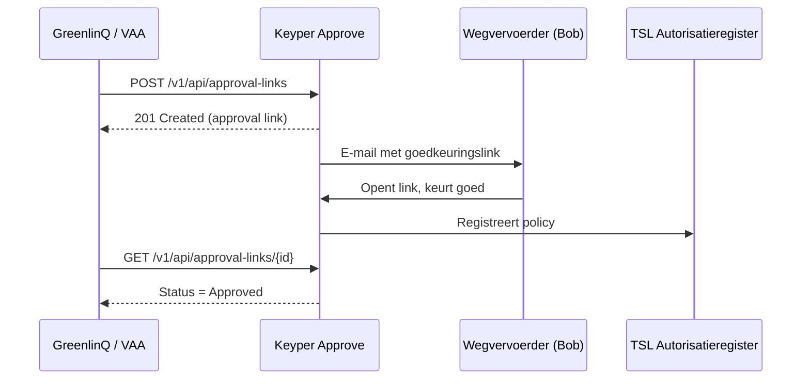

# Transport Emissie Data via Keyper

Deze gids is voor dataservice consumers (zoals **GreenlinQ / VAA**) die via **Keyper Approve** toestemming vragen aan een wegvervoerder (**Bob**) om transport-emissiedata voor een specifiek klantnummer op te halen bij een datadienst-aanbieder (**BigMile**).

Dit is het derde pad naast de twee al beschreven paden voor dezelfde usecase:

- [Policy inschieten als issuer](transport-emissie-data-policy.md) — de wegvervoerder maakt de policy zelf aan, rechtstreeks via de TSL API, zonder Keyper.
- [Transport Emissie Data Autorisatie](transport-emissie-data-autorisatie.md) — hoe BigMile de policy achteraf controleert via `explained-enforce`.

Gebruik deze gids wanneer de wegvervoerder de toestemming niet zelf via de API wil inschieten, maar in plaats daarvan een goedkeuringslink per e-mail wil ontvangen en de aanvraag met één klik wil accorderen.

Voor de algemene werking van Keyper (wat een approval link is, hoe authenticatie werkt, orchestratie-opties) zie de [Keyper documentatie](../keyper/README.md) en [Keyper API Authenticatie](../keyper/api-authentication.md). Deze gids beschrijft alleen wat TSL-specifiek is.

## Vereisten

| Wat | Wie |
| --- | --- |
| GreenlinQ / VAA geregistreerd in het TSL Participantenregister, inclusief app | VAA / Poort8 |
| Toegang tot de Keyper API aangevraagd en goedgekeurd | VAA via de catalogus in het [TSL Self-Service Portal](https://tsl.poort8.nl/portal) |
| Wegvervoerder (Bob) en BigMile bekend en geregistreerd in het Participantenregister | Zie het TSL Participantenregister |
| Klantnummer van de teler bekend | Uit de administratie van de wegvervoerder |

## Overzicht



## Approval-link aanmaken

Authenticeer met scope `keyper-api` (zie [Keyper API Authenticatie](../keyper/api-authentication.md)) en maak de approval-link aan met flow `tsl.default@v1`:

```http
POST https://keyper.poort8.nl/v1/api/approval-links
Authorization: Bearer <ACCESS_TOKEN>
Content-Type: application/json
```

```json
{
  "requester": {
    "name": "Consumer Contactpersoon",
    "email": "contact@greenlinq.nl",
    "organization": "GreenlinQ",
    "organizationId": "NLNHR.60756829"
  },
  "approver": {
    "name": "Wegvervoerder Bob",
    "email": "bob@greenpack.nl",
    "organization": "Greenpack",
    "organizationId": "NLNHR.77118421"
  },
  "dataspace": {
    "baseUrl": "https://tsl.poort8.nl"
  },
  "reference": "TSL-2026-Q3-001",
  "addPolicyTransactions": [
    {
      "type": "transport-emissie-data",
      "issuerId": "NLNHR.77118421",
      "subjectId": "NLNHR.60756829",
      "serviceProvider": "NLNHR.73401919",
      "action": "GET",
      "resourceId": "KLANT-7788",
      "attribute": "*",
      "expiration": 2147483647
    }
  ],
  "orchestration": {
    "flow": "tsl.default@v1"
  }
}
```

| Veld | Beschrijving |
| --- | --- |
| `approver.organizationId` | EUID van de wegvervoerder (Bob) die de toestemming moet geven |
| `dataspace.baseUrl` | TSL Autorisatieregister-URL |
| `addPolicyTransactions[].resourceId` | Klantnummer van de teler |
| `addPolicyTransactions[].type` | Altijd `transport-emissie-data` voor deze usecase |
| `orchestration.flow` | Altijd `tsl.default@v1` |

Een geslaagde aanroep levert `201 Created` met een `url` op die naar Bob wordt gemaild. Zie [Keyper API Authenticatie](../keyper/api-authentication.md) voor foutresponses en toegangsregels.

## Na goedkeuring

Zodra Bob de aanvraag goedkeurt, registreert Keyper de policy in het TSL Autorisatieregister. BigMile kan de policy vanaf dat moment verifiëren via [`explained-enforce`](transport-emissie-data-autorisatie.md#stap-3-bevraag-explained-enforce) en de emissiedata uitleveren aan GreenlinQ / VAA.

## Ondersteuning

Vragen? Neem contact op met Poort8 via **<hello@poort8.nl>**.
