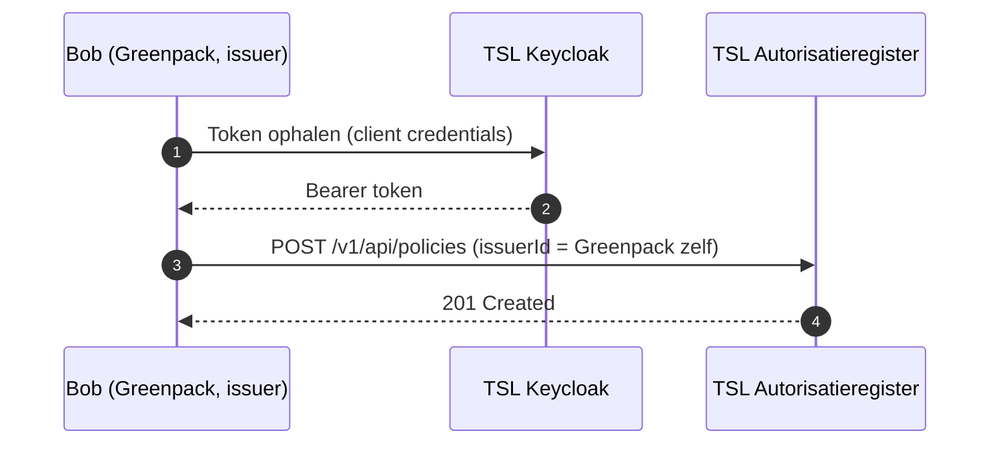

# Policy inschieten als issuer

Deze gids is voor ontwikkelaars aan de **issuer-kant** die een autorisatiebeleid (policy) rechtstreeks via de NoodleBar/TSL API aanmaken, zodat een dataservice consumer transport-emissiedata mag ophalen. Deze gids is het spiegelbeeld van [Transport Emissie Data Autorisatie](transport-emissie-data-autorisatie.md): die beschrijft hoe de datadienst-aanbieder een policy *controleert* via `explained-enforce`; deze gids beschrijft hoe de data-rechthebbende die policy *aanmaakt*.

In deze usecase machtigt **Bob (Greenpack, de wegvervoerder)** de dataservice consumer **David (GreenlinQ / VAA)** om bij **Charlie (BigMile)** transport-emissiedata op te halen voor een specifiek klantnummer van een teler.

> **Belangrijk — standaard schiet een issuer policies voor zichzelf in.** In het standaardpad is de issuer de organisatie waarmee je bent geauthenticeerd. Je mag `issuerId` weglaten (dan wordt het afgeleid uit je token) of expliciet je eigen EUID meesturen. Voor cross-organisatie aanmaak gelden extra voorwaarden: dit kan alleen voor door Poort8 goedgekeurde trusted/control plane clients met delegated rechten.

## Voor wie is deze gids?

Voor applicaties van een **data-rechthebbende (issuer)** die:

- zelf, buiten Keyper om, een policy aanmaken via de TSL API;
- een dataservice consumer willen machtigen voor een specifiek klantnummer;
- de issuer van de policy zelf zijn — je machtigt namens je eigen organisatie.

Deze gids beschrijft niet de Keyper approval-flow. De nadruk ligt op het standaardpad (aanmaken voor je eigen organisatie); delegated/trusted varianten worden hieronder alleen op hoofdlijnen benoemd.

## Rollen in deze usecase

| Rol                                     | Partij                                          | AR-veld                       | EUID             |
| --------------------------------------- | ----------------------------------------------- | ----------------------------- | ---------------- |
| Data-rechthebbende / machtiger (= jezelf) | Bob — Greenpack SSC B.V. (KVK 77118421)         | `issuer` / `issuerId`         | `NLNHR.77118421` |
| Dataservice consumer                    | David — GreenlinQ / VAA, Fresh Info B.V. (KVK 60756829) | `subject` / `subjectId` | `NLNHR.60756829` |
| Datadienst-aanbieder                    | Charlie — BigMile (KVK 73401919)                | `serviceProvider`             | `NLNHR.73401919` |
| Onderliggende rechthebbende-op-toegang  | Alice — teler                                   | `resource` / `resourceId` via klantnummer | bijv. `KLANT-7788` |

De EUID is opgebouwd als `NLNHR.<KVK-nummer>`. Het klantnummer van de teler is rechtstreeks de `resourceId`; er wordt in deze usecase geen resource group-hierarchie gebruikt.

## Procesoverzicht



## Het "standaard voor jezelf"-principe

Wanneer Greenpack zich authenticeert via client credentials, is het verkregen token gekoppeld aan de organisatie Greenpack in het TSL-realm. Het `POST /v1/api/policies`-endpoint leidt de issuer af uit die geauthenticeerde organisatie. `issuerId` is daarom optioneel:

- Laat je `issuerId` weg → de issuer wordt afgeleid uit je token (Greenpack).
- Zet je `issuerId` op je eigen EUID → de policy wordt aangemaakt.
- Zet je `issuerId` op de EUID van een andere organisatie zonder delegated/trusted rechten → de aanvraag wordt geweigerd (`403 Forbidden`).

Dit is bewust: een organisatie kan alleen toegang verlenen tot data waarover zij zelf de rechthebbende is, tenzij een trusted/control plane app met delegated rechten dit expliciet namens deelnemers mag doen. De beleidsaanmaak blijft dan op hetzelfde policies-endpoint, maar met aanvullende autorisatieregels en governance. Zie ter achtergrond [NoodleBar Scopes](../noodlebar/11%20-%20Scopes.md).

## Voorwaarden

| Wat                                                              | Hoe                                                       |
| --------------------------------------------------------------- | -------------------------------------------------------- |
| Greenpack (issuer) geregistreerd in het TSL Participantenregister, inclusief app | Wegvervoerder / Poort8                                   |
| API-toegang tot `noodlebar-api`                                 | Via de catalogus in de portal                            |
| Keycloak `client_id` + `client_secret` voor de TSL-omgeving     | Wordt bij het registreren van de app uitgegeven          |
| Consumer (GreenlinQ / VAA) en serviceProvider (BigMile) bekend en geregistreerd | Zie het TSL Participantenregister                        |
| Klantnummer van de teler bekend                                 | Uit de eigen administratie van de wegvervoerder          |
| Voor cross-org aanmaak: trusted/control plane registratie + delegated rechten | Alleen na expliciete goedkeuring door Poort8             |

## Stap 1 — Token ophalen

Authenticeer tegen de TSL Keycloak-omgeving via OAuth 2.0 client credentials met scope `noodlebar-api`. Het verkregen `access_token` autoriseert je app om namens Greenpack de TSL API aan te roepen.

```
POST https://auth.poort8.nl/realms/tsl/protocol/openid-connect/token
Content-Type: application/x-www-form-urlencoded

grant_type=client_credentials
&client_id=<YOUR_CLIENT_ID>
&client_secret=<YOUR_CLIENT_SECRET>
&scope=noodlebar-api
```

## Policy-velden

| Veld              | Beschrijving                                          | Voorbeeld                |
| ----------------- | ----------------------------------------------------- | ------------------------ |
| `issuerId`        | Data-rechthebbende (standaard: jezelf), als EUID | `NLNHR.77118421`         |
| `subjectId`       | Dataservice consumer (GreenlinQ / VAA), als EUID      | `NLNHR.60756829`         |
| `serviceProvider` | Datadienst-aanbieder (BigMile), als EUID              | `NLNHR.73401919`         |
| `action`          | Toegestane actie                                      | `GET`                    |
| `resourceId`      | Klantnummer van de teler                              | `KLANT-7788`             |
| `type`            | Resource type                                         | `transport-emissie-data` |
| `attribute`       | Data-attributen                                       | `*`                      |
| `useCase`         | Use case-model                                        | `unspecified`            |
| `expiration`      | Geldigheid van het mandaat als Unix timestamp         | `2147483647`             |

Alleen `subjectId`, `action` en `resourceId` zijn technisch verplicht; de overige velden zijn optioneel. Vul `issuerId`, `serviceProvider`, `type`, `attribute` en `useCase` echter altijd in overeenstemming met de latere `explained-enforce`-check in, anders vindt het Autorisatieregister geen passende policy.

## Stap 2 — Policy aanmaken

Maak de policy aan die de consumer machtigt om voor het opgegeven klantnummer transport-emissiedata op te halen. In het standaardpad zet je `issuerId` op je eigen EUID (of laat je het veld weg).

```
POST https://tsl.poort8.nl/v1/api/policies
Authorization: Bearer <ACCESS_TOKEN>
Content-Type: application/json
```

```json
{
  "useCase": "unspecified",
  "issuerId": "NLNHR.77118421",
  "subjectId": "NLNHR.60756829",
  "serviceProvider": "NLNHR.73401919",
  "action": "GET",
  "resourceId": "<KLANTNUMMER>",
  "type": "transport-emissie-data",
  "attribute": "*",
  "expiration": 2147483647
}
```

Een geslaagde aanmaak levert `201 Created` met de aangemaakte policy (inclusief `policyId`). Zie de [TSL API documentatie ➚](https://tsl.poort8.nl/scalar/v1) voor het volledige schema.

## Policy bijwerken of verwijderen

- `PUT /v1/api/policies` — werk een bestaande policy bij, bijvoorbeeld om de `expiration` te verlengen.
- `DELETE /v1/api/policies/{id}` — verwijder een policy en trek daarmee de machtiging in.

De data-rechthebbende die de policy heeft aangemaakt kan deze te allen tijde intrekken. Zie de [TSL API documentatie ➚](https://tsl.poort8.nl/scalar/v1) voor de endpoint-specificaties.

## Omgevingsgegevens

| Service          | URL                                                               |
| ---------------- | ----------------------------------------------------------------- |
| Token endpoint   | `https://auth.poort8.nl/realms/tsl/protocol/openid-connect/token` |
| Policies endpoint | `https://tsl.poort8.nl/v1/api/policies`                          |
| API documentatie | [TSL API docs ➚](https://tsl.poort8.nl/scalar/v1)                 |

Vragen? Neem contact op met Poort8 via **<hello@poort8.nl>**.
